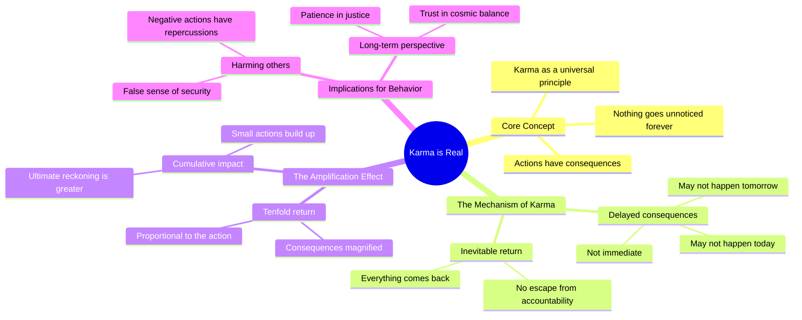

# Karma Is Real: What Goes Around Comes Back Tenfold

> 🌐 **Read this in:** **English** · [中文](../../zh-CN/2026-07/tiktok-transcript-karma-is-real-motivation-podcast-quotes-podcastclips-womene-dd79.md)

> **Creator:** [@pro_success.7](https://www.tiktok.com/@pro_success.7) · **Views:** 2.9M · **Posted:** 2026-07-04 · **Niche:** other
>
> **TL;DR:** Opens with a universal truth that immediately grabs attention.

[Watch original video →](https://vm.tiktok.com/ZNRwHH1sK/)

## Why This Went Viral

## Hook (first 3 seconds)
- **Verbatim opening:** "Karma is real yeah you can hurt people and think nothing will happen"
- **Hook pattern:** Bold claim + contrast (hurt people vs. nothing happening)
- **Why it stops scrolling:** It directly challenges a common self-deception ("I can get away with it") with a universal moral truth, creating immediate tension between what people *want* to believe and what they *fear* is true.

## Emotional Rhythm
1. **Curiosity** – "Karma is real" sets up a familiar concept, but the phrasing implies new insight.
2. **Tension** – "you can hurt people and think nothing will happen" – viewer recognizes their own or others' denial.
3. **Suspense** – "maybe not today maybe not tomorrow yeah but one day" – builds anticipation through repetition and delay.
4. **Release / Resonance** – "everything comes back" – the payoff, satisfying the built-up expectation.
5. **Amplification** – "tenfold" – escalates emotional stakes, creating a sense of justice.
6. **Climax / Finality** – "nothing in life goes unnoticed forever" – the ultimate moral verdict, leaving no escape.

## Keyword Density
- **Karma** – emotional pull (universal justice concept, triggers guilt/relief)
- **Hurt/hurting** – emotional pull (identifies the wrongdoing)
- **Nothing** – algorithmic reach (high-frequency word, simple, searchable)
- **Come back/comes back** – emotional pull (cycle imagery, satisfying closure)
- **Tenfold** – algorithmic reach (unique, memorable, shareable in comments)
- **Forever** – emotional pull (finality, existential weight)
- **Day/days** – both (temporal anchor, easy to visualize, algorithmic repetition)

## Why It Spreads
1. **Universal guilt trigger** – "you can hurt people and think nothing will happen" names a near-universal human experience (denial after wrongdoing), making viewers feel seen and compelled to share as confession or warning.
2. **Rhythmic suspense structure** – "maybe not today maybe not tomorrow yeah but one day" mimics oral storytelling cadence, making it feel like ancient wisdom rather than generic advice, increasing shareability.
3. **Escalation payoff** – "tenfold" is a specific, memorable multiplier that people quote and debate in comments, driving engagement.
4. **Final mic-drop line** – "nothing in life goes unnoticed forever" is a complete, quotable truth that works as a caption, comment, or status, maximizing off-platform spread.
5. **No ambiguity = high comment potential** – The absolute certainty ("nothing... forever") invites both agreement ("Facts") and pushback ("Not always"), fueling comment section activity.

## What You Can Steal
1. **Open with a contradiction** – Start with a statement that people *want* to believe (e.g., "you can hurt people and think nothing will happen") to hook denial and curiosity simultaneously.
2. **Use "maybe... not... but..." rhythm** – Delay the payoff with three-part suspense (not today, not tomorrow, but one day) to build emotional tension before the release.
3. **End with an absolute** – A final line that leaves no room for doubt ("nothing... forever") makes the video quote-worthy and forces viewers to either agree or argue, both of which drive shares.

## Mind Map

## Full Transcript (Generated by [TokTranscript](https://toktranscript.com/?utm_source=github&utm_medium=breakdown&utm_campaign=tool_attribution))

> 📝 Transcripts on this page are auto-generated and show the first 60%. Want to transcribe any TikTok in 30 seconds and get the full version? [Try TokTranscript free →](https://toktranscript.com/?utm_source=github&utm_medium=breakdown&utm_campaign=transcript_cta)

Karma is real yeah you can hurt people and think nothing will happen maybe not today maybe not tomorrow yeah but one day everything comes back

*[Read the full transcript on TokTranscript →](https://toktranscript.com/plaza/tiktok-transcript-karma-is-real-motivation-podcast-quotes-podcastclips-womene-dd79?utm_source=github&utm_medium=breakdown&utm_campaign=transcript_full)*

## Browse More

- All [other](../../by-niche/en/other.md) breakdowns
- All [Bold Statement](../../by-pattern/en/hook-bold-statement.md) examples

## Video Info

| | |
|---|---|
| Creator | [@pro_success.7](https://www.tiktok.com/@pro_success.7) |
| Original video | [https://vm.tiktok.com/ZNRwHH1sK/](https://vm.tiktok.com/ZNRwHH1sK/) |
| Original title | Karma is Real..   #motivation #podcast #quotes  #podcastclips #womene... |
| Views | 2.9M (2900000) |
| Posted | 2026-07-04 |
| Duration | 0s |
| Niche | `other` |
| Hook pattern | `Bold Statement` |
| Original language | `en` |
| Available languages | en, zh-CN |
| Generated | 2026-07-05 by [TokTranscript](https://toktranscript.com/) |

---

*This breakdown is for educational analysis under fair use. Original video © [@pro_success.7](https://www.tiktok.com/@pro_success.7). All transcripts are auto-generated and may contain errors.*

*Want to analyze your own TikToks like this? [TokTranscript.com →](https://toktranscript.com/viral-breakdown?utm_source=github&utm_medium=breakdown&utm_campaign=footer_cta)*