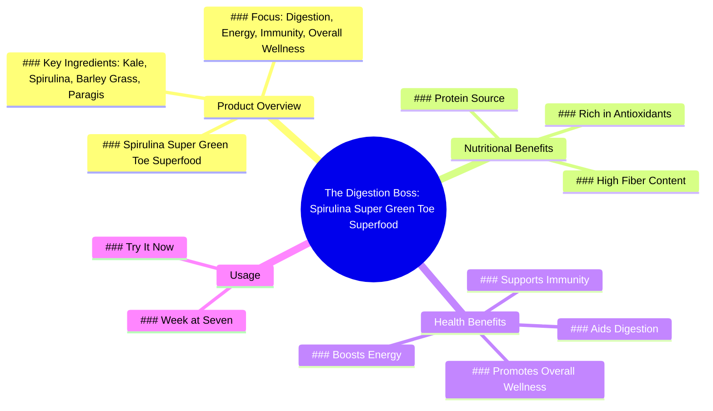

# Bloated After Eating Little? Try Spirulina Superfoods

> 🌐 **Read this in:** **English** · [中文](../../zh-CN/2026-07/tiktok-transcript-laging-bloated-kahit-konti-lang-kinain-tyan-mo-rin-ba-ganito-0deb.md)

> **Creator:** [@shopwithsonjie](https://www.tiktok.com/@shopwithsonjie) · **Views:** 235.9K · **Posted:** 2026-07-29 · **Niche:** other
>
> **TL;DR:** Opens with a relatable discomfort to hook viewers seeking relief.

[Watch original video →](https://www.tiktok.com/@shopwithsonjie/video/7619133069861211399?shop_region=PH&shop_id=7495310222761495027)

## Why This Went Viral

## Hook (first 3 seconds)
- **Verbatim opening line:** "The weight I can't Gas again. I'm bloated. Who can help me?"
- **Hook pattern:** Scene + Pain point (relatable struggle with bloating/gas)
- **Why it stops scrolling:** Immediate, visceral identification with a common discomfort. The question "Who can help me?" creates an open loop that demands resolution.

## Emotional Rhythm
- **Beat 1 (0–3s):** **Frustration/Discomfort** – "The weight I can't Gas again. I'm bloated." Viewer feels seen.
- **Beat 2 (3–5s):** **Desperation/Appeal** – "Who can help me?" builds tension and curiosity.
- **Beat 3 (5–7s):** **Authority Arrives** – "The digestion boss continues" – introduces a solution character.
- **Beat 4 (7–12s):** **Education/Trust** – "I am spirulina. I am rich in antioxidants, fiber and protein." Builds credibility.
- **Beat 5 (12–16s):** **Clarity/Resonance** – Listing specific superfoods (kale, spirulina, barley grass, paragis) reinforces "this is for people like me."
- **Beat 6 (16–end):** **Call to Action/Climax** – "Week at seven spirulina super green toe Superfood power for digestion, energy, immunity and overall wellness. Try it now!" – relief + urgency.

**Climax moment:** The phrase "Week at seven spirulina super green toe" – a branded promise that ties the pain to a specific product, creating a clear next step.

## Keyword Density
| Word/Phrase | Count (approx.) | Function |
|-------------|-----------------|----------|
| bloated / gas / digestion | 4 | **Emotional pull** – triggers pain point identification |
| spirulina | 3 | **Algorithmic reach** – branded keyword + health trend |
| superfood / super green | 3 | **Algorithmic reach** – trending health category |
| antioxidants / fiber / protein | 3 | **Emotional pull** – benefit words that build trust |
| energy / immunity / wellness | 3 | **Emotional pull** – aspirational outcomes |
| who can help me | 1 | **Emotional pull** – creates open loop |
| try it now | 1 | **Algorithmic reach** – CTA for engagement/click |

**Algorithmic drivers:** "spirulina," "superfood," "super green" – high-search-volume health terms.  
**Emotional drivers:** "bloated," "gas," "digestion," "energy," "immunity" – pain + aspiration.

## Why It Spreads
1. **Pain-first framing bypasses resistance** – The video opens with "I'm bloated" not "Buy this." Viewers who suffer from bloating instantly self-identify, making them receptive to the solution. *Transcript evidence: "The weight I can't Gas again. I'm bloated."*
2. **Personification of the product creates a character** – "I am the spirulina" turns a supplement into a relatable helper ("the digestion boss"). This makes the pitch feel like a story, not an ad. *Transcript evidence: "I am the spirulina. I am rich in antioxidants..."*
3. **Specific ingredient list builds credibility** – Naming kale, spirulina, barley grass, and paragis signals "this is a real formula, not generic powder." Specificity = trust. *Transcript evidence: "Super Foods Kale, Spirulina, Barly grass and Paragis"*
4. **Clustered benefits solve multiple pain points** – "digestion, energy, immunity, and overall wellness" means the video appeals to different viewers for different reasons, widening the shareable audience. *Transcript evidence: "Superfood power for digestion, energy, Immunity and overall wellness."*
5. **Urgent CTA closes the loop** – "Try it now!" after building pain + solution + trust gives the viewer a clear, low-friction next step. *Transcript evidence: "Try it now!"*

## What You Can Steal
1. **Start with a specific pain, not a product.** Open with a 3-second scene of a relatable struggle (e.g., "I can't focus," "My back hurts," "I'm always tired") before introducing your solution. The pain creates the hook; the product becomes the hero.
2. **Personify your product as a character.** Give your supplement, tool, or service a voice and a role (e.g., "the digestion boss," "the focus coach," "the sleep wizard"). This turns a dry pitch into a mini-story that viewers remember and share.
3. **Stack 3+ specific benefits in a single sentence.** Don't just say "good for health." List "digestion, energy, immunity, and overall wellness" – the more benefits you name, the more different audience segments will feel the video is "for them."

## Mind Map

## Full Transcript (Generated by [TokTranscript](https://toktranscript.com/?utm_source=github&utm_medium=breakdown&utm_campaign=tool_attribution))

> 📝 Transcripts on this page are auto-generated and show the first 60%. Want to transcribe any TikTok in 30 seconds and get the full version? [Try TokTranscript free →](https://toktranscript.com/?utm_source=github&utm_medium=breakdown&utm_campaign=transcript_cta)

The weight I can't Gas again. I'm bloated. Who can help me The digestion boss continues I am the spirulina. I am rich in Antioxidants, Fiber and Protein.

*[Read the full transcript on TokTranscript →](https://toktranscript.com/plaza/tiktok-transcript-laging-bloated-kahit-konti-lang-kinain-tyan-mo-rin-ba-ganito-0deb?utm_source=github&utm_medium=breakdown&utm_campaign=transcript_full)*

## Browse More

- All [other](../../by-niche/en/other.md) breakdowns
- All [Problem Agitation](../../by-pattern/en/hook-problem-agitation.md) examples

## Video Info

| | |
|---|---|
| Creator | [@shopwithsonjie](https://www.tiktok.com/@shopwithsonjie) |
| Original video | [https://www.tiktok.com/@shopwithsonjie/video/7619133069861211399?shop_region=PH&shop_id=7495310222761495027](https://www.tiktok.com/@shopwithsonjie/video/7619133069861211399?shop_region=PH&shop_id=7495310222761495027) |
| Original title | Laging bloated kahit konti lang kinain? 😣 Tyan mo rin ba ganito? #Tim... |
| Views | 235.9K (235900) |
| Posted | 2026-07-29 |
| Duration | 0s |
| Niche | `other` |
| Hook pattern | `Problem Agitation` |
| Original language | `en` |
| Available languages | en, zh-CN |
| Generated | 2026-08-01 by [TokTranscript](https://toktranscript.com/) |

---

*This breakdown is for educational analysis under fair use. Original video © [@shopwithsonjie](https://www.tiktok.com/@shopwithsonjie). All transcripts are auto-generated and may contain errors.*

*Want to analyze your own TikToks like this? [free TikTok transcript generator →](https://toktranscript.com/viral-breakdown?utm_source=github&utm_medium=breakdown&utm_campaign=footer_cta)*