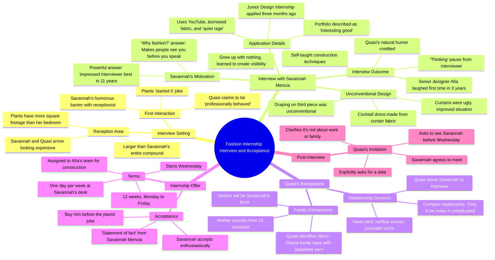

# Last Part- Fine Girl, No Filter  Sharp Mouth, Soft Heart  #part2 #vir...

> 🌐 **Read this in:** **English** · [中文](../../zh-CN/2026-07/tiktok-transcript-last-part-fine-girl-no-filter-sharp-mouth-soft-heart-part2-v-173e.md)

> **Creator:** [@africtalesdaily](https://www.tiktok.com/@africtalesdaily) · **Views:** 160.5K · **Posted:** 2026-07-23 · **Niche:** entertainment
>
> **TL;DR:** Uses hyperbolic comparison to immediately establish wealth disparity and hook viewer curiosity.

[Watch original video →](https://vm.tiktok.com/ZGd9E11rA/)

## Why This Went Viral

## Hook (first 3 seconds)
- **Verbatim opening line:** "Reception area is bigger than my entire compound."
- **Hook pattern:** Contrast / scene-setting with a personal, relatable comparison.
- **Why it stops scrolling:** The line immediately creates a visceral, humorous contrast between luxury ("reception area") and scarcity ("my entire compound"), generating instant curiosity about the setting and the speaker’s perspective.

## Emotional Rhythm
- **Beat 1 – Curiosity:** The opening contrast hooks the viewer.
- **Beat 2 – Tension + Humor:** "The plants started it looking expensive like that" — playful banter adds tension and personality.
- **Beat 3 – Suspense:** The interview begins; the applicant’s self-taught, underdog story builds stakes.
- **Beat 4 – Resonance:** "I grew up with nothing… fashion is the one thing that makes people see you before you speak" — emotional depth and relatability peak.
- **Beat 5 – Relief + Warmth:** The offer is given, and the final twist (romantic subplot) delivers a satisfying, lighthearted climax.
- **Climax moment:** "That's the best answer anyone has given me in 11 years of interviews."

## Keyword Density
- **"Fashion"** – 5 mentions; drives algorithmic reach (high-search-volume niche) and emotional pull (aspiration, identity).
- **"Nothing"** – 3 mentions; emotional anchor (scarcity, underdog narrative).
- **"See" / "seen"** – 4 mentions; emotional pull (visibility, validation).
- **"Interview" / "internship"** – 6 mentions; algorithmic reach (career, hustle content).
- **"Mother"** – 4 mentions; emotional pull (family dynamics, humor).
- **"Plants"** – 3 mentions; quirky, memorable hook reinforcement.
- **"Laugh" / "funny"** – 3 mentions; emotional relief and relatability.

## Why It Spreads
1. **Underdog narrative + aspirational payoff:** The protagonist’s journey from "nothing" to landing a fashion internship resonates universally. The line "I grew up with nothing… fashion makes people see you before you speak" is a shareable, quote-worthy emotional core.
2. **Sharp, witty dialogue with high rewatch value:** Lines like "The curtains were ugly, I improved the situation for everyone" and "That’s the best answer anyone has given me" are punchy, quotable, and encourage comments and shares.
3. **Romantic subplot as a surprise twist:** The final exchange ("Are you trying to uncomplicate something right now?") adds a layer of romantic tension, expanding the audience beyond career content to romance lovers.
4. **Relatable humor + specific detail:** The opening plant joke and "quiet rage of a girl with too much time and no money" mix specificity with universal humor, making the video feel authentic and memorable.

## What You Can Steal
1. **Open with a contrast that reveals character:** Start your video with a line that pits two worlds against each other (e.g., "My entire apartment is smaller than her walk-in closet") to immediately signal stakes and personality.
2. **Embed a quotable "underdog truth" in the middle:** Craft a line that distills your protagonist’s struggle into a universal insight (e.g., "I never had the money to be seen, so I learned to make the thing that does the seeing"). This becomes the shareable hook.
3. **Add a romantic or emotional twist in the last 10 seconds:** After the main arc resolves, introduce a new layer (romance, mystery, or a callback joke) to reward rewatches and spark comments like "Did they end up together?"

## Mind Map

## Full Transcript (Generated by [TokTranscript](https://toktranscript.com/?utm_source=github&utm_medium=breakdown&utm_campaign=tool_attribution))

> 📝 Transcripts on this page are auto-generated and show the first 60%. Want to transcribe any TikTok in 30 seconds and get the full version? [Try TokTranscript free →](https://toktranscript.com/?utm_source=github&utm_medium=breakdown&utm_campaign=transcript_cta)

Reception area is bigger than my entire compound. Savannah, the plants alone have more square footage than my bedroom. Please behave. I'm always behaved. I'm professionally behaved. You just insulted the plants. The plants started it looking expensive like that. Good morning. Can I help? We're with her at work. Cole and Umentza, future of fashion, currently operating on no sleep and one of Quazi's mother's bread rolls. She means we have an appointment. So Savannah Mencia, the same. I pulled your application this morning. You applied for the Junior Design internship three months ago. I did. Your portfolio was interesting. Interesting good. Or interesting like a car accident. Interesting. Good. Your construction techniques are self taught entirely. YouTube borrowed fabric and the quiet rage of a girl with too much time and no money. Your draping on the third piece was unconventional. You made a cocktail dress from curtain fabric. In my defense, the curtains were ugly. I improved the situation for everyone. Why fashion? Because I grew up with nothing and fashion is the one thing that makes people see you before you speak. I never had the money to be seen, so I decided to learn how to make the thing that does the scene. That's powerful, Savannah. Inspiring indeed. That's the best answer anyone has given me in 11 years of interviews. I also just really love fabric. But the first answer sounded better. Well, she's thinking, what does that mean? It means a very powerful Woman is sitting in a room deciding my future and I'm standing in the hallway. That's cost more. Pasquale. You made Afia laugh. Which one is Afia? Senior designer, right side. She hasn't laughed in a client meeting in three years. My mother timed it. I didn't even try to be funny. I know.

*[Read the full transcript on TokTranscript →](https://toktranscript.com/plaza/tiktok-transcript-last-part-fine-girl-no-filter-sharp-mouth-soft-heart-part2-v-173e?utm_source=github&utm_medium=breakdown&utm_campaign=transcript_full)*

## Browse More

- All [entertainment](../../by-niche/en/entertainment.md) breakdowns
- All [Exaggerated Comparison](../../by-pattern/en/hook-exaggerated-comparison.md) examples

## Video Info

| | |
|---|---|
| Creator | [@africtalesdaily](https://www.tiktok.com/@africtalesdaily) |
| Original video | [https://vm.tiktok.com/ZGd9E11rA/](https://vm.tiktok.com/ZGd9E11rA/) |
| Original title | Last Part- Fine Girl, No Filter  Sharp Mouth, Soft Heart  #part2 #vir... |
| Views | 160.5K (160500) |
| Posted | 2026-07-23 |
| Duration | 0s |
| Niche | `entertainment` |
| Hook pattern | `Exaggerated Comparison` |
| Original language | `en` |
| Available languages | en, zh-CN |
| Generated | 2026-07-26 by [TokTranscript](https://toktranscript.com/) |

---

*This breakdown is for educational analysis under fair use. Original video © [@africtalesdaily](https://www.tiktok.com/@africtalesdaily). All transcripts are auto-generated and may contain errors.*

*Want to analyze your own TikToks like this? [TokTranscript.com →](https://toktranscript.com/viral-breakdown?utm_source=github&utm_medium=breakdown&utm_campaign=footer_cta)*