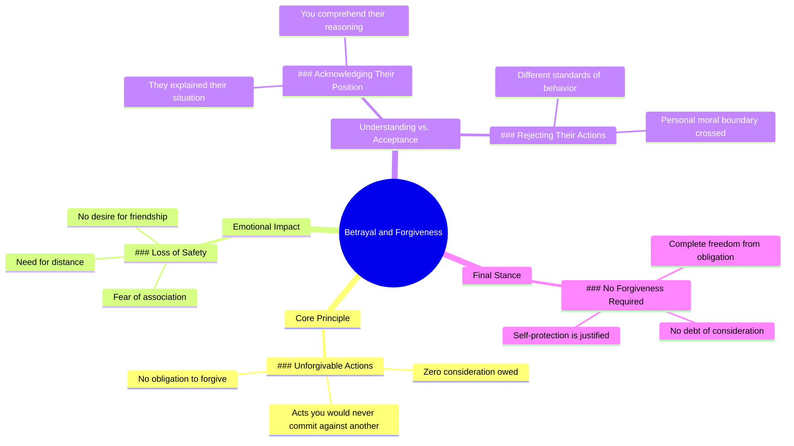

# Leo Skepi on Betrayal and Ending a Friendship

> 🌐 **Read this in:** **English** · [中文](../../zh-CN/2026-07/tiktok-transcript-leo-skepi-fyp-betrayal-hurt-forgiveness-leoskepi-loyalty-fri-e611.md)

> **Creator:** [@thecuratedclips](https://www.tiktok.com/@thecuratedclips) · **Views:** 9.9M · **Posted:** 2026-07-01 · **Niche:** other
>
> **TL;DR:** Sets up a powerful ethical imbalance that immediately engages the listener's sense of justice.

[Watch original video →](https://www.tiktok.com/t/ZTSkSVG6L/)

## Why This Went Viral

## Hook (first 3 seconds)
- **Verbatim opening line:** "You did to me what I never would have done to you."
- **Hook pattern:** Contrast / moral high-ground claim
- **Why it stops scrolling:** The line instantly establishes a betrayal dynamic, creating a strong emotional imbalance. Viewers feel the weight of injustice and want to know the specifics—or they've experienced this exact pain and feel seen immediately.

## Emotional Rhythm
- **Beat 1 – Betrayal sting (0–3s):** "You did to me what I never would have done to you." — sharp, personal accusation.
- **Beat 2 – Boundary setting (3–8s):** "I don't want any type of friendship… I don't feel safe." — escalates from hurt to protective distance.
- **Beat 3 – Empathy trap (8–12s):** "I understand the position that you were in." — creates temporary relief, lowers guard.
- **Beat 4 – Moral twist (12–16s):** "But if I was in that position, I still would not have done that to you." — the climax. Reverses empathy into a higher moral standard.
- **Beat 5 – Liberation (16–end):** "You do not owe them a lick of consideration…" — final release, permission to walk away without guilt.

**Climax moment:** "But if I was in that position, I still would not have done that to you." — this is the line that gets replayed, quoted, and screenshotted.

## Keyword Density
1. **"you"** – repeated 7x. Drives algorithmic reach (direct address triggers engagement). Also emotional pull — creates accusatory intimacy.
2. **"I"** – repeated 6x. Personalizes the moral stance, makes it feel like a universal truth spoken from one person's experience.
3. **"never"** – repeated 2x. Absolute language creates high contrast and memorability.
4. **"would not"** – repeated 3x. Reinforces the moral boundary — algorithmic weight for "would" (high search volume in relationship content).
5. **"forgiveness"** – repeated 2x. High emotional pull keyword — triggers resonance with anyone struggling with guilt or pressure to forgive.
6. **"position"** – repeated 2x. Context word that builds empathy before the twist.
7. **"safe"** – 1x but high emotional weight — triggers trauma/attachment algorithm signals.
8. **"owe"** – 1x but high impact — shifts from emotional language to transactional, which feels new.

**Algorithmic reach drivers:** "you," "I," "would not," "forgiveness"  
**Emotional pull drivers:** "never," "safe," "owe," "position"

## Why It Spreads
1. **Universal betrayal script** – The line "You did to me what I never would have done to you" is a template that fits 90% of interpersonal conflicts (friendships, breakups, family, work). Viewers mentally replace "you" with their own betrayer.
2. **Permission-giving climax** – "You do not owe them a lick of consideration…" removes guilt. This is the most shareable line — people send it to friends who are stuck in toxic forgiveness cycles.
3. **Moral high-ground without arrogance** – The speaker first validates the other person's position ("I understand…"), then reveals their own higher standard. This makes the moral claim feel earned, not preachy.
4. **Tight emotional arc in under 30 seconds** – The video delivers a complete journey (hurt → understanding → boundary → liberation) in 20 seconds. Perfect for short-form retention.
5. **High comment-bait structure** – The final line ("you do not owe them forgiveness") is deliberately controversial. It invites two comment camps: "Yes, finally someone said it" vs. "But forgiveness is for yourself." Both sides comment, boosting reach.

## What You Can Steal
1. **The "empathy then reversal" pattern** – Start by validating the other side ("I understand your position"), then pivot with "but" to your own moral boundary. This makes your stance feel considered, not reactive.
2. **Absolute contrast language** – Use "never" vs. "would" in the same sentence. The gap between what they did and what you would never do creates a memorable moral chasm viewers want to share.
3. **Permission-ending** – End with a declarative sentence that gives viewers permission to act without guilt ("You do not owe them…"). This turns your video into a tool they share with others who need the same permission.

## Mind Map

## Full Transcript (Generated by [TokTranscript](https://toktranscript.com/?utm_source=github&utm_medium=breakdown&utm_campaign=tool_attribution))

> 📝 Transcripts on this page are auto-generated and show the first 60%. Want to transcribe any TikTok in 30 seconds and get the full version? [Try TokTranscript free →](https://toktranscript.com/?utm_source=github&utm_medium=breakdown&utm_campaign=transcript_cta)

You did to me what I never would have done to you. I don't want any type of friendship. I don't feel safe having you know anything about me or having any association with me. I understand the position that you were in. You described it to me perfectly. But if I was in that position, I still would not have done that to you.

*[Read the full transcript on TokTranscript →](https://toktranscript.com/plaza/tiktok-transcript-leo-skepi-fyp-betrayal-hurt-forgiveness-leoskepi-loyalty-fri-e611?utm_source=github&utm_medium=breakdown&utm_campaign=transcript_full)*

## Browse More

- All [other](../../by-niche/en/other.md) breakdowns
- All [Moral Contrast](../../by-pattern/en/hook-moral-contrast.md) examples

## Video Info

| | |
|---|---|
| Creator | [@thecuratedclips](https://www.tiktok.com/@thecuratedclips) |
| Original video | [https://www.tiktok.com/t/ZTSkSVG6L/](https://www.tiktok.com/t/ZTSkSVG6L/) |
| Original title | @Leo Skepi #fyp #betrayal #hurt #forgiveness #leoskepi #loyalty #frie... |
| Views | 9.9M (9900000) |
| Posted | 2026-07-01 |
| Duration | 0s |
| Niche | `other` |
| Hook pattern | `Moral Contrast` |
| Original language | `en` |
| Available languages | en, zh-CN |
| Generated | 2026-07-01 by [TokTranscript](https://toktranscript.com/) |

---

*This breakdown is for educational analysis under fair use. Original video © [@thecuratedclips](https://www.tiktok.com/@thecuratedclips). All transcripts are auto-generated and may contain errors.*

*Want to analyze your own TikToks like this? [TokTranscript →](https://toktranscript.com/viral-breakdown?utm_source=github&utm_medium=breakdown&utm_campaign=footer_cta)*