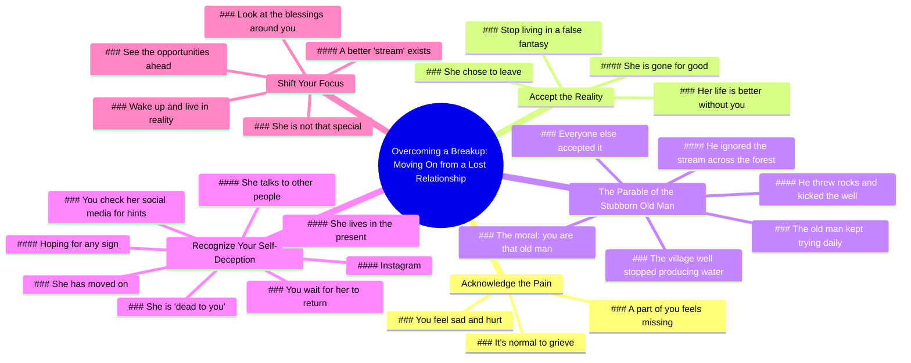

# Lightsunzayn’s Advice on Moving On After a Breakup

> 🌐 **Read this in:** **English** · [中文](../../zh-CN/2026-07/tiktok-transcript-lightsunzayn-s-advice-on-how-to-move-on-properly-lights-7a98.md)

> **Creator:** [@lightsunzayn](https://www.tiktok.com/@lightsunzayn) · **Views:** 3.5M · **Posted:** 2026-07-08 · **Niche:** entertainment
>
> **TL;DR:** Opens with a relatable personal problem and a direct question to engage the viewer immediately.

[Watch original video →](https://www.tiktok.com/t/ZTSCUpVrf/)

## Why This Went Viral

## Hook (first 3 seconds)
- **Verbatim opening:** "Like, me and my girl just broke up, and I can't stop thinking about her. What do I do?"
- **Hook pattern:** Relatable problem + direct question (empathy + call for solution)
- **Why it stops scroll:** Instantly mirrors the exact emotional state of the target audience (heartbroken men). The question feels personal, intimate, and urgent — like a friend confessing. Viewers who feel stuck in the same loop click to hear the answer.

## Emotional Rhythm
1. **Empathy / Identification** (0–3s) — "I know you feel sad. I know you feel hurt." The speaker validates the viewer's pain.
2. **Tension / Hard Truth** (6–12s) — "The moment she decided to break up… her life would be better without you." A sharp, uncomfortable reality check.
3. **Suspense / Story Setup** (15–25s) — "There's a story about this old man…" The parable creates curiosity: *Where is this going?*
4. **Frustration / Relatability** (25–40s) — The old man's futile daily ritual mirrors the viewer's own obsessive behavior (checking social media, hoping).
5. **Climax / Twist** (40–50s) — "Across the forest, there was a stream… even more breathtaking." The payoff: the well is empty, but something better exists.
6. **Resonance / Wake-Up Call** (50–end) — "You're that stubborn old man… Wake up!" Direct confrontation + call to action. Emotional release.

## Keyword Density
| Keyword / Phrase | Frequency (approx.) | Purpose |
|---|---|---|
| "You" / "Your" | 20+ | Algorithm: high engagement (direct address). Emotional: creates intimacy & accountability. |
| "Fantasy" / "False fantasy" | 5 | Emotional pull: names the cognitive distortion the viewer is trapped in. |
| "Well" / "Empty well" | 8 | Algorithm: story anchor (easily searchable / clipable). Emotional: metaphor for the ex. |
| "She" / "Her" | 10 | Emotional: the object of obsession. Algorithm: triggers relationship/breakup keywords. |
| "Wake up" | 2 | Emotional: climax phrase. Algorithm: high-retention moment (people rewatch/share this line). |
| "Move on" / "Moved on" | 3 | Emotional: the desired outcome. Algorithm: high-volume search term. |
| "Stubborn old man" | 3 | Emotional: self-identification. Algorithm: memorable character for comments/reference. |

## Why It Spreads
1. **The "Hard Truth" Format** — The video doesn't coddle. It delivers a brutal reality ("her life would be better without you") that feels like a friend shaking you awake. This pattern is highly shareable because viewers tag friends who "need to hear this."
2. **The Parable as a Trojan Horse** — The story of the old man and the well is simple, visual, and emotionally sticky. Viewers remember the metaphor and retell it in comments or to friends. It's the viral "mental model" that spreads beyond the video.
3. **Direct Address + Second-Person Repetition** — The constant "you" (you feel, you check, you're living) creates a one-on-one coaching dynamic. This increases watch time (feels personal) and comment volume ("this is me").
4. **Climactic Call to Action** — "Wake up!" is a punchy, repeatable, shareable command. It's the perfect soundbite for remixes, stitches, and duets. The emotional peak is also the most quotable line.
5. **Niche + Universal** — Target: heartbroken men (tight niche). But the metaphor (clinging to something empty while ignoring better options) applies to jobs, friendships, habits. This broadens the shareability beyond the breakup niche.

## What You Can Steal
1. **Start with the viewer's exact thought** — Open with a verbatim quote of what your audience is thinking/feeling ("I can't stop thinking about her"). This creates instant identification. In any niche, lead with the pain point as a direct quote.
2. **Use a short, visual parable** — A 30-second story with a single, clear metaphor (well = ex, stream = better future) is more memorable than abstract advice. Keep the parable under 45 seconds. Make the moral explicit: "You are that [character]."
3. **End with a sharp, repeatable command** — "Wake up!" is two syllables, aggressive, and quotable. Your video's final 3 seconds should be a line viewers can screenshot, comment, or stitch. Avoid soft closers like "I hope this helps." Go for a punch.

## Mind Map

## Full Transcript (Generated by [TokTranscript](https://toktranscript.com/?utm_source=github&utm_medium=breakdown&utm_campaign=tool_attribution))

> 📝 Transcripts on this page are auto-generated and show the first 60%. Want to transcribe any TikTok in 30 seconds and get the full version? [Try TokTranscript free →](https://toktranscript.com/?utm_source=github&utm_medium=breakdown&utm_campaign=transcript_cta)

Like, me and my girl just broke up, and I can't stop thinking about her. What do I do? Listen. And listen to this carefully, okay? I know you feel sad. I know you feel hurt. You feel like a part of you is missing. But the moment she decided to break up with you is the moment she decided that her life would be better without you. And you need to stop living in this false fantasy that you create in your own mind. And you need to realize that she's gone. Listen, there's the story about this old man who lived in this village, okay? And everyone in that village would go to the single well that was in the center. This well produced the most taking, refreshing water you could ever taste. And every morning, 6 a m. Sharp, they would go put their bucket in, and water would come out. Until one day, the well stop producing water. Everyone else in the village accepted that, except this one stubborn old man. Every morning, he would come try to get water from that well, but nothing would happen. He would put the bucket in, he would take it out, nothing would happen. You throw rocks down there, he would kick the well, but nothing would happen. Yet he continued to show up every single day.

*[Read the full transcript on TokTranscript →](https://toktranscript.com/plaza/tiktok-transcript-lightsunzayn-s-advice-on-how-to-move-on-properly-lights-7a98?utm_source=github&utm_medium=breakdown&utm_campaign=transcript_full)*

## Browse More

- All [entertainment](../../by-niche/en/entertainment.md) breakdowns
- All [Direct question hook](../../by-pattern/en/hook-direct-question-hook.md) examples

## Video Info

| | |
|---|---|
| Creator | [@lightsunzayn](https://www.tiktok.com/@lightsunzayn) |
| Original video | [https://www.tiktok.com/t/ZTSCUpVrf/](https://www.tiktok.com/t/ZTSCUpVrf/) |
| Original title | Lightsunzayn’s Advice On How To Move On Properly ❤️‍🩹 - - - - #lights... |
| Views | 3.5M (3500000) |
| Posted | 2026-07-08 |
| Duration | 0s |
| Niche | `entertainment` |
| Hook pattern | `Direct question hook` |
| Original language | `en` |
| Available languages | en, zh-CN |
| Generated | 2026-07-09 by [TokTranscript](https://toktranscript.com/) |

---

*This breakdown is for educational analysis under fair use. Original video © [@lightsunzayn](https://www.tiktok.com/@lightsunzayn). All transcripts are auto-generated and may contain errors.*

*Want to analyze your own TikToks like this? [try this transcription tool →](https://toktranscript.com/viral-breakdown?utm_source=github&utm_medium=breakdown&utm_campaign=footer_cta)*