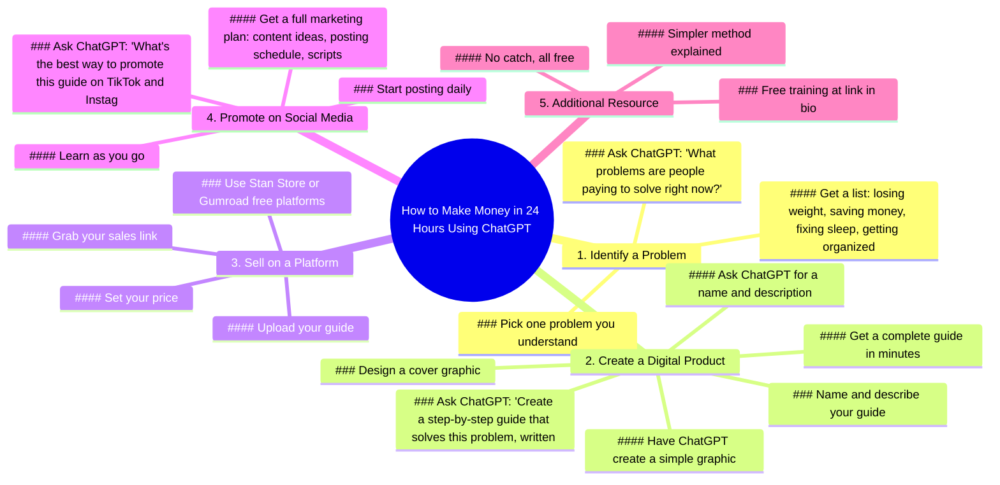

# Make Money in 24 Hours Using ChatGPT

> 🌐 **Read this in:** **English** · [中文](../../zh-CN/2026-07/tiktok-transcript-makemoneyonline-digitalproducts-chatgpt-digitalmarketingforb-b958.md)

> **Creator:** [@officialloucameron](https://www.tiktok.com/@officialloucameron) · **Views:** 2.5M · **Posted:** 2026-07-19 · **Niche:** finance
>
> **TL;DR:** Promises quick, easy money with a specific tool, grabbing attention instantly.

[Watch original video →](https://www.tiktok.com/@officialloucameron/video/7660325898129837342)

## Why This Went Viral

## Hook (first 3 seconds)
- **Verbatim opening line:** "I'm gonna show you how to make money in the next 24 hours using nothing but ChatGPT."
- **Hook pattern:** Bold claim + time constraint + tool name (ChatGPT)
- **Why it stops scrolling:** The promise of instant, zero-effort money with a trendy AI tool triggers immediate greed and curiosity. The "24 hours" creates urgency, and "no inventory, no shipping, no design skills" removes all common objections before the viewer can think of them.

## Emotional Rhythm
- **Beat 1 – Greed & Curiosity (0:00–0:15):** "Make money in 24 hours" + "zero experience needed" → viewer leans in
- **Beat 2 – Step-by-step empowerment (0:15–1:00):** "Open ChatGPT, type this" → feels achievable, tension builds as the product takes shape
- **Beat 3 – Mini climax (1:00–1:15):** "You have a product, a name, a description, and a cover" → satisfaction of completion
- **Beat 4 – Action push (1:15–1:45):** "Upload, set price, grab link, boom" → relief that it's easy, excitement of being "in business"
- **Beat 5 – Final push & twist (1:45–2:15):** "This is how people with zero experience are launching real products" → social proof + FOMO
- **Beat 6 – Soft sell (2:15–end):** "Free training in bio, no catch" → trust-building, low-risk close
- **Climax moment:** "Boom! You're officially in business" — the emotional peak of achievement

## Keyword Density
| Keyword/Phrase | Frequency | Function |
|---|---|---|
| "ChatGPT" | 6 | Algorithmic reach (trending topic) + emotional pull (AI magic) |
| "Step-by-step" / "guide" | 4 | Emotional pull (clarity, ease) |
| "Zero experience" / "nothing but" | 3 | Emotional pull (removes fear, lowers barrier) |
| "Free" | 3 | Algorithmic + emotional (value perception) |
| "24 hours" / "one day" | 2 | Emotional pull (urgency, instant gratification) |
| "Money" / "make money" | 2 | Algorithmic (high-search intent) |
| "Link in bio" | 1 | Algorithmic (call-to-action, engagement) |

## Why It Spreads
1. **The "too good to be true" formula triggers shareability.** The line "using nothing but ChatGPT" makes viewers feel like they've discovered a secret. People share secrets to look smart or helpful. *Concrete line:* "No inventory, no shipping, and no design skills."

2. **Every objection is pre-killed in the first 15 seconds.** The video removes friction before the viewer can think of it. This creates a "why wouldn't I try this?" feeling, which drives saves and shares. *Concrete line:* "You didn't write a single word of it yourself."

3. **The "free training" CTA creates a low-risk loop.** By offering a free resource at the end, the video feels like a gift, not a sales pitch. This increases trust and drives clicks to bio, which signals to the algorithm that the content is valuable. *Concrete line:* "It's absolutely free. It breaks it all down. There's no catch."

4. **The step-by-step format is a "save for later" magnet.** Viewers save the video to follow the steps later. Saves are a high-weight engagement signal on short-form platforms. *Concrete line:* "First, open up ChatGPT. And type in..."

5. **Social proof is embedded in the middle, not the end.** "This is how people with zero experience are launching real digital products" normalizes the outcome and creates FOMO. *Concrete line:* "This is how people with zero experience are launching real digital products in one day."

## What You Can Steal
1. **The "objection sandwich" hook.** Open with the bold promise, immediately follow with the three biggest objections your audience has — and state they don't apply. Example: "I'll show you how to [big result] using [free tool]. No [objection 1], no [objection 2], no [objection 3]."

2. **The "tool as character" structure.** Make the tool (ChatGPT) the protagonist, not you. This makes the process feel mechanical and replicable. Viewers think "I can do that too." In your next video, frame the tool as the hero: "Let me show you what [tool] can do for you in 5 minutes."

3. **The "free training" as a trust anchor.** Instead of a hard sell, offer a free resource that extends the value. This turns a one-off video into a funnel. Use the exact phrase: "There's no catch. It's all in your hands. Go do the work." — this positions you as a coach, not a seller.

## Mind Map

## Full Transcript (Generated by [TokTranscript.com](https://toktranscript.com/?utm_source=github&utm_medium=breakdown&utm_campaign=tool_attribution))

> 📝 Transcripts on this page are auto-generated and show the first 60%. Want to transcribe any TikTok in 30 seconds and get the full version? [Try TokTranscript free →](https://toktranscript.com/?utm_source=github&utm_medium=breakdown&utm_campaign=transcript_cta)

I'm gonna show you how to make money in the next 24 hours using nothing but chat G P T. No inventory, no shipping, and no design skills. Now let me walk you through exactly how to do it. First, open up chat G P T. And type in what problems are people paying to solve right now? It's gonna give you a list. Losing weight, saving money, fixing sleep, getting organised. A ton more. Pick one problem. One preferably, that you understand a little bit. Next, go back to chat G P T. And give it this prompt. Create a step by step guide that solves this problem, written in simple language. In a few minutes, you'll have a complete digital product. A real guy people would pay for. You didn't write a single word of it yourself. Now ask Chat G P T. For a name for your guide and a description that makes people want it. Then have it create a simple graphic so your product looks professional. Right now you have a product, you have a name, a description and a cover. And you built all of it inside one free tool. Next, go to Stand Store or gumroad. Now, what these are are free platforms that let you sell digital products from a single link.

*[Read the full transcript on TokTranscript →](https://toktranscript.com/plaza/tiktok-transcript-makemoneyonline-digitalproducts-chatgpt-digitalmarketingforb-b958?utm_source=github&utm_medium=breakdown&utm_campaign=transcript_full)*

## Browse More

- All [finance](../../by-niche/en/finance.md) breakdowns
- All [Immediate Value Promise](../../by-pattern/en/hook-immediate-value-promise.md) examples

## Video Info

| | |
|---|---|
| Creator | [@officialloucameron](https://www.tiktok.com/@officialloucameron) |
| Original video | [https://www.tiktok.com/@officialloucameron/video/7660325898129837342](https://www.tiktok.com/@officialloucameron/video/7660325898129837342) |
| Original title | #makemoneyonline #digitalproducts #chatgpt #digitalmarketingforbeginn... |
| Views | 2.5M (2500000) |
| Posted | 2026-07-19 |
| Duration | 0s |
| Niche | `finance` |
| Hook pattern | `Immediate Value Promise` |
| Original language | `en` |
| Available languages | en, zh-CN |
| Generated | 2026-07-20 by [TokTranscript](https://toktranscript.com/) |

---

*This breakdown is for educational analysis under fair use. Original video © [@officialloucameron](https://www.tiktok.com/@officialloucameron). All transcripts are auto-generated and may contain errors.*

*Want to analyze your own TikToks like this? [TokTranscript.com →](https://toktranscript.com/viral-breakdown?utm_source=github&utm_medium=breakdown&utm_campaign=footer_cta)*