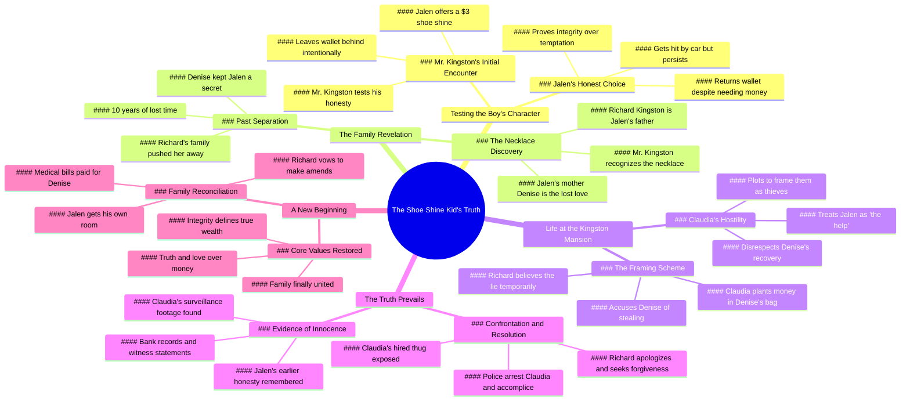

# Millionaire Tests Poor Boy and Finds the Truth

> 🌐 **Read this in:** **English** · [中文](../../zh-CN/2026-07/tiktok-transcript-millionaire-tested-poor-boy-and-find-the-truth-full-story-ai-8db9.md)

> **Creator:** [@aistoriess7](https://www.tiktok.com/@aistoriess7) · **Views:** 1.1M · **Posted:** 2026-07-20 · **Niche:** entertainment
>
> **TL;DR:** The hook sets up a class-based prejudice that immediately engages viewers by challenging stereotypes.

[Watch original video →](https://www.tiktok.com/t/ZP8t2Teme/)

## Why This Went Viral

## Hook (first 3 seconds)
- **Verbatim opening:** "Need a shoe shine today? Leave it. Mr Kingston kid. Probably just looking for handouts."
- **Hook pattern:** Scene + contrast (poor kid working vs. wealthy man dismissing him) + character introduction
- **Why it stops scrolling:** The immediate tension between "leave it" (dismissal) and "I work for mine" (dignity) creates a moral fork in the road. Viewers lock in to see who's right.

## Emotional Rhythm
- **Beat 1 – Curiosity:** "I work for mine" – Who is this kid? Why is he out here?
- **Beat 2 – Warmth → Suspense:** "My mama says even small jobs deserve big effort" → "Your daddy just got my mama" – sudden vulnerability.
- **Beat 3 – Tension peak:** Wallet left behind → test of honesty. "Let's see how honest you stay when nobody wants you."
- **Beat 4 – Moral choice:** "No, baby. You need a clean heart more than money." – Mama's lesson lands.
- **Beat 5 – Twist:** Car accident → still returns wallet → necklace reveal.
- **Beat 6 – Climax:** "Because he's your son." – identity reveal shatters everything.
- **Beat 7 – Relief → New tension:** "They stay in here. He get in one of my rooms." – false safety.
- **Beat 8 – Betrayal:** Claudia frames Denise. "Tired people make the best suspects."
- **Beat 9 – Redemption arc:** Dad realizes mistake → "I'mma spend the rest of my life earning it."
- **Beat 10 – Resolution:** "Money ain't what made us rich. Truth did."

## Keyword Density
| Word/Phrase | Frequency Notes | Driver |
|-------------|----------------|--------|
| "Mama" | ~15+ mentions | Emotional pull – maternal love = core resonance |
| "Truth" | ~10 mentions | Algorithmic reach – moral clarity = shareable |
| "Son" / "Daddy" | ~12 mentions | Emotional pull – family longing = high retention |
| "Wallet" / "Money" | ~10 mentions | Plot driver – creates stakes and trust tests |
| "Honest" / "Honesty" | ~6 mentions | Algorithmic reach – virtue signals = viral |
| "Clean" (heart, work) | ~5 mentions | Emotional pull – purity metaphor = memorable |
| "Home" / "House" | ~6 mentions | Emotional pull – belonging = deep resonance |
| "Deserve" | ~4 mentions | Algorithmic reach – justice = shareable |
| "Cold" / "Warm" | ~4 mentions | Emotional pull – temperature = mood shorthand |
| "Forgive" | ~3 mentions | Emotional pull – redemption = high engagement |

**Algorithmic drivers:** "Truth," "honest," "deserve" – these trigger shares because they signal moral clarity.
**Emotional pull:** "Mama," "son," "home" – these trigger tears and retention.

## Why It Spreads
1. **Moral clarity + identity reveal** – "Because he's your son" is the single most shareable moment. It flips the entire story from "poor kid" to "secret heir." Viewers instantly want to tag someone: *"This got me."*

2. **Character test structure** – The wallet test (honesty), the hospital test (sacrifice), the house test (resilience) give viewers 3 clear moments to root for Jalen. Each test is a mini-viral hook. *"You earned more than that"* becomes a quote people screenshot.

3. **Emotional rollercoaster with payoff** – The story cycles through hope → betrayal → redemption. Viewers stay because they *need* to see the bad guys punished. *"Police on the way. Don't even think about running."* is the catharsis they waited for.

4. **Universal longing** – "I just wanted my daddy" hits a core human need. It's not about money; it's about belonging. This makes the video shareable across demographics (fatherless homes, adoption, estranged families).

5. **Claudia as perfect villain** – She's not just mean; she's *strategically cruel* ("Tired people make the best suspects"). Viewers hate her actively, which drives comments and shares. *"That's cold"* becomes a meme.

## What You Can Steal
1. **The "honesty test" opening** – Start your video with a small moral dilemma (wallet left behind, extra change, a secret overheard). It forces viewers to ask *"What would I do?"* – instant engagement.

2. **Three-act emotional structure** – Use the pattern: **Setup** (who they are) → **Test** (what they face) → **Reveal** (who they really are). Every viral story follows this. Jalen's arc: shoe shine kid → tested → secret son.

3. **Plant a "necklace"** – Use a physical object that carries emotional weight (necklace, letter, photo, toy). It becomes a visual anchor viewers track through the story. When it reappears at the climax, it lands harder than any dialogue.

## Mind Map

## Full Transcript (Generated by [free TikTok transcript generator](https://toktranscript.com/?utm_source=github&utm_medium=breakdown&utm_campaign=tool_attribution))

> 📝 Transcripts on this page are auto-generated and show the first 60%. Want to transcribe any TikTok in 30 seconds and get the full version? [Try TokTranscript free →](https://toktranscript.com/?utm_source=github&utm_medium=breakdown&utm_campaign=transcript_cta)

Need a shoe shine today? Leave it. Mr Kingston kid. Probably just looking for handouts. Nah, sir. I work for mine. How much? $3, sir. They'll shine like brand new. You do real clean work, young man. My mama says even small jobs deserve big effort. Sounds like somebody taught you that speech. Nah, that's just my mama talking. What you doing out here in this weather? My mama's in the hospital and your daddy just got my mama. Everybody got a sad story these days, sir. This too much money. Take it for your mama. I only earned $3. You earned more than that. Let's see how honest you stay when nobody wants you. You left your wallet behind, sir. I know. So you testing him. I wanna know who he really is. He's a shoe shine kid, that's all. Mr Reid, man, they already gone. This ain't mine. Mama gonna know what to do. Jalen, what's that? That rich man left it behind. You look inside. No, ma'am. Good. Then we'll look together. This could pay for your medicine. Yeah, just one time. No, baby. You need a clean heart more than money. Tomorrow you take it back. What if he think I tried to keep it? Then you tell him the truth. Storm coming tomorrow. Wait till the rain slows down. Then it'll be too late. I gotta bring it back. Oh, man, the wallet. It's still dry. I gotta keep moving. Mr Reed. I'm sorry, son. What happened? Car clipped me on the way here and you still came. I just wanted to return your money. Take the money. No, sir. It belongs to you. You earned it. I only brought back what was yours. Hold up that necklace. Where'd you get it? My mama gave it to me. What's your name, son? Jalen Brooks. Brooks. Where your mama get that necklace from? She said it belonged to somebody she lost a long time ago. Marcus, get the car. We headed to the hospital right now, right away. Boss, did I do something wrong, sir? Nah, son. Then why you keep looking at me like that? Because I gave that necklace to a woman I loved years ago, Denise Brooks. Richard. Denise, Mama, you know him. Stay close to me, baby. Why my necklace around his neck? Because he's your son. My father. I was gonna tell you someday, someday. 10 years done passed. Your family pushed me away before I could tell you. I thought you left me. I left so your name wouldn't hurt my child. Jalen, I never knew you really. My daddy. Yeah. Then why was it always just me and Mama? Because I stayed blind too long. From today on, that's over. You, my son. Her treatment, bills overdue. Pay all of it. Richard, I ain't asked for your money. Nah, that's the problem. You never asked for nothing and I'm ashamed of that. Mama finally gonna get better. Watch your Step Miss Brooks, you and my son coming home with me. A home can be dangerous when heart's cold. Then I'll make sure you'll stay warm. Richard, who are these people? This Denise Brooks and this my son, Jalen Brooks. Your son? Well, ain't that sweet? They stay in here. He get in one of my rooms. Felix, be respectful. He smell like rain and shoe polish. I can sleep anywhere. Good. That'll come in handy in this house. Everybody gotta earn their place. I'm still recovering. Then recover while cleaning. Hey, football boy, bring me some juice. My name Jalen. Not in this house. To us, you just the help. Please don't treat my son like that. Richard's money make him useful, not important. What if Richard find out? He gonna find exactly what I want him to find. And Denise, she gonna look like a thief. Then they gone for good. Exactly. Look at her. She's so tired, mom. That's cold. Nah, tired people make the best suspects. Money missing from my safe.

*[Read the full transcript on TokTranscript →](https://toktranscript.com/plaza/tiktok-transcript-millionaire-tested-poor-boy-and-find-the-truth-full-story-ai-8db9?utm_source=github&utm_medium=breakdown&utm_campaign=transcript_full)*

## Browse More

- All [entertainment](../../by-niche/en/entertainment.md) breakdowns
- All [Assumption vs. Reality](../../by-pattern/en/hook-assumption-vs-reality.md) examples

## Video Info

| | |
|---|---|
| Creator | [@aistoriess7](https://www.tiktok.com/@aistoriess7) |
| Original video | [https://www.tiktok.com/t/ZP8t2Teme/](https://www.tiktok.com/t/ZP8t2Teme/) |
| Original title | Millionaire tested poor boy and find the truth full story #aifruit #a... |
| Views | 1.1M (1100000) |
| Posted | 2026-07-20 |
| Duration | 0s |
| Niche | `entertainment` |
| Hook pattern | `Assumption vs. Reality` |
| Original language | `en` |
| Available languages | en, zh-CN |
| Generated | 2026-07-21 by [TokTranscript](https://toktranscript.com/) |

---

*This breakdown is for educational analysis under fair use. Original video © [@aistoriess7](https://www.tiktok.com/@aistoriess7). All transcripts are auto-generated and may contain errors.*

*Want to analyze your own TikToks like this? [free TikTok transcript generator →](https://toktranscript.com/viral-breakdown?utm_source=github&utm_medium=breakdown&utm_campaign=footer_cta)*