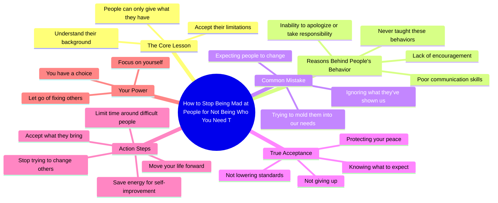

# Stop Being Mad at People for Not Meeting Your Needs

> 🌐 **Read this in:** **English** · [中文](../../zh-CN/2026-07/tiktok-transcript-mindset-success-selfimprovement-relationships-boundaries-a180.md)

> **Creator:** [@drtroylee](https://www.tiktok.com/@drtroylee) · **Views:** 994.9K · **Posted:** 2026-07-19 · **Niche:** other
>
> **TL;DR:** Directly addresses a common emotional pain point and offers a solution, immediately engaging viewers seeking relief.

[Watch original video →](https://www.tiktok.com/@drtroylee/video/7662812710014389534?is_from_webapp=1&sender_device=pc&web_id=7664062104052139534)

## Why This Went Viral

## Hook (first 3 seconds)
- **Verbatim opening:** "Learn how not to be mad at people for not being who you need them to be."
- **Hook pattern:** **Bold claim** (offering a solution to a universal frustration) + **contrast** (being mad vs. not being mad).
- **Why it stops scrolling:** It names a painful, unspoken experience (resentment toward others for not meeting expectations) and promises a release from that pain. The word "learn" signals actionable wisdom, not just venting.

## Emotional Rhythm
- **Beat 1 — Recognition (0–5s):** "One of the hardest lessons in life" — immediately validates the viewer's struggle.
- **Beat 2 — Empathy (5–15s):** "Some people don't know how to encourage because they've never been encouraged" — builds understanding, not blame.
- **Beat 3 — Tension (15–20s):** "The mistake that we make is expecting people to become who we need them to be" — calls out the viewer's own pattern, creating a moment of discomfort.
- **Beat 4 — Relief (20–30s):** "Acceptance isn't giving up… it's protecting your peace" — reframes acceptance as strength, not weakness.
- **Beat 5 — Empowerment (30–40s):** "When you stop trying to change everyone… your life starts to move forward" — climax: the payoff for letting go.
- **Beat 6 — Closure (40–45s):** "Can't fix these folks… you have the choice. Love you." — soft landing, personal affection.

## Keyword Density
| Keyword/Phrase | Frequency (approx) | Driver |
|----------------|-------------------|--------|
| people / them | 10+ | **Algorithmic reach** (broad, searchable term) |
| need / needed | 4 | **Emotional pull** (desire, lack) |
| acceptance | 2 | **Emotional pull** (core theme) |
| change / trying to change | 3 | **Emotional pull** (frustration, effort) |
| peace | 2 | **Emotional pull** (aspiration) |
| choice | 1 (climax) | **Emotional pull** (empowerment) |
| life / lesson | 3 | **Algorithmic reach** (self-help category) |

- **Algorithmic reach:** "people," "life," "lesson" — high-volume keywords that help the video surface in self-help and relationship advice feeds.
- **Emotional pull:** "need," "acceptance," "peace," "choice" — trigger reflection and shareability because they name a desired state.

## Why It Spreads
1. **Names a universal pain point without shaming.** "The mistake that we make" includes everyone — the viewer feels seen, not judged. This lowers defensiveness and increases share-to-save ratio.
2. **Reframes a hard truth as a gift.** "Acceptance isn't giving up… it's protecting your peace" — this twist flips the narrative from "you're weak for staying" to "you're strong for choosing peace." That reframe is highly shareable.
3. **Ends with a direct, personal sign-off.** "Love you" — breaks the fourth wall, creates intimacy. Viewers feel the speaker is talking *to them*, not at them. This drives comment engagement ("needed this").
4. **Rhythmic repetition of "some people don't know how to…"** — creates a hypnotic, memorable cadence that makes the message stick and easier to quote in captions or reposts.
5. **Climax is a clear, actionable takeaway.** "You can only limit your time around them or accept" — gives two concrete choices, no ambiguity. Viewers can immediately apply it and tag a friend.

## What You Can Steal
1. **Open with a "problem → solution" sentence.** Don't start with a question or a vague scene. Start with exactly what the viewer will gain: "Learn how not to be mad at people…" — promise the cure before the diagnosis.
2. **Use the "some people… because…" pattern to build empathy without excusing.** This structure (behavior → root cause) makes you sound wise, not preachy. It’s a template: "Some people don't know how to [X] because they've never [Y]."
3. **End with a one-line permission slip + a personal sign-off.** "You have the choice. I'm just saying. Love you." — this combo gives the viewer a clear, low-friction action (choice) and makes them feel cared for. Use it to boost saves and comments.

## Mind Map

## Full Transcript (Generated by [TokTranscript](https://toktranscript.com/?utm_source=github&utm_medium=breakdown&utm_campaign=tool_attribution))

> 📝 Transcripts on this page are auto-generated and show the first 60%. Want to transcribe any TikTok in 30 seconds and get the full version? [Try TokTranscript free →](https://toktranscript.com/?utm_source=github&utm_medium=breakdown&utm_campaign=transcript_cta)

Learn how not to be mad at people for not being who you need them to be. One of the hardest lessons in life is realising that people can only give you what they have and who they are. Some people don't know how to encourage because they've never been encouraged. Some people don't know how to communicate, apologise or accept responsibility for their actions coz they never been taught. That doesn't make it okay, but it does make it understandable. The mistake that we make is expecting people to become who we need them to be rather than what they've shown us that they are.

*[Read the full transcript on TokTranscript →](https://toktranscript.com/plaza/tiktok-transcript-mindset-success-selfimprovement-relationships-boundaries-a180?utm_source=github&utm_medium=breakdown&utm_campaign=transcript_full)*

## Browse More

- All [other](../../by-niche/en/other.md) breakdowns
- All [Problem-solution promise](../../by-pattern/en/hook-problem-solution-promise.md) examples

## Video Info

| | |
|---|---|
| Creator | [@drtroylee](https://www.tiktok.com/@drtroylee) |
| Original video | [https://www.tiktok.com/@drtroylee/video/7662812710014389534?is_from_webapp=1&sender_device=pc&web_id=7664062104052139534](https://www.tiktok.com/@drtroylee/video/7662812710014389534?is_from_webapp=1&sender_device=pc&web_id=7664062104052139534) |
| Original title | #mindset #success #selfimprovement #relationships #boundaries  |
| Views | 994.9K (994900) |
| Posted | 2026-07-19 |
| Duration | 0s |
| Niche | `other` |
| Hook pattern | `Problem-solution promise` |
| Original language | `en` |
| Available languages | en, zh-CN |
| Generated | 2026-07-22 by [TokTranscript](https://toktranscript.com/) |

---

*This breakdown is for educational analysis under fair use. Original video © [@drtroylee](https://www.tiktok.com/@drtroylee). All transcripts are auto-generated and may contain errors.*

*Want to analyze your own TikToks like this? [free TikTok transcript generator →](https://toktranscript.com/viral-breakdown?utm_source=github&utm_medium=breakdown&utm_campaign=footer_cta)*