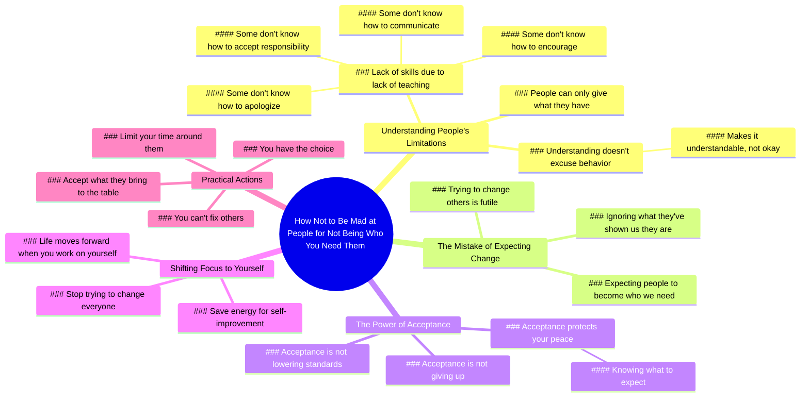

# Stop Expecting People to Be What You Need

> 🌐 **Read this in:** **English** · [中文](../../zh-CN/2026-07/tiktok-transcript-mindset-success-selfimprovement-relationships-boundaries-eee4.md)

> **Creator:** [@drtroylee](https://www.tiktok.com/@drtroylee) · **Views:** 1.0M · **Posted:** 2026-07-19 · **Niche:** other
>
> **TL;DR:** Directly addresses a common emotional pain point and promises a solution, instantly engaging viewers.

[Watch original video →](https://www.tiktok.com/@drtroylee/video/7662812710014389534?is_from_webapp=1&sender_device=pc&web_id=7664244124723971598)

## Why This Went Viral

## Hook (first 3 seconds)
- **Verbatim opening:** "Learn how not to be mad at people for not being who you need them to be."
- **Hook pattern:** **Bold claim + solution promise** (directly addresses a painful relational frustration).
- **Why it stops scroll:** It names a universal, emotionally charged problem (anger at unmet expectations) and offers a path to relief — viewers feel seen and immediately want the answer.

## Emotional Rhythm
1. **Curiosity + Validation** (0–5s): "Learn how not to be mad…" — viewer feels understood.
2. **Empathy + Explanation** (5–15s): "Some people don't know how to encourage because they've never been encouraged." — builds compassion, reduces blame.
3. **Tension** (15–20s): "The mistake we make is expecting people to become who we need them to be rather than what they've shown us they are." — sharp insight creates a "aha" moment.
4. **Relief + Permission** (20–30s): "Acceptance isn't giving up… it's just protecting your peace." — reframes acceptance as strength, not weakness.
5. **Motivation + Call to Action** (30–35s): "When you stop trying to change everyone… your life starts to move forward." — climax: the payoff of the lesson.
6. **Warm closure** (35–40s): "Can't fix these folks… You have the choice. Love you." — leaves viewer feeling empowered and cared for.

## Keyword Density
- **"People"** (7x) — algorithmic reach (high-frequency topic, relational content).
- **"Need / needed"** (5x) — emotional pull (universal desire for validation).
- **"Acceptance / accept"** (4x) — core concept, drives emotional resonance.
- **"Change"** (3x) — algorithmic (self-improvement niche) + emotional (frustration release).
- **"Peace"** (2x) — emotional anchor (desired outcome).
- **"Choice"** (2x) — empowerment trigger (high shareability).
- **"Understandable"** (1x) — key empathy word, lowers defensiveness.

**Algorithmic drivers:** "people," "change," "life" — broad, searchable, high-volume topics.  
**Emotional pull:** "need," "acceptance," "peace," "choice" — create relatability and a sense of control.

## Why It Spreads
1. **Universal pain point named immediately** — "not being who you need them to be" applies to partners, parents, friends, bosses. Viewers self-identify in seconds.
2. **Reframes a negative emotion as wisdom** — "mad" → "understandable" → "protect your peace." This flips resentment into self-respect, making it highly shareable as "life advice."
3. **Permission to stop trying to fix others** — "Can't fix these folks. You can only limit your time." This validates the viewer's exhaustion and gives them a socially acceptable exit strategy.
4. **Emotional closure with warmth** — "Love you" at the end creates a parasocial bond, increasing saves and shares (viewers feel personally spoken to).
5. **Rhythmic, quotable structure** — lines like "Acceptance isn't giving up… it's protecting your peace" are easily clipped, captioned, and reposted as standalone quotes.

## What You Can Steal
1. **Open with a "solution to a painful pattern"** — not a question, but a direct command ("Learn how not to be mad…"). This signals immediate value and hooks the frustrated viewer.
2. **Use "some people" as a compassionate buffer** — instead of blaming, say "Some people don't know how to X because they've never been Y." This keeps the audience from feeling attacked while still delivering truth.
3. **End with a warm, personal sign-off** — "Love you" or "I'm just saying" creates intimacy and increases likelihood of saves, comments, and shares (viewers feel they received a private message).

## Mind Map

## Full Transcript (Generated by [TokTranscript.com](https://toktranscript.com/?utm_source=github&utm_medium=breakdown&utm_campaign=tool_attribution))

> 📝 Transcripts on this page are auto-generated and show the first 60%. Want to transcribe any TikTok in 30 seconds and get the full version? [Try TokTranscript free →](https://toktranscript.com/?utm_source=github&utm_medium=breakdown&utm_campaign=transcript_cta)

Learn how not to be mad at people for not being who you need them to be. One of the hardest lessons in life is realising that people can only give you what they have and who they are. Some people don't know how to encourage because they've never been encouraged. Some people don't know how to communicate, apologise or accept responsibility for their actions coz they never been taught. That doesn't make it okay, but it does make it understandable. The mistake that we make is expecting people to become who we need them to be rather than what they've shown us that they are.

*[Read the full transcript on TokTranscript →](https://toktranscript.com/plaza/tiktok-transcript-mindset-success-selfimprovement-relationships-boundaries-eee4?utm_source=github&utm_medium=breakdown&utm_campaign=transcript_full)*

## Browse More

- All [other](../../by-niche/en/other.md) breakdowns
- All [Problem-Solution Promise](../../by-pattern/en/hook-problem-solution-promise.md) examples

## Video Info

| | |
|---|---|
| Creator | [@drtroylee](https://www.tiktok.com/@drtroylee) |
| Original video | [https://www.tiktok.com/@drtroylee/video/7662812710014389534?is_from_webapp=1&sender_device=pc&web_id=7664244124723971598](https://www.tiktok.com/@drtroylee/video/7662812710014389534?is_from_webapp=1&sender_device=pc&web_id=7664244124723971598) |
| Original title | #mindset #success #selfimprovement #relationships #boundaries  |
| Views | 1.0M (1000000) |
| Posted | 2026-07-19 |
| Duration | 0s |
| Niche | `other` |
| Hook pattern | `Problem-Solution Promise` |
| Original language | `en` |
| Available languages | en, zh-CN |
| Generated | 2026-07-21 by [TokTranscript](https://toktranscript.com/) |

---

*This breakdown is for educational analysis under fair use. Original video © [@drtroylee](https://www.tiktok.com/@drtroylee). All transcripts are auto-generated and may contain errors.*

*Want to analyze your own TikToks like this? [TokTranscript.com →](https://toktranscript.com/viral-breakdown?utm_source=github&utm_medium=breakdown&utm_campaign=footer_cta)*