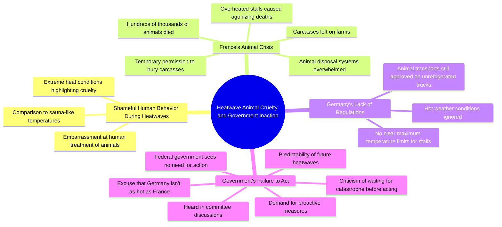

# Heatwave Animal Suffering in French Farms

> 🌐 **Read this in:** **English** · [中文](../../zh-CN/2026-07/tiktok-transcript-muss-es-erst-zur-katastrophe-kommen-tierhaltung-hitzewelle-t-5813.md)

> **Creator:** [@zoe.gruene](https://www.tiktok.com/@zoe.gruene) · **Views:** 1.2M · **Posted:** 2026-07-19 · **Niche:** other
>
> **TL;DR:** Opens with a powerful, self-critical emotional statement that instantly grabs attention and signals moral urgency.

[Watch original video →](https://vt.tiktok.com/ZSXxPuh7E/)

## Why This Went Viral

## Hook (first 3 seconds)
- **Verbatim opening line:** "Manchmal schäm ich mich wirklich dafür 1 Mensch zu sein und das gilt jetzt besonders bei diesen heißen Temperaturen wenn ich sehe wie wir mit Tieren umgehen"
- **Hook pattern:** Emotional shame confession + contrast (Mensch vs. Tiere) + urgency (heiße Temperaturen)
- **Why it stops scroll:** The speaker opens with a raw, uncomfortable admission of shame that feels vulnerable and confrontational. It immediately signals "this is not a normal political speech" and creates dissonance — viewers expect a politician to defend policy, not express personal disgust.

## Emotional Rhythm
- **Beat 1 — Shame & Disgust (0–5s):** "schäm ich mich" + "wie wir mit Tieren umgehen" — visceral, personal, sets moral high ground
- **Beat 2 — Horror & Scale (5–15s):** "hunderttausende Tiere qualvoll... verreckt" — graphic, specific numbers, image of suffering
- **Beat 3 — Systemic Failure (15–25s):** "tierkörperbeseitigungsanlagen nich mehr hinterhergekommen" + "Kadava... zurückgelassen" — bureaucratic breakdown, adds concrete detail
- **Beat 4 — Fear & Projection (25–35s):** "sowas in Deutschland nicht passieren kann... aber auch hier haben wir keine klaren Höchsttemperaturen" — shifts from France to Germany, creates local tension
- **Beat 5 — Anger & Frustration (35–45s):** "Bundesregierung... kein Handlungsbedarf" + "es ist doch total absehbar" — direct accusation, builds to climax
- **Beat 6 — Climax & Moral Outrage (45–55s):** "warum muss denn immer erst eine Katastrophe passieren bis diese Bundesregierung sich mal entscheidet zu handeln" — peak emotional punch, rhetorical question
- **Beat 7 — Abrupt Cut (55–60s):** "Ihre Redezeit ist zu Ende" — cold, procedural end that contrasts with the emotional intensity, leaving viewer unsatisfied (which drives sharing)

## Keyword Density
| Keyword/Phrase | Frequency (approx.) | Function |
|---|---|---|
| **Tiere / Tieren** | 4 | Emotional pull — moral weight, empathy trigger |
| **Temperaturen / heiß / Hitzesommer** | 4 | Algorithmic reach — seasonal, trending topic |
| **Frankreich** | 3 | Algorithmic reach — geographic comparison, news hook |
| **Bundesregierung** | 2 | Algorithmic reach — political accountability |
| **Katastrophe** | 2 | Emotional pull — fear, urgency, drama |
| **Handeln / Handlungsbedarf** | 2 | Emotional pull — call to action, frustration |
| **qualvoll / verreckt** | 2 | Emotional pull — graphic, shareable outrage |
| **keine klaren Höchsttemperaturen** | 1 (but central) | Algorithmic reach — policy gap, searchable issue |

## Why It Spreads
1. **Moral outrage + specific, verifiable facts** — "hunderttausende Tiere qualvoll... verreckt" + "tierkörperbeseitigungsanlagen nich mehr hinterhergekommen" — this is not generic anger; it's data-driven fury that feels credible and urgent. Viewers share because they feel informed and outraged.
2. **The "it could happen here" projection** — "auch hier haben wir keine klaren Höchsttemperaturen" — the video shifts from "look at France" to "this is us next" in under 10 seconds. This creates local fear that drives shares within Germany/neighboring countries.
3. **The climax question is a perfect share trigger** — "warum muss denn immer erst eine Katastrophe passieren bis diese Bundesregierung sich mal entscheidet zu handeln?" — this is a universal political frustration that resonates across parties, making it non-partisan outrage that anyone can share.
4. **The cold, procedural ending creates emotional whiplash** — "Ihre Redezeit ist zu Ende" after such heated emotion makes the viewer feel cut off, which increases the urge to comment/share to "finish" the emotional arc.
5. **Contrast between personal shame and institutional failure** — opening with "schäm ich mich" as a politician creates a rare moment of vulnerability, which makes the video feel authentic and unscripted — a key factor in political content going viral.

## What You Can Steal
1. **Open with a personal, uncomfortable confession** — "Manchmal schäm ich mich..." works because it's unexpected from a politician. In any niche, starting with "I'm embarrassed to admit..." or "I can't believe I'm saying this..." creates immediate intrigue and emotional buy-in.
2. **Use the "this is happening now → it will happen to you" bridge** — the video spends 15 seconds on France, then pivots to Germany. For any trend/crisis, show a real example first, then explicitly say "this is where we're headed" to create urgency.
3. **End with a rhetorical question that cannot be answered** — "warum muss denn immer erst eine Katastrophe passieren?" forces the viewer to mentally complete the thought. This increases engagement (comments, shares) because people want to answer the question or vent agreement.

## Mind Map

## Full Transcript (Generated by [TokTranscript](https://toktranscript.com/?utm_source=github&utm_medium=breakdown&utm_campaign=tool_attribution))

> 📝 Transcripts on this page are auto-generated and show the first 60%. Want to transcribe any TikTok in 30 seconds and get the full version? [Try TokTranscript free →](https://toktranscript.com/?utm_source=github&utm_medium=breakdown&utm_campaign=transcript_cta)

manchmal schäm ich mich wirklich dafür 1 Mensch zu sein und das gilt jetzt besonders bei diesen heißen Temperaturen wenn ich sehe wie wir mit Tieren umgehen in Frankreich sind in den letzten Wochen hunderttausende Tiere qualvoll in den viel zu überhitzten stellen bei wirklich saunaartigen Temperaturen verreckt man kanns nich Anders sagen es waren so viele dass die tierkörperbeseitigungsanlagen nich mehr hinterhergekommen sind die kadava wurden teilweise auf den Höfen zurückgelassen man konnte sie da zeitweise sogar vergraben und jetzt wollen wir uns natürlich alle wünschen dass sowas in Deutschland nicht passieren kann aber auch hier haben wir keine klaren Höchsttemperaturen für Stelle und es werden selbst bei heißesten Temperaturen immer noch tiertransporte auf ungekühlten

*[Read the full transcript on TokTranscript →](https://toktranscript.com/plaza/tiktok-transcript-muss-es-erst-zur-katastrophe-kommen-tierhaltung-hitzewelle-t-5813?utm_source=github&utm_medium=breakdown&utm_campaign=transcript_full)*

## Browse More

- All [other](../../by-niche/en/other.md) breakdowns
- All [Emotional confession](../../by-pattern/en/hook-emotional-confession.md) examples

## Video Info

| | |
|---|---|
| Creator | [@zoe.gruene](https://www.tiktok.com/@zoe.gruene) |
| Original video | [https://vt.tiktok.com/ZSXxPuh7E/](https://vt.tiktok.com/ZSXxPuh7E/) |
| Original title | Muss es erst zur Katastrophe kommen? #tierhaltung #hitzewelle #tiersc... |
| Views | 1.2M (1200000) |
| Posted | 2026-07-19 |
| Duration | 0s |
| Niche | `other` |
| Hook pattern | `Emotional confession` |
| Original language | `en` |
| Available languages | en, zh-CN |
| Generated | 2026-07-20 by [TokTranscript](https://toktranscript.com/) |

---

*This breakdown is for educational analysis under fair use. Original video © [@zoe.gruene](https://www.tiktok.com/@zoe.gruene). All transcripts are auto-generated and may contain errors.*

*Want to analyze your own TikToks like this? [TokTranscript →](https://toktranscript.com/viral-breakdown?utm_source=github&utm_medium=breakdown&utm_campaign=footer_cta)*