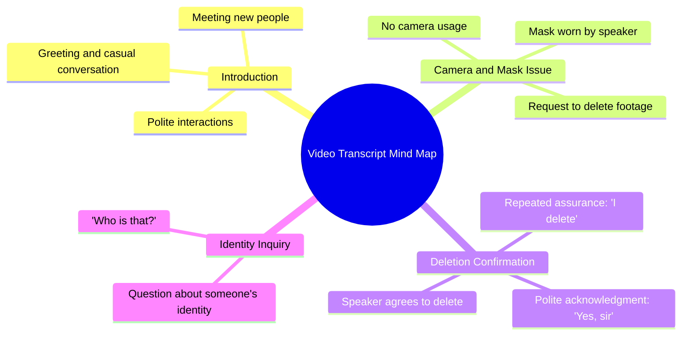

# N3on Accidentally Films a Masked Stranger

> 🌐 **Read this in:** **English** · [中文](../../zh-CN/2026-07/tiktok-transcript-n3on-did-not-realise-who-he-just-put-on-camera-n3on-clips-fy-3311.md)

> **Creator:** [@clips_are_good](https://www.tiktok.com/@clips_are_good) · **Views:** 12.2M · **Posted:** 2026-07-30 · **Niche:** other
>
> **TL;DR:** The hook sets up a normal greeting then subverts it with a paranoid request to delete footage.

[Watch original video →](https://vm.tiktok.com/ZN8eufTAY/)

## Why This Went Viral

## Hook (first 3 seconds)
- **Verbatim opening:** "Hello. How you guys doing? Hey, nice to meet you. Nice to meet you. No camera. I use mask."
- **Hook pattern:** Scene + Question (immediate social interaction with a twist)
- **Why it stops scroll:** The polite, friendly greeting instantly feels warm and personal — but the quick shift to "No camera. I use mask" creates a subtle tension. The viewer is pulled in by the contrast between normal conversation and an unexpected request (mask + deletion). It feels like a real, unscripted moment, which triggers curiosity.

## Emotional Rhythm
- **Beat 1 (Curiosity):** Friendly greeting — "Hello. How you guys doing?" — feels safe, normal.
- **Beat 2 (Mild tension):** "No camera. I use mask." — introduces an odd, cautious behavior.
- **Beat 3 (Suspense):** "Can you delete this, please?" — request to delete footage feels urgent, maybe secretive.
- **Beat 4 (Relief + Twist):** "Oh, yes, I will. I delete. I delete. I delete. Yes, sir." — the compliance is almost too fast, creating a new layer of unease.
- **Beat 5 (Climax):** "Who is that?" — the final line shifts focus to an off-screen presence, leaving an open-ended mystery.
- **Climax moment:** The last line — "Who is that?" — because it breaks the pattern and suggests something else is happening.

## Keyword Density
- **"Delete"** (repeated 4 times) — Algorithmic reach: triggers search for privacy, consent, or viral "deleted footage" trends. Emotional pull: creates urgency and unease.
- **"Mask"** — Algorithmic: ties to pandemic-era or anonymity content. Emotional: signals caution, fear, or disguise.
- **"Camera"** — Algorithmic: high-volume keyword for video-related content. Emotional: makes viewer self-aware of being watched.
- **"Nice to meet you"** — Emotional: disarming, friendly contrast to the tension.
- **"Yes, sir"** — Emotional: submissive tone, adds power dynamic and mystery.
- **"Who is that"** — Emotional: cliffhanger, drives comments and speculation.

## Why It Spreads
- **Mystery + cliffhanger:** The final line "Who is that?" forces viewers to comment, tag friends, or rewatch to catch details. This drives engagement signals (comments, replays) that boost algorithmic reach.
- **Unresolved tension:** The request to delete footage is never fully explained. Viewers are left wondering if the person is hiding something, in danger, or part of a prank. This ambiguity fuels shares and speculation.
- **Relatability + discomfort:** The polite opening followed by an awkward request mirrors real-life social awkwardness. People share because they've "been there" or find the interaction cringe-funny.
- **Short, repeatable structure:** The entire interaction is under 30 seconds, making it easy to loop, remix, or stitch. The "delete delete delete" repetition is meme-ready.
- **Algorithm-friendly pattern:** High keyword density ("delete," "mask," "camera") plus a clear hook and cliffhanger match the platform's preference for high-retention, high-comment content.

## What You Can Steal
1. **Use a "polite tension" hook:** Start with a warm, normal interaction (greeting, smile) then pivot to an unexpected request or rule. This contrast grabs attention fast.
2. **End with an unanswered question:** The last line ("Who is that?") is a built-in comment bait. Always leave one loose thread that forces viewers to speculate or ask for more.
3. **Repeat a key word for rhythm:** Saying "delete" four times creates a hypnotic, meme-like cadence. Pick one action word and repeat it in a short burst to make the clip sticky and quotable.

## Mind Map

## Full Transcript (Generated by [try this transcription tool](https://toktranscript.com/?utm_source=github&utm_medium=breakdown&utm_campaign=tool_attribution))

> 📝 Transcripts on this page are auto-generated and show the first 60%. Want to transcribe any TikTok in 30 seconds and get the full version? [Try TokTranscript free →](https://toktranscript.com/?utm_source=github&utm_medium=breakdown&utm_campaign=transcript_cta)

Hello. How you guys doing? Hey, nice to meet you. Nice to meet you. No camera. I use mask. Yeah, yeah.

*[Read the full transcript on TokTranscript →](https://toktranscript.com/plaza/tiktok-transcript-n3on-did-not-realise-who-he-just-put-on-camera-n3on-clips-fy-3311?utm_source=github&utm_medium=breakdown&utm_campaign=transcript_full)*

## Browse More

- All [other](../../by-niche/en/other.md) breakdowns
- All [Unexpected response](../../by-pattern/en/hook-unexpected-response.md) examples

## Video Info

| | |
|---|---|
| Creator | [@clips_are_good](https://www.tiktok.com/@clips_are_good) |
| Original video | [https://vm.tiktok.com/ZN8eufTAY/](https://vm.tiktok.com/ZN8eufTAY/) |
| Original title | N3on did NOT realise WHO he just put on camera 😨😳 #n3on #clips #fyp #... |
| Views | 12.2M (12200000) |
| Posted | 2026-07-30 |
| Duration | 0s |
| Niche | `other` |
| Hook pattern | `Unexpected response` |
| Original language | `en` |
| Available languages | en, zh-CN |
| Generated | 2026-07-31 by [TokTranscript](https://toktranscript.com/) |

---

*This breakdown is for educational analysis under fair use. Original video © [@clips_are_good](https://www.tiktok.com/@clips_are_good). All transcripts are auto-generated and may contain errors.*

*Want to analyze your own TikToks like this? [TokTranscript →](https://toktranscript.com/viral-breakdown?utm_source=github&utm_medium=breakdown&utm_campaign=footer_cta)*