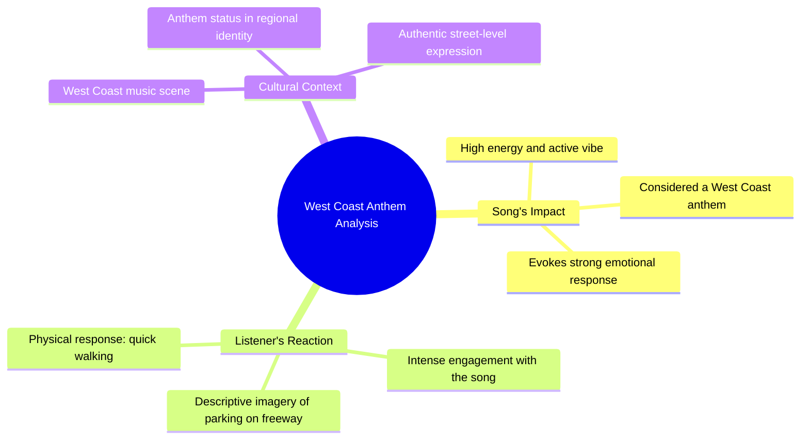

# West Coast Anthem Gets Man Ready to Park on Freeway

> 🌐 **Read this in:** **English** · [中文](../../zh-CN/2026-07/tiktok-transcript-og-trippin-lol-og-unc-anthem-westcoast-cali-5641.md)

> **Creator:** [@wenceslas007](https://www.tiktok.com/@wenceslas007) · **Views:** 1.1M · **Posted:** 2026-07-04 · **Niche:** entertainment
>
> **TL;DR:** The hook creates urgency and curiosity by promising a hot take before abruptly leaving.

[Watch original video →](https://www.tiktok.com/@wenceslas007/video/7651309168392965406?_r=1&_t=ZN-97lLQeyAqO6)

## Why This Went Viral

## Hook (first 3 seconds)
- **Verbatim opening:** "I'm gonna say this and I'm gonna get the fuck out of here, nigga."
- **Hook pattern:** Bold claim + threat of departure (creates urgency and stakes)
- **Why it stops scrolling:** The speaker immediately signals high stakes ("get the fuck out") and a controversial or risky opinion. The aggressive tone and profanity demand attention, while "I'm gonna say this" creates a cliffhanger that compels viewers to hear the hot take before it's gone.

## Emotional Rhythm
- **Beat 1 (0–2s):** Tension – aggressive, confrontational opening ("I'm gonna say this and I'm gonna get the fuck out")
- **Beat 2 (2–5s):** Curiosity – introduces the subject ("that song") with high emotional charge ("so damn active")
- **Beat 3 (5–8s):** Resonance – cultural specificity ("West Coast anthem") builds in-group connection
- **Beat 4 (8–12s):** Visual climax – hyperbolic, vivid imagery ("park the car on the freeway... get out and start quick walking") creates a laugh-out-loud mental picture
- **Beat 5 (12–14s):** Release – the absurdity of the image lands as comedy, leaving the viewer satisfied and likely to rewatch or share

## Keyword Density
- **"Nigga"** (4x) – drives algorithmic reach via high engagement (comments, shares) and emotional pull (cultural authenticity, in-group bonding)
- **"Song"** (1x, implied throughout) – algorithmic relevance to music content
- **"Active"** (1x) – emotional pull; a unique descriptor that sparks curiosity
- **"West Coast"** (1x) – algorithmic reach via geographic/regional music communities
- **"Anthem"** (1x) – emotional pull; elevates the song's status
- **"Park the car" / "freeway" / "quick walking"** – visual keywords that drive shareability (easily quotable, meme-able imagery)

## Why It Spreads
1. **High-stakes framing** – "I'm gonna say this and I'm gonna get the fuck out" creates a "forbidden opinion" dynamic. Viewers feel they're getting exclusive, unfiltered content, which drives watch time and shares.
2. **Hyper-specific, absurd imagery** – "park the car on the freeway... start quick walking" is a vivid, ridiculous visual that's instantly memorable. This makes the video quotable and easy to remix or react to, fueling remix culture.
3. **Cultural in-group signaling** – "West Coast anthem" and the repeated use of "nigga" (in a specific cultural context) create a sense of insider knowledge. Viewers who identify with West Coast hip-hop culture feel validated and are more likely to share within their community.
4. **Emotional whiplash** – The video starts aggressive, then pivots to absurd comedy. This contrast keeps viewers engaged through the entire short clip and increases the likelihood of rewatching to catch the tonal shift.
5. **Low-effort, high-reward format** – The "hot take + walk away" structure is easy to replicate. Viewers can imagine themselves or others doing the same, making it a template for user-generated content (UGC) that spreads organically.

## What You Can Steal
1. **The "threat of departure" hook** – Open with a line that implies you're about to say something risky and then leave immediately. This creates urgency and makes viewers feel they're getting exclusive, unfiltered content. Example: "I'm about to say something that'll get me blocked, so listen fast."
2. **Paint a ridiculous, specific mental image** – Instead of saying "I love this song," describe an absurd action that proves your devotion. The more specific and visual, the more shareable. Example: "I'd leave my own birthday party to go listen to this in the car."
3. **Use in-group language to build community** – One well-placed cultural reference (like "West Coast anthem") or a shared vernacular term can turn a general audience into a loyal tribe. Viewers who identify with the reference feel seen and are more likely to engage and share.

## Mind Map

## Full Transcript (Generated by [TokTranscript.com](https://toktranscript.com/?utm_source=github&utm_medium=breakdown&utm_campaign=tool_attribution))

> 📝 Transcripts on this page are auto-generated and show the first 60%. Want to transcribe any TikTok in 30 seconds and get the full version? [Try TokTranscript free →](https://toktranscript.com/?utm_source=github&utm_medium=breakdown&utm_campaign=transcript_cta)

I'm gonna say this and I'm gonna get the fuck out of here, nigga. That song is so damn active, nigga. And such a West Coast anthem, nigga.

*[Read the full transcript on TokTranscript →](https://toktranscript.com/plaza/tiktok-transcript-og-trippin-lol-og-unc-anthem-westcoast-cali-5641?utm_source=github&utm_medium=breakdown&utm_campaign=transcript_full)*

## Browse More

- All [entertainment](../../by-niche/en/entertainment.md) breakdowns
- All [Urgent declaration + immediate exit](../../by-pattern/en/hook-urgent-declaration-immediate-exit.md) examples

## Video Info

| | |
|---|---|
| Creator | [@wenceslas007](https://www.tiktok.com/@wenceslas007) |
| Original video | [https://www.tiktok.com/@wenceslas007/video/7651309168392965406?_r=1&_t=ZN-97lLQeyAqO6](https://www.tiktok.com/@wenceslas007/video/7651309168392965406?_r=1&_t=ZN-97lLQeyAqO6) |
| Original title | Og trippin lol #og #unc #anthem #westcoast #cali |
| Views | 1.1M (1100000) |
| Posted | 2026-07-04 |
| Duration | 0s |
| Niche | `entertainment` |
| Hook pattern | `Urgent declaration + immediate exit` |
| Original language | `en` |
| Available languages | en, zh-CN |
| Generated | 2026-07-07 by [TokTranscript](https://toktranscript.com/) |

---

*This breakdown is for educational analysis under fair use. Original video © [@wenceslas007](https://www.tiktok.com/@wenceslas007). All transcripts are auto-generated and may contain errors.*

*Want to analyze your own TikToks like this? [TokTranscript →](https://toktranscript.com/viral-breakdown?utm_source=github&utm_medium=breakdown&utm_campaign=footer_cta)*