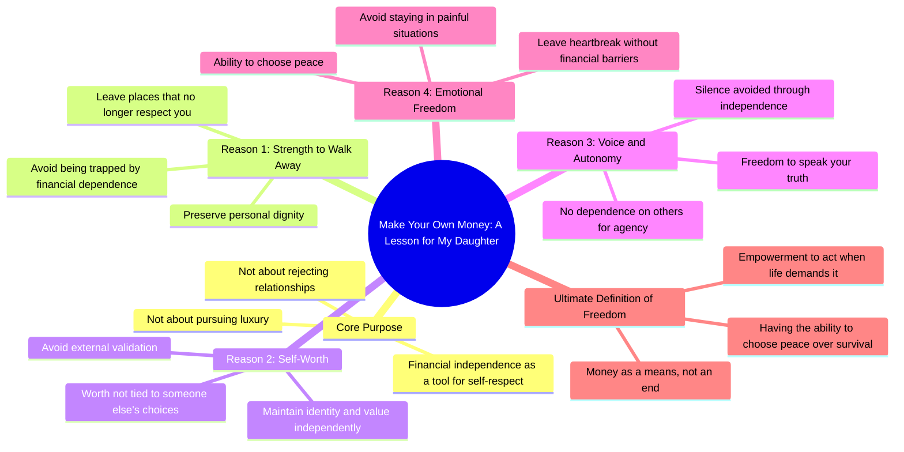

# Teach Your Daughter Financial Independence for Self-Respect

> 🌐 **Read this in:** **English** · [中文](../../zh-CN/2026-07/tiktok-transcript-one-day-i-will-tell-my-daughter-this-make-your-own-money-not-fc83.md)

> **Creator:** [@loudthoughtsforyou](https://www.tiktok.com/@loudthoughtsforyou) · **Views:** 1.9M · **Posted:** 2026-07-10 · **Niche:** other
>
> **TL;DR:** Opens with a personal promise and a direct command that immediately challenges conventional wisdom.

[Watch original video →](https://www.tiktok.com/t/ZTSV8MBss/)

## Why This Went Viral

## Hook (first 3 seconds)
- **Verbatim opening line:** "I will tell my daughter this one day. Make your own money."
- **Hook pattern:** Bold claim + emotional promise (parental wisdom layered with a feminist/self-worth message).
- **Why it stops scroll:** It weaponizes a universal emotional trigger—parental love—but immediately subverts the expected "gold digger" trope. The viewer expects "so you don't need a man," but the next line flips to "so you can leave a place that no longer respects you." That reversal creates a micro-jolt of surprise + emotional resonance.

## Emotional Rhythm
- **Beat 1 (Curiosity + Trust):** "I will tell my daughter this one day." — Sets up a vulnerable, intimate frame. Viewer leans in.
- **Beat 2 (Tension + Defiance):** "Make your own money. Not because you won't need a man, not because you want luxury." — Subverts cliché. Creates cognitive dissonance.
- **Beat 3 (Pain + Recognition):** "But because one day you might need the strength to walk away from a place that no longer respects you." — The twist. Universal pain point (toxic relationships, financial entrapment).
- **Beat 4 (Resonance + Catharsis):** "So your worth is never tied to someone else's choices. So your voice is never silenced by dependence." — Repetition of "So" builds a rhythmic crescendo. Viewer feels seen.
- **Climax:** "Because freedom is not just having money. Freedom is having the ability to choose peace over survival." — The thesis lands. It's a mic-drop moment that reframes money as a tool for autonomy, not greed.
- **Final Beat (Call to Action, implicit):** "When life asks you to." — Leaves a haunting, open-ended question in the viewer's mind.

## Keyword Density
- **"Money"** (3x) — Algorithmic reach (high-search-volume term). Also emotional: ties financial literacy to self-worth.
- **"Freedom"** (2x) — Emotional pull. Abstract, aspirational. Drives shares (people want to be associated with freedom).
- **"Walk away"** (1x, but implied throughout) — Action verb. High emotional charge. Drives engagement from survivors of toxic relationships.
- **"Respects" / "Respect"** (1x) — Core value. Algorithmic + emotional. Low competition, high resonance.
- **"Strength"** (1x) — Emotional anchor. Implies vulnerability overcome. Drives saves (people want to remember this line).
- **"Peace"** (1x) — Contrast with "survival." Creates a binary that's easy to retweet/screenshot.
- **"Dependence"** (1x) — Negative emotional trigger. Drives comments from people who've felt trapped.
- **"Choice"** (1x) — Agency word. Algorithmic (high engagement in self-help niches).

## Why It Spreads
1. **The "Subverted Expectation" Hook:** The first line sets up a cliché ("make your own money so you don't need a man"), but immediately flips it into a trauma-informed, feminist empowerment message. This surprise triggers a dopamine hit + compels viewers to rewatch or share to prove they "get it."
2. **Universal Pain Point + Specific Audience:** The video targets women (directly "my daughter"), but the emotional core—feeling trapped in a situation you can't afford to leave—is universal. Men, queer people, and anyone in a toxic job/relationship also feel seen. This expands the share circle beyond the niche.
3. **Rhythmic Repetition + "So" Structure:** The "So your worth... So your voice... So you never have to stay" pattern is hypnotic. It mimics a sermon or manifesto. Viewers are more likely to save, quote, or remix because the lines are modular and quotable.
4. **The "Freedom vs. Survival" Binary:** The climax reframes a material need (money) as a spiritual need (peace). This binary is emotionally sticky. It gets screenshotted, turned into memes, and used as captions. The contrast is easy to remember and repeat.
5. **Open-Ended Final Line:** "When life asks you to." — This is a cliffhanger. It invites the viewer to complete the thought, which drives comments ("What if life never asks?" "But what if you can't afford to leave?"). Comments fuel the algorithm.

## What You Can Steal
1. **Use the "Subverted Expectation" Pattern:** Start with a line your audience has heard 100 times ("Make your own money"), then immediately contradict it with a deeper, more vulnerable truth. This forces a re-engagement.
2. **Structure Your Script with "So" Repetition:** Write 3–4 lines that each begin with "So your..." or "So you never..." This creates a rhythmic, hypnotic flow that feels like a manifesto. It also makes the video easy to quote and remix.
3. **End on a Haunting, Open Question:** Don't resolve the tension. Leave the viewer with an incomplete thought ("When life asks you to") that forces them to comment, save, or share to complete the meaning. This is the highest-leverage engagement tactic.

## Mind Map

## Full Transcript (Generated by [TokTranscript](https://toktranscript.com/?utm_source=github&utm_medium=breakdown&utm_campaign=tool_attribution))

> 📝 Transcripts on this page are auto-generated and show the first 60%. Want to transcribe any TikTok in 30 seconds and get the full version? [Try TokTranscript free →](https://toktranscript.com/?utm_source=github&utm_medium=breakdown&utm_campaign=transcript_cta)

I will tell my daughter this one day. Make your own money. Not because you won't need a man, not because you want luxury. But because one day you might need the strength to walk away from a place that no longer respects you. So your worth is never tied to someone else's choices. So your voice is never silenced by dependence.

*[Read the full transcript on TokTranscript →](https://toktranscript.com/plaza/tiktok-transcript-one-day-i-will-tell-my-daughter-this-make-your-own-money-not-fc83?utm_source=github&utm_medium=breakdown&utm_campaign=transcript_full)*

## Browse More

- All [other](../../by-niche/en/other.md) breakdowns
- All [Promise + Imperative](../../by-pattern/en/hook-promise-imperative.md) examples

## Video Info

| | |
|---|---|
| Creator | [@loudthoughtsforyou](https://www.tiktok.com/@loudthoughtsforyou) |
| Original video | [https://www.tiktok.com/t/ZTSV8MBss/](https://www.tiktok.com/t/ZTSV8MBss/) |
| Original title | One day, I will tell my daughter this: Make your own money. Not becau... |
| Views | 1.9M (1900000) |
| Posted | 2026-07-10 |
| Duration | 0s |
| Niche | `other` |
| Hook pattern | `Promise + Imperative` |
| Original language | `en` |
| Available languages | en, zh-CN |
| Generated | 2026-07-10 by [TokTranscript](https://toktranscript.com/) |

---

*This breakdown is for educational analysis under fair use. Original video © [@loudthoughtsforyou](https://www.tiktok.com/@loudthoughtsforyou). All transcripts are auto-generated and may contain errors.*

*Want to analyze your own TikToks like this? [TokTranscript →](https://toktranscript.com/viral-breakdown?utm_source=github&utm_medium=breakdown&utm_campaign=footer_cta)*