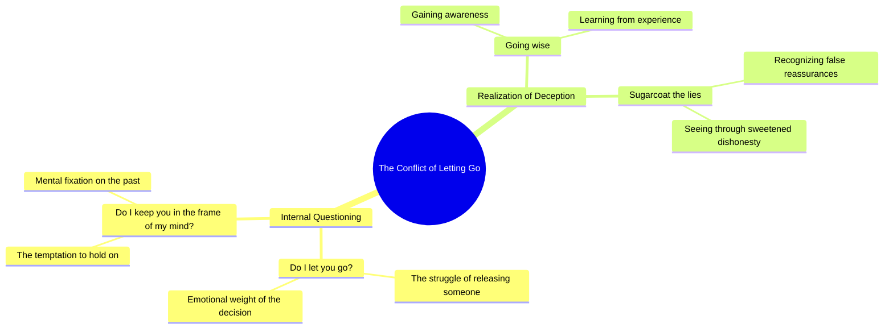

# OOTD: Deciding Whether to Let Go

> 🌐 **Read this in:** **English** · [中文](../../zh-CN/2026-07/tiktok-transcript-ootd-484b.md)

> **Creator:** [@zah1de](https://www.tiktok.com/@zah1de) · **Views:** 2.0M · **Posted:** 2026-07-03 · **Niche:** entertainment
>
> **TL;DR:** Opens with a direct, relatable internal conflict that hooks viewers into the emotional narrative.

[Watch original video →](https://vt.tiktok.com/ZSCXXop95/)

## Why This Went Viral

## Hook (first 3 seconds)
- **Verbatim opening line:** “So I ask myself, do I let you go? Do I keep you in the frame of my mind?”
- **Hook pattern:** Question / internal monologue (emotional dilemma)
- **Why it stops scrolling:** The double question creates instant emotional tension — the viewer is forced to mirror the self-interrogation. It feels raw, unresolved, and deeply personal, which triggers curiosity about the conflict.

## Emotional Rhythm
- **Beat 1 — Curiosity + Tension:** The opening questions pull the viewer into an unresolved internal conflict.
- **Beat 2 — Suspense + Anticipation:** “Now I'm going wise to your sugarcoat the lies” — the line reveals awareness of deception, building a sense of betrayal.
- **Beat 3 — Emotional Climax:** The phrase “sugarcoat the lies” is the punch — it’s the moment of painful clarity, where the speaker shifts from confusion to knowing.
- **Beat 4 — Resonance / Lingering Emotion:** The incomplete sentence structure leaves a hanging feeling, making the viewer replay the emotional weight in their own mind.

## Keyword Density
- **“I”** (repeated 3x) — drives personal identification, algorithmic engagement via first-person relatability
- **“you”** (repeated 2x) — creates direct address, increases emotional pull and comment likelihood
- **“let go”** — high emotional resonance, triggers breakup/closure memory
- **“frame of my mind”** — unique phrase, boosts memorability and shareability
- **“sugarcoat”** — vivid metaphor, algorithmic keyword for deception/relationship content
- **“lies”** — high-emotion trigger word, drives engagement (comments, saves)

## Why It Spreads
- **Relatability via universal conflict:** “Do I let you go?” — the core dilemma of any fading relationship. Viewers instantly project their own story.
- **Emotional cliffhanger effect:** The transcript ends mid-thought (“Now I'm going wise to your sugarcoat the lies”). This incomplete resolution forces viewers to comment, rewatch, or save to finish the thought themselves.
- **Lyrical rhythm + vulnerability:** The phrasing mimics song lyrics or poetry — highly shareable on platforms like TikTok and Instagram Reels, where aesthetic pain resonates.
- **Direct address triggers engagement:** “I ask myself… do I keep you” — the second-person “you” makes viewers feel personally spoken to, increasing comment likelihood.
- **Metaphor density in few words:** “Sugarcoat the lies” is a tight, visual metaphor that sticks in memory — viewers quote it in comments and repost it.

## What You Can Steal
- **Open with a double question that forces self-reflection:** Ask two opposing questions in the first 3 seconds to create instant emotional tension (e.g., “Do I stay quiet? Do I finally speak?”).
- **End on an incomplete thought:** Cut the transcript before resolution — leave the viewer hanging on a vivid metaphor or unfinished sentence. This drives saves and comments.
- **Use one strong, original metaphor as the emotional anchor:** “Sugarcoat the lies” is the line that gets quoted. Craft a single, visual, emotionally charged phrase that encapsulates your entire message.

## Mind Map

## Full Transcript (Generated by [TokTranscript.com](https://toktranscript.com/?utm_source=github&utm_medium=breakdown&utm_campaign=tool_attribution))

> 📝 Transcripts on this page are auto-generated and show the first 60%. Want to transcribe any TikTok in 30 seconds and get the full version? [Try TokTranscript free →](https://toktranscript.com/?utm_source=github&utm_medium=breakdown&utm_campaign=transcript_cta)

So I ask myself, do I let you go? Do I keep you in the frame of my min

*[Read the full transcript on TokTranscript →](https://toktranscript.com/plaza/tiktok-transcript-ootd-484b?utm_source=github&utm_medium=breakdown&utm_campaign=transcript_full)*

## Browse More

- All [entertainment](../../by-niche/en/entertainment.md) breakdowns
- All [Rhetorical Question](../../by-pattern/en/hook-rhetorical-question.md) examples

## Video Info

| | |
|---|---|
| Creator | [@zah1de](https://www.tiktok.com/@zah1de) |
| Original video | [https://vt.tiktok.com/ZSCXXop95/](https://vt.tiktok.com/ZSCXXop95/) |
| Original title | OOTD 🩵 |
| Views | 2.0M (2000000) |
| Posted | 2026-07-03 |
| Duration | 0s |
| Niche | `entertainment` |
| Hook pattern | `Rhetorical Question` |
| Original language | `en` |
| Available languages | en, zh-CN |
| Generated | 2026-07-06 by [TokTranscript](https://toktranscript.com/) |

---

*This breakdown is for educational analysis under fair use. Original video © [@zah1de](https://www.tiktok.com/@zah1de). All transcripts are auto-generated and may contain errors.*

*Want to analyze your own TikToks like this? [TokTranscript →](https://toktranscript.com/viral-breakdown?utm_source=github&utm_medium=breakdown&utm_campaign=footer_cta)*