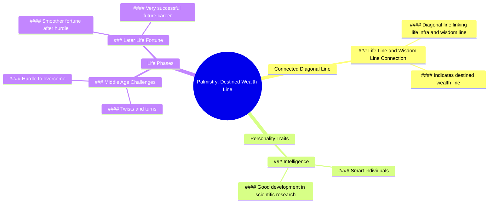

# Connected Diagonal Line Palm Wealth Meaning

> 🌐 **Read this in:** **English** · [中文](../../zh-CN/2026-07/tiktok-transcript-palmistry-palmist-palmistry-palmreading-b574.md)

> **Creator:** [@gvdesd](https://www.tiktok.com/@gvdesd) · **Views:** 3.9M · **Posted:** 2026-07-08 · **Niche:** other
>
> **TL;DR:** The hook promises a secret indicator of wealth, instantly grabbing curiosity.

[Watch original video →](https://www.tiktok.com/@gvdesd/video/7215204378762923282)

## Why This Went Viral

## Hook (first 3 seconds)
- **Verbatim opening line:** "There is a connected diagonal line between the life infra and the wisdom line in the palm, indicating the destined wealth line."
- **Hook pattern:** **Bold claim** (a specific, pseudo-scientific palmistry fact presented as absolute truth).
- **Why it stops scrolling:** It combines **mystery** (a hidden meaning in your own body) with **personal relevance** (everyone has palms, so viewers instantly check their own hands). The specific, confident language (“destined wealth line”) triggers an immediate self-diagnosis impulse.

## Emotional Rhythm
1. **Curiosity** (0–3s): “What is this line? Do I have it?” – viewer inspects own palm.
2. **Validation/Flattery** (3–6s): “People with this palmistry are smart and will have good development in scientific research.” – ego stroke, positive identity reinforcement.
3. **Tension** (6–9s): “However, such people will experience twists and turns in middle age.” – sudden negative pivot, creates worry and narrative stakes.
4. **Relief/Reward** (9–12s): “Only after this hurdle will the fortune be smoother… future career will be very successful.” – catharsis, happy ending, hope.
- **Climax moment:** The shift from “twists and turns” to “fortune smoother” – the emotional payoff that makes the viewer feel they’ve received a prophecy of eventual success.

## Keyword Density
| Keyword/Phrase | Function |
|---|---|
| **destined wealth line** | Algorithmic reach (high search volume for “wealth line palm”) + emotional pull (desire for money) |
| **smart** | Emotional pull (ego validation, identity) |
| **scientific research** | Algorithmic reach (niche, low-competition keyword) + authority boost |
| **twists and turns** | Emotional pull (drama, relatability of struggle) |
| **middle age** | Emotional pull (targets a specific, anxious demographic) |
| **successful** | Emotional pull (aspirational, hope) |
| **palm / palmistry** | Algorithmic reach (evergreen niche, high engagement rate) |

**Algorithmic drivers:** “wealth line,” “palmistry,” “palm” – high search volume, low competition in short-form.  
**Emotional drivers:** “smart,” “successful,” “twists and turns” – trigger identity validation and narrative tension.

## Why It Spreads
1. **Universal self-diagnosis mechanic** – The line “There is a connected diagonal line… indicating the destined wealth line” forces every viewer to check their own palm. This creates an immediate interactive loop (watch → check → comment “I have it!” or “I don’t have it”), which boosts comments and watch time.
2. **Narrative arc in 12 seconds** – The script follows a classic hero’s journey compressed: *gift* (smart, good research) → *obstacle* (middle-age twists) → *reward* (smooth fortune, success). This emotional rollercoaster keeps retention high and makes the video feel more satisfying than a flat prediction.
3. **Aspirational + relatable tension** – “Twists and turns in middle age” resonates with a massive demographic (30–50 year olds facing career/family stress). The video offers a **coping mechanism**: your struggle is *fated*, and success is *guaranteed* after it. This reduces anxiety and makes viewers want to share it with friends who are struggling.
4. **Authority through specificity** – Using terms like “life infra,” “wisdom line,” and “scientific research” creates an illusion of expertise. Viewers trust the claim more than a generic “you’ll be rich” reading, increasing perceived value and shareability.
5. **Low barrier to engagement** – The video ends with a positive future (successful career). Viewers who identify with the prediction are likely to comment “I have this line” or “I’m in middle age now, hope it’s true” – both of which drive algorithmic boost via comment count and keyword matching.

## What You Can Steal
1. **The “check yourself” hook** – Open with a claim that forces the viewer to physically inspect something (their palm, their face, their phone screen). Example: “If you see a V-shaped crease between your eyebrows, you have a natural talent for negotiation.” This instantly engages and creates a reason to stay.
2. **The compressed hero’s arc** – Use a 3-part emotional structure: **gift → struggle → reward**. Even in 10 seconds, this pattern (positive → negative → positive) keeps retention high and makes the video feel complete. Works for any niche (fitness, finance, relationships).
3. **Specific anxiety targeting** – Instead of a vague “you’ll face challenges,” name a concrete life stage (“middle age,” “your late 20s,” “after 40”). This makes the video feel personal to a specific group, increasing shares within that demographic and comments from people who “fit” the description.

## Mind Map

## Full Transcript (Generated by [free TikTok transcript generator](https://toktranscript.com/?utm_source=github&utm_medium=breakdown&utm_campaign=tool_attribution))

> 📝 Transcripts on this page are auto-generated and show the first 60%. Want to transcribe any TikTok in 30 seconds and get the full version? [Try TokTranscript free →](https://toktranscript.com/?utm_source=github&utm_medium=breakdown&utm_campaign=transcript_cta)

There is a connected diagonal line between the life infra and the wisdom line in the palm, indicating the destined wealth line. People with this palmistry are smart and will have good development in scientific research.

*[Read the full transcript on TokTranscript →](https://toktranscript.com/plaza/tiktok-transcript-palmistry-palmist-palmistry-palmreading-b574?utm_source=github&utm_medium=breakdown&utm_campaign=transcript_full)*

## Browse More

- All [other](../../by-niche/en/other.md) breakdowns
- All [Reveal a hidden sign](../../by-pattern/en/hook-reveal-a-hidden-sign.md) examples

## Video Info

| | |
|---|---|
| Creator | [@gvdesd](https://www.tiktok.com/@gvdesd) |
| Original video | [https://www.tiktok.com/@gvdesd/video/7215204378762923282](https://www.tiktok.com/@gvdesd/video/7215204378762923282) |
| Original title | #手相palmistry #palmist #palmistry #palmreading #手相  |
| Views | 3.9M (3900000) |
| Posted | 2026-07-08 |
| Duration | 0s |
| Niche | `other` |
| Hook pattern | `Reveal a hidden sign` |
| Original language | `en` |
| Available languages | en, zh-CN |
| Generated | 2026-07-09 by [TokTranscript](https://toktranscript.com/) |

---

*This breakdown is for educational analysis under fair use. Original video © [@gvdesd](https://www.tiktok.com/@gvdesd). All transcripts are auto-generated and may contain errors.*

*Want to analyze your own TikToks like this? [analyze your own TikToks →](https://toktranscript.com/viral-breakdown?utm_source=github&utm_medium=breakdown&utm_campaign=footer_cta)*