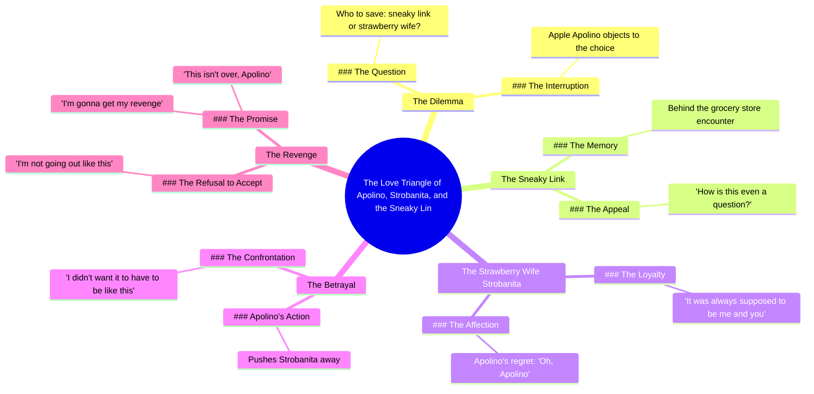

# Loyal Apple Chooses Between Wife and Sneaky Link

> 🌐 **Read this in:** **English** · [中文](../../zh-CN/2026-07/tiktok-transcript-part-1-loyal-apple-fruitstory-aistory-fruitdrama-aifruit-7b19.md)

> **Creator:** [@fruit4thoughtai](https://www.tiktok.com/@fruit4thoughtai) · **Views:** 6.3M · **Posted:** 2026-07-13 · **Niche:** entertainment
>
> **TL;DR:** Presents an absurd, relatable conflict that immediately grabs attention.

[Watch original video →](https://www.tiktok.com/t/ZTSnB7jps/)

## Why This Went Viral

## Hook (first 3 seconds)
- **Verbatim:** "I don't know who to save. My sneaky link or my strawberry wife."
- **Hook pattern:** Contrast + absurd premise (relationship drama with fruit characters)
- **Why it stops scrolling:** The phrase "sneaky link" immediately signals drama, but the pairing with "strawberry wife" is so bizarre it forces a double-take. Viewers must watch to understand the joke.

## Emotional Rhythm
1. **Curiosity** (0:00–0:03) — "I don't know who to save" sets up a moral dilemma.
2. **Confusion + delight** (0:03–0:06) — "Apple, no!" reveals the characters are fruit, creating absurdist tension.
3. **Nostalgic callback** (0:06–0:09) — "Remember what we did behind the grocery store?" adds backstory, deepening the joke.
4. **Betrayal** (0:09–0:12) — "How is this even a question?" escalates conflict.
5. **Climax** (0:12–0:18) — "It was always supposed to be me and you" delivers the emotional payoff (mock-romantic resolution).
6. **Twist + cliffhanger** (0:18–0:22) — "I'm gonna get my revenge" re-engages for a sequel.

## Keyword Density
- **"Apple" / "Apolino"** (5x) — Drives character identity and algorithmic search for "Apple drama" or "fruit soap opera."
- **"Save"** (3x) — Emotional pull word that signals stakes.
- **"Sneaky link"** (2x) — Viral TikTok slang that triggers familiarity + humor.
- **"Wife" / "Strobanita"** (3x) — Creates relationship frame, taps into "love triangle" trope.
- **"Revenge"** (1x) — High-emotion word that promises continuation, boosting watch time.

## Why It Spreads
1. **Absurd premise + recognizable format** — The "who do I save?" dilemma is a classic relationship trope, but with fruit characters. This mismatch creates shareable surprise. (Line: "My sneaky link or my strawberry wife.")
2. **Emotional cliffhanger** — The revenge threat at the end forces viewers to comment "Part 2?" and share with friends, boosting engagement signals. (Line: "I'm gonna get my revenge.")
3. **Low barrier to remix** — The script is simple enough for other creators to parody with different objects (e.g., "my avocado side piece vs. my banana husband"), driving trend replication.
4. **High rewatchability** — The rapid-fire dialogue and exaggerated voice acting reward multiple watches to catch all the absurd lines. (Line: "Remember what we did behind the grocery store?")

## What You Can Steal
1. **Use a "mismatched format" hook** — Take a familiar emotional template (relationship drama, betrayal, revenge) and apply it to an unexpected subject (fruit, objects, animals). This creates instant curiosity.
2. **End with a sequel teaser** — Always leave one unresolved thread ("I'm gonna get my revenge") to boost comments asking for Part 2 and increase overall watch time.
3. **Give characters absurd names** — "Apolino" and "Strobanita" are memorable and quotable. Unique names make the video easier to reference in comments and shares, fueling word-of-mouth spread.

## Mind Map

## Full Transcript (Generated by [try this transcription tool](https://toktranscript.com/?utm_source=github&utm_medium=breakdown&utm_campaign=tool_attribution))

> 📝 Transcripts on this page are auto-generated and show the first 60%. Want to transcribe any TikTok in 30 seconds and get the full version? [Try TokTranscript free →](https://toktranscript.com/?utm_source=github&utm_medium=breakdown&utm_campaign=transcript_cta)

I don't know who to save. My sneaky link or my strawberry wife. Apple, no! You can't do this! Remember what we did behind the grocery store? How is this even a question? Help me up. Appleino, what are you doing? I didn't want it to have to be like this.

*[Read the full transcript on TokTranscript →](https://toktranscript.com/plaza/tiktok-transcript-part-1-loyal-apple-fruitstory-aistory-fruitdrama-aifruit-7b19?utm_source=github&utm_medium=breakdown&utm_campaign=transcript_full)*

## Browse More

- All [entertainment](../../by-niche/en/entertainment.md) breakdowns
- All [Dilemma Hook](../../by-pattern/en/hook-dilemma-hook.md) examples

## Video Info

| | |
|---|---|
| Creator | [@fruit4thoughtai](https://www.tiktok.com/@fruit4thoughtai) |
| Original video | [https://www.tiktok.com/t/ZTSnB7jps/](https://www.tiktok.com/t/ZTSnB7jps/) |
| Original title | Part 1 | Loyal Apple #fruitstory #aistory #fruitdrama #aifruit  |
| Views | 6.3M (6300000) |
| Posted | 2026-07-13 |
| Duration | 0s |
| Niche | `entertainment` |
| Hook pattern | `Dilemma Hook` |
| Original language | `en` |
| Available languages | en, zh-CN |
| Generated | 2026-07-14 by [TokTranscript](https://toktranscript.com/) |

---

*This breakdown is for educational analysis under fair use. Original video © [@fruit4thoughtai](https://www.tiktok.com/@fruit4thoughtai). All transcripts are auto-generated and may contain errors.*

*Want to analyze your own TikToks like this? [TokTranscript.com →](https://toktranscript.com/viral-breakdown?utm_source=github&utm_medium=breakdown&utm_campaign=footer_cta)*