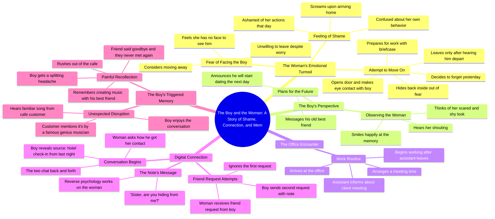

# Neighbor’s Guitar and Cake: A Sudden Heartbeat Next Door

> 🌐 **Read this in:** **English** · [中文](../../zh-CN/2026-07/tiktok-transcript-part5-the-neighbor-s-guitar-and-cake-a-sudden-heartbeat-next-7e7e.md)

> **Creator:** [@vjbrisaidajayvonn](https://www.tiktok.com/@vjbrisaidajayvonn) · **Views:** 146.5K · **Posted:** 2026-07-31 · **Niche:** entertainment
>
> **TL;DR:** Starts with a scream and shame, instantly creating curiosity and emotional investment.

[Watch original video →](https://vm.tiktok.com/ZS4jHC1pF/)

## Why This Went Viral

## Hook (first 3 seconds)
- **Verbatim opening line:** "The woman screamed as soon as she got home she felt so ashamed of what she did today she had no idea why she acted that way"
- **Hook pattern:** Scene + mystery (immediate action with unexplained emotional stakes)
- **Why it stops scroll:** It drops you mid-crisis with zero context — a scream, shame, and a "what did she do?" question that forces the brain to fill the gap. The fast, breathless delivery mimics a gossip confession, making the viewer feel like they've stumbled onto a secret.

## Emotional Rhythm
1. **Confusion/Curiosity** (0–3s): Scream + shame with no backstory — "what happened?"
2. **Tension** (3–10s): She's hiding from the boy; he's smiling at her fear — dramatic irony builds suspense.
3. **Relief/Comedy** (10–20s): She sneaks out to work, narrowly avoids him — a playful cat-and-mouse beat.
4. **Anticipation** (20–30s): Friend request arrives; she ignores it; he uses reverse psychology ("sister are you hiding from me") — a satisfying micro-payoff.
5. **Whiplash Twist** (30–40s): A random cafe song triggers a splitting headache — the tone flips from romance to trauma.
6. **Climax/Emotional Gut-Punch**: The memory reveal — "after his friend said goodbye the two never saw each other again" — reframes the entire video as grief, not romance.

## Keyword Density
- **"Woman" / "boy"** — 12+ mentions: Anchor characters for the algorithm's "storytime" category; simple pronouns keep the narrative scannable.
- **"Ashamed" / "scared" / "shy" / "relieved"** — 6+ emotional state words: Drive emotional pull and comment-section empathy.
- **"Friend request"** — 3 mentions: A universally relatable action that boosts shareability (everyone has ignored a request).
- **"Best friend" / "said goodbye"** — 4 mentions: The twist's emotional payload; triggers nostalgia and grief reactions.
- **"Music" / "song"** — 3 mentions: Bridges the hook to the twist; also a searchable keyword for music-related discovery.

## Why It Spreads
- **The "What did she do?" open loop** — The scream + shame creates an unanswered question that keeps viewers pinned past the 3-second mark. Retention spikes because the payoff is deliberately delayed.
- **The reverse psychology line** — "sister are you hiding from me" is a quotable, screenshot-able moment. Viewers share it as a "texting strategy" or "how to get a reply" — turning the video into a utility, not just a story.
- **The genre-bait twist** — The video masquerades as a romance/slice-of-life story, then pivots to deep grief in the final 10 seconds. This violates expectation, which triggers strong emotional reactions (shock, sadness) — the #1 driver for comments like "I did NOT see that coming."
- **The "friend said goodbye" ambiguity** — It never says death, breakup, or fight. This vagueness invites speculation, and every commenter projects their own loss onto it — fueling debate and repeat views.
- **The cafe song trigger** — A sensory detail (music) that most people can relate to as a memory trigger. It makes the twist feel personal, pushing viewers to share their own "song that breaks me" stories in the comments.

## What You Can Steal
- **Start mid-emotion, not mid-scene.** Open with a scream, a laugh, a gasp — not "here's what happened." Let the viewer's brain assemble the context. The gap is the hook.
- **Bait-and-switch the genre.** Set up a familiar trope (romance, comedy, revenge) and then pivot to a heavier theme (grief, loss, regret) in the last 15 seconds. The tonal shift is what makes people rewatch and reshare.
- **Use one vague, powerful line as your comment-bait.** "He never saw his best friend again" works because it's unspecific. Leave one detail intentionally blurry so the audience fills it in with their own story — that's what turns passive viewers into commenters.

## Mind Map

## Full Transcript (Generated by [try this transcription tool](https://toktranscript.com/?utm_source=github&utm_medium=breakdown&utm_campaign=tool_attribution))

> 📝 Transcripts on this page are auto-generated and show the first 60%. Want to transcribe any TikTok in 30 seconds and get the full version? [Try TokTranscript free →](https://toktranscript.com/?utm_source=github&utm_medium=breakdown&utm_campaign=transcript_cta)

the woman screamed as soon as she got home she felt so ashamed of what she did today she had no idea why she acted that way she thought she had no face to see the boy she considered moving away but she was unwilling to leave she kept worrying about it meanwhile the boy returned home he heard the woman shouting he couldn't help thinking of how scared and shy she looked he smiled happily then he took his phone and messaged his old best friend telling him that he was going to start dating the next day the woman pulled herself together she decided to forget what happened yesterday she picked up her briefcase and opened the door to go to work but she made eye contact with the boy at the door she got so scared that she hid back inside she only opened the door slowly after hearing him leave she felt relieved when she saw no one then she left safely after arriving at the office her assistant told her the client wanted a meeting the woman told her to arrange a time after the assistant left the woman started working then she received a friend request she

*[Read the full transcript on TokTranscript →](https://toktranscript.com/plaza/tiktok-transcript-part5-the-neighbor-s-guitar-and-cake-a-sudden-heartbeat-next-7e7e?utm_source=github&utm_medium=breakdown&utm_campaign=transcript_full)*

## Browse More

- All [entertainment](../../by-niche/en/entertainment.md) breakdowns
- All [Emotional Cold Open](../../by-pattern/en/hook-emotional-cold-open.md) examples

## Video Info

| | |
|---|---|
| Creator | [@vjbrisaidajayvonn](https://www.tiktok.com/@vjbrisaidajayvonn) |
| Original video | [https://vm.tiktok.com/ZS4jHC1pF/](https://vm.tiktok.com/ZS4jHC1pF/) |
| Original title | Part5|The Neighbor’s Guitar and Cake A Sudden Heartbeat Next Door#fyp... |
| Views | 146.5K (146500) |
| Posted | 2026-07-31 |
| Duration | 0s |
| Niche | `entertainment` |
| Hook pattern | `Emotional Cold Open` |
| Original language | `en` |
| Available languages | en, zh-CN |
| Generated | 2026-08-01 by [TokTranscript](https://toktranscript.com/) |

---

*This breakdown is for educational analysis under fair use. Original video © [@vjbrisaidajayvonn](https://www.tiktok.com/@vjbrisaidajayvonn). All transcripts are auto-generated and may contain errors.*

*Want to analyze your own TikToks like this? [free TikTok transcript generator →](https://toktranscript.com/viral-breakdown?utm_source=github&utm_medium=breakdown&utm_campaign=footer_cta)*