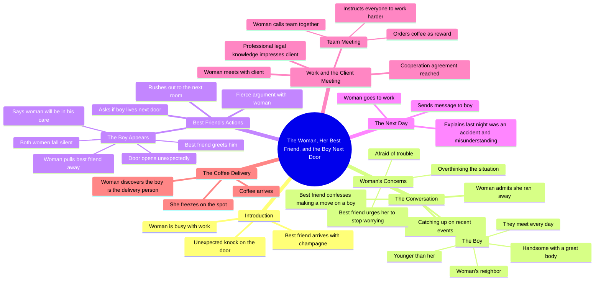

# Neighbor’s Guitar and Cake: A Sudden Heartbeat Next Door

> 🌐 **Read this in:** **English** · [中文](../../zh-CN/2026-07/tiktok-transcript-part6-the-neighbor-s-guitar-and-cake-a-sudden-heartbeat-next-80c4.md)

> **Creator:** [@vjbrisaidajayvonn](https://www.tiktok.com/@vjbrisaidajayvonn) · **Views:** 134.8K · **Posted:** 2026-07-31 · **Niche:** entertainment
>
> **TL;DR:** Opens with a mundane scene disrupted by an unexpected visitor with champagne, sparking curiosity about the celebration.

[Watch original video →](https://vm.tiktok.com/ZS46CpEXL/)

## Why This Went Viral

## Hook (first 3 seconds)
- **Verbatim opening:** "the woman was busy with work she heard a knock on the door she opened it and found her best friend was there holding a bottle of champagne"
- **Hook pattern:** Scene-setting with an implied promise of drama (a knock + champagne = celebration or confrontation)
- **Why it stops scroll:** It drops you mid-action with zero context. The viewer instantly asks: *Who is this woman? Why champagne? What happens next?* The mundane setup ("busy with work") creates contrast against the sudden social intrusion — a universal tension point.

## Emotional Rhythm
1. **Curiosity** (0–5s) — Knock + champagne: something is about to happen.
2. **Comfort/Relatability** (5–15s) — Two friends catching up, gossip about a boy.
3. **Amusement + Light Teasing** (15–25s) — Best friend calls her a coward; playful dynamic.
4. **Intrigue/Tension** (25–40s) — The reveal: the boy is her *neighbor* and *younger*. Age gap + proximity = stakes.
5. **Escalation** (40–55s) — Best friend bolts out the door to the neighbor's room. Physical comedy + shock.
6. **Awkward Peak (Climax)** (55–70s) — The boy appears. Silence. "She just wanted to see him... the woman would be in his care." Maximum cringe + secondhand embarrassment.
7. **Relief/Reset** (70–85s) — Next day, work context. The woman explains it was a "misunderstanding."
8. **Twist Ending** (85–100s) — Coffee delivery: *it's the boy.* Freeze frame. Tension returns with a cliffhanger.

**Climax moment:** The boy walking through the door mid-argument. Three-way standoff. Silence. This is the "oh no" beat that makes viewers screenshot and send to friends.

## Keyword Density
- **"boy"** (10+ times) — Central object of desire/tension; drives the romantic plot.
- **"best friend"** (6+ times) — The catalyst character; creates the conflict.
- **"woman"** (8+ times) — Protagonist anchor; makes the story feel universal.
- **"ran away" / "coward"** (4+ times) — Emotional hook; frames her as relatable/insecure.
- **"neighbor"** (4+ times) — Spatial proximity = inevitable collision; fuels the "will they/won't they" tension.
- **"next door"** (3 times) — Reinforces the awkward stakes.

**Algorithmic reach drivers:** "boy," "neighbor," "best friend" — high-search-volume romance tropes that surface in recommendations.
**Emotional pull drivers:** "ran away," "coward," "misunderstanding" — vulnerability words that trigger empathy and engagement (comments like "she's so me").

## Why It Spreads
1. **Relatable romantic awkwardness** — "She ran away from a handsome younger neighbor" is a specific-but-universal fear. Viewers comment: *"I would've done the same"* or *"No way she ran."* The transcript's line *"she was afraid of trouble because the boy was her neighbor"* is the emotional anchor — everyone has avoided a crush due to proximity risk.
2. **Best friend as comic chaos agent** — *"The next second her best friend stood up immediately rushed out the door"* is a physical gag that translates across languages. It's memeable — the "ride-or-die friend who does too much" archetype gets tagged in shares.
3. **Cliffhanger ending with a visual punch** — *"the woman found it was the boy who delivered it she froze on the spot"* — this is a serialized hook. Viewers are forced to comment *"PART 2?"* which boosts engagement signals. The freeze-frame is a screenshot moment.
4. **Age-gap + neighbor tension** — *"he was younger than her"* + *"they met every day"* = high-stakes forbidden-adjacent romance. This is a proven trope in short-form storytelling (dominant in Asian micro-drama and Western TikTok series alike).
5. **Fast-paced scene cuts** — Each line is a new micro-scene (knock → talk → tease → rush → argument → door opens → coffee). This pacing keeps retention high; there's no dead air.

## What You Can Steal
1. **Open mid-action, not with an intro.** Start with *"she heard a knock on the door"* — not "so this is a story about..." Drop the viewer into a moment and let context build itself. Your first line should feel like you're interrupting a scene, not starting one.
2. **Use a "disruptor" character to escalate.** The best friend does the thing the protagonist is too scared to do. This creates instant conflict without the protagonist acting out of character. Add a character who *acts* while your lead *reacts* — it doubles the drama.
3. **End on a visual cliffhanger, not a resolution.** The coffee delivery reveal is a zero-dialogue beat that forces a "what happens next" reaction. If you can't film a twist, end on a freeze-frame or a meaningful look. Never resolve fully — leave one thread dangling for comments and part 2 demand.

## Mind Map

## Full Transcript (Generated by [try this transcription tool](https://toktranscript.com/?utm_source=github&utm_medium=breakdown&utm_campaign=tool_attribution))

> 📝 Transcripts on this page are auto-generated and show the first 60%. Want to transcribe any TikTok in 30 seconds and get the full version? [Try TokTranscript free →](https://toktranscript.com/?utm_source=github&utm_medium=breakdown&utm_campaign=transcript_cta)

the woman was busy with work she heard a knock on the door she opened it and found her best friend was there holding a bottle of champagne after entering the room the two talked about recent events not long after her best friend said she made a move on the boy but she ran away by herself the woman nodded her best friend teased her for being such a coward and asked if the boy was handsome and in good shape the woman said he was not only handsome but also had a great body her best friend asked in confusion why she ran away the woman said she was afraid of trouble because the boy was her neighbor they met every day and he was younger than her her best friend signalled her to stop talking pursuing love did not require so much consideration she had always been too worried since she was young if she did not see such a good opportunity did she really want to stay single then her best friend asked if the boy lived next door the woman said yes the next second her best friend stood up immediately rushed out the door to the next room the woman stopped her best friend and asked what she was doing the two had a fierce argument just then the door opened the boy appeared in front of the

*[Read the full transcript on TokTranscript →](https://toktranscript.com/plaza/tiktok-transcript-part6-the-neighbor-s-guitar-and-cake-a-sudden-heartbeat-next-80c4?utm_source=github&utm_medium=breakdown&utm_campaign=transcript_full)*

## Browse More

- All [entertainment](../../by-niche/en/entertainment.md) breakdowns
- All [Mysterious arrival](../../by-pattern/en/hook-mysterious-arrival.md) examples

## Video Info

| | |
|---|---|
| Creator | [@vjbrisaidajayvonn](https://www.tiktok.com/@vjbrisaidajayvonn) |
| Original video | [https://vm.tiktok.com/ZS46CpEXL/](https://vm.tiktok.com/ZS46CpEXL/) |
| Original title | Part6|The Neighbor’s Guitar and Cake A Sudden Heartbeat Next Door#fyp... |
| Views | 134.8K (134800) |
| Posted | 2026-07-31 |
| Duration | 0s |
| Niche | `entertainment` |
| Hook pattern | `Mysterious arrival` |
| Original language | `en` |
| Available languages | en, zh-CN |
| Generated | 2026-08-01 by [TokTranscript](https://toktranscript.com/) |

---

*This breakdown is for educational analysis under fair use. Original video © [@vjbrisaidajayvonn](https://www.tiktok.com/@vjbrisaidajayvonn). All transcripts are auto-generated and may contain errors.*

*Want to analyze your own TikToks like this? [analyze your own TikToks →](https://toktranscript.com/viral-breakdown?utm_source=github&utm_medium=breakdown&utm_campaign=footer_cta)*