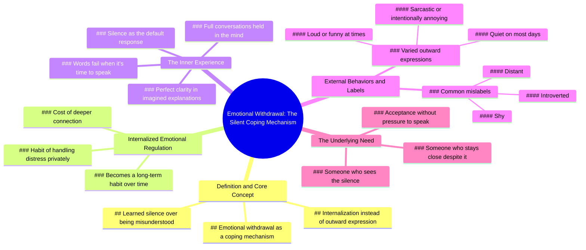

# Why Silent People Withdraw When Hurt

> 🌐 **Read this in:** **English** · [中文](../../zh-CN/2026-07/tiktok-transcript-people-who-go-silent-38db.md)

> **Creator:** [@jimmy__jon](https://www.tiktok.com/@jimmy__jon) · **Views:** 3.3M · **Posted:** 2026-07-02 · **Niche:** other
>
> **TL;DR:** Introduces a relatable behavior with a clinical term, creating curiosity and validation.

[Watch original video →](https://www.tiktok.com/t/ZP8GBaGSX/)

## Why This Went Viral

## Hook (first 3 seconds)
- **Verbatim opening line:** "People who go silent when something upsets or hurts them are often experiencing a coping mechanism called emotional withdrawal."
- **Hook pattern:** Bold claim + psychological label ("emotional withdrawal")
- **Why it stops scrolling:** It names a specific, relatable behavior (going silent when upset) and immediately reframes it as a psychological mechanism, not a personality flaw. This triggers instant self-recognition ("That's me") or curiosity about someone else.

## Emotional Rhythm
1. **Curiosity** — The opening line makes the viewer wonder: "Do I do this? Do I know someone who does?"
2. **Validation** — "It's not that they have nothing to say, it's that their system learned silence is safer" — a deep resonance for quiet people or those who've been misunderstood.
3. **Tension** — "They hold full conversations in their head… but when it's time to speak, the words don't come out" — creates suspense and empathy.
4. **Relief/Clarity** — "Psychologists call this internalized emotional regulation" — the label gives structure to a vague feeling.
5. **Resonance** — "Sometimes they're loud, sometimes they're funny… but most days they're just quiet" — humanizes the behavior, breaking the stereotype.
6. **Climax** — "What they actually need is someone who sees their silence and still chooses to stay close" — the emotional payoff: a raw, vulnerable plea for connection.
- **Climax moment:** The final line — it's the twist that reframes silence as a need, not a rejection.

## Keyword Density
| Keyword/Phrase | Count (approx.) | Driver |
|---|---|---|
| silence / silent / quiet | 5 | **Algorithmic reach** — high-search, high-relate term |
| misunderstood | 1 (implied throughout) | **Emotional pull** — core pain point |
| coping mechanism | 2 | **Algorithmic reach** — psychology keyword |
| internalized | 2 | **Emotional pull** — creates depth |
| safer / safe | 1 | **Emotional pull** — triggers protective instinct |
| connection | 1 | **Emotional pull** — universal need |
| loud / funny / sarcastic / annoying | 4 (contrast cluster) | **Emotional pull** — breaks stereotype, adds texture |
| stay close | 1 | **Emotional pull** — climax word |

- **Algorithmic drivers:** "silence," "coping mechanism," "internalized" — these are searchable, shareable psychology terms.
- **Emotional drivers:** "misunderstood," "safe," "connection," "stay close" — these create the viral emotional hook that makes people tag friends or save the video.

## Why It Spreads
1. **Universal relatability + precise labeling** — The video names a behavior almost everyone has experienced (either in themselves or someone they know) and gives it a clinical label ("emotional withdrawal"). This makes viewers feel seen and smart for knowing the term.  
   *Transcript evidence:* "People who go silent when something upsets or hurts them" + "Psychologists call this internalized emotional regulation."

2. **Reframes a negative trait as a survival skill** — Instead of shaming silence, the video validates it as a learned safety response. This reduces shame and makes viewers want to share it with quiet friends or partners.  
   *Transcript evidence:* "It's not that they have nothing to say, it's that their system learned silence is safer than being misunderstood."

3. **Ends with a direct, emotional call to action** — The final line isn't a "like and subscribe" — it's a plea for connection. Viewers tag their partner or friend with "this is me" or "this is us," which drives shares.  
   *Transcript evidence:* "What they actually need is someone who sees their silence and still chooses to stay close."

4. **Contrast creates depth** — The video doesn't flatten the quiet person into a single type. It shows they can be loud, funny, sarcastic, annoying — making the character more real and shareable.  
   *Transcript evidence:* "Sometimes they're loud, sometimes they're funny, sarcastic, even a little annoying on purpose. But most days they're just quiet."

5. **Short, dense, and quotable** — Every sentence is a potential quote card. The script is tight, with no filler. This makes it easy to repurpose into text overlays, tweets, or Instagram captions.  
   *Transcript evidence:* Every line is a standalone insight — no fluff.

## What You Can Steal
1. **Lead with a psychological label** — Start your video with "This is called [term]" instead of "Have you ever…?" The label creates authority and makes the content feel like a secret revealed.  
   *Example:* "People who cancel plans last minute are often using a coping mechanism called anticipatory avoidance."

2. **Use the "but most days" contrast** — After describing a specific behavior, add a line that shows the person's full range ("Sometimes they're X, sometimes Y, but most days Z"). This makes the character feel real and complex, increasing emotional investment.  
   *Example:* "Sometimes they're the life of the party, sometimes they're the one in the corner. But most days they're just tired."

3. **End with a relationship plea** — The final line should not be a generic call to action. Instead, state what the person actually needs from others. This makes the video a gift to tag someone with, not just a monologue.  
   *Example:* "What they actually need is someone who doesn't take it personally and just says, 'I'll be here when you're ready.'"

## Mind Map

## Full Transcript (Generated by [TokTranscript](https://toktranscript.com/?utm_source=github&utm_medium=breakdown&utm_campaign=tool_attribution))

> 📝 Transcripts on this page are auto-generated and show the first 60%. Want to transcribe any TikTok in 30 seconds and get the full version? [Try TokTranscript free →](https://toktranscript.com/?utm_source=github&utm_medium=breakdown&utm_campaign=transcript_cta)

People who go silent when something upsets or hurts them are often experiencing a coping mechanism called emotional withdrawal. It's not that they have nothing to say, it's that their system Learned silence is safer than being misunderstood. Instead of expressing anger or frustration outwardly, they internalize it. They hold full conversations in their head, explaining exactly how they feel with perfect clarity. But when it's time to speak, the words don't come out, so they stay quiet instead.

*[Read the full transcript on TokTranscript →](https://toktranscript.com/plaza/tiktok-transcript-people-who-go-silent-38db?utm_source=github&utm_medium=breakdown&utm_campaign=transcript_full)*

## Browse More

- All [other](../../by-niche/en/other.md) breakdowns
- All [Psychological label reveal](../../by-pattern/en/hook-psychological-label-reveal.md) examples

## Video Info

| | |
|---|---|
| Creator | [@jimmy__jon](https://www.tiktok.com/@jimmy__jon) |
| Original video | [https://www.tiktok.com/t/ZP8GBaGSX/](https://www.tiktok.com/t/ZP8GBaGSX/) |
| Original title | people who go silent... |
| Views | 3.3M (3300000) |
| Posted | 2026-07-02 |
| Duration | 0s |
| Niche | `other` |
| Hook pattern | `Psychological label reveal` |
| Original language | `en` |
| Available languages | en, zh-CN |
| Generated | 2026-07-05 by [TokTranscript](https://toktranscript.com/) |

---

*This breakdown is for educational analysis under fair use. Original video © [@jimmy__jon](https://www.tiktok.com/@jimmy__jon). All transcripts are auto-generated and may contain errors.*

*Want to analyze your own TikToks like this? [TokTranscript →](https://toktranscript.com/viral-breakdown?utm_source=github&utm_medium=breakdown&utm_campaign=footer_cta)*