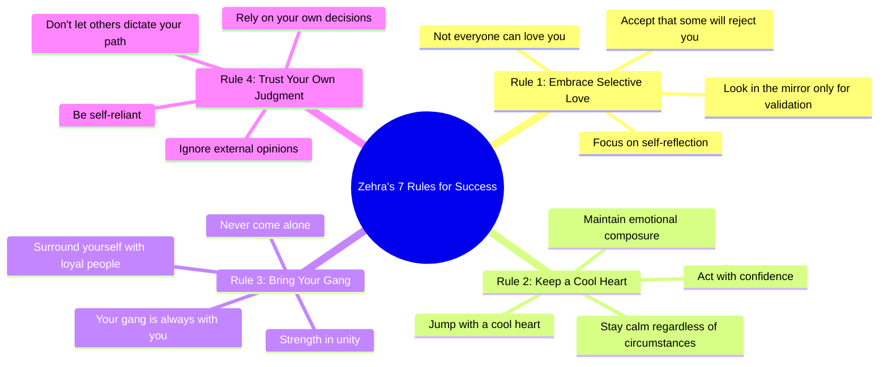

# Queen of Pop Out Now Stream Everywhere

> 🌐 **Read this in:** **English** · [中文](../../zh-CN/2026-07/tiktok-transcript-queen-of-pop-out-now-jetzt-auf-allen-plattformen-streamen-f03a.md)

> **Creator:** [@serdar_lunatix](https://www.tiktok.com/@serdar_lunatix) · **Views:** 3.3M · **Posted:** 2026-07-03 · **Niche:** entertainment
>
> **TL;DR:** Opens with a shocking wealth claim that immediately grabs attention and establishes authority.

[Watch original video →](https://vt.tiktok.com/ZSCXVJdy2/)

## Why This Went Viral

## Hook (first 3 seconds)
- **Verbatim opening line:** "that we are already now I am a millionaire she says in school I have done nothing yet"
- **Hook pattern type:** **Contrast** (claims to be a millionaire while admitting to having done nothing in school) + **Bold claim** ("I am a millionaire")
- **Why it stops scrolling:** The contradiction between "millionaire" and "done nothing in school" creates immediate cognitive dissonance. Viewers are forced to stop and resolve the paradox — is this real? Is she bragging or humble? That tension is irresistible.

## Emotional Rhythm
- **Beat 1 — Curiosity:** "I am a millionaire" — instant intrigue, status signal
- **Beat 2 — Tension/Defensiveness:** "she says in school I have done nothing yet" — a vulnerable admission that creates doubt
- **Beat 3 — Authority shift:** "because I know this is the zehra 7 Rule number 1" — introduces a secret system, builds credibility
- **Beat 4 — Resonance/Relatability:** "you want success not everyone can love you" — a universal truth that feels earned
- **Beat 5 — Confidence spike:** "I never come alone because that is there Rule number 3" — gang loyalty, power in numbers
- **Beat 6 — Climax/Dismissal:** "I don't think anyone else can tell me" — final mic-drop, total self-ownership
- **Climax moment:** The final line — it's the emotional payoff of the entire "I don't need your approval" arc.

## Keyword Density
| Keyword/Phrase | Count | Purpose |
|---|---|---|
| **millionaire** | 1 (opening) | Algorithmic reach — high-engagement trigger word |
| **rule number** | 3 (explicitly) | Emotional pull — creates a system, makes the creator seem methodical |
| **success** | 1 | Emotional pull — aspirational, broad appeal |
| **love you** | 1 | Emotional pull — vulnerability, human connection |
| **I / me / my** | 5+ | Algorithmic + emotional — builds personal brand, signals authority |
| **gang** | 1 | Emotional pull — loyalty, community, tribe |
| **alone** | 1 | Emotional pull — fear of isolation, contrast to "gang" |
| **tell me** | 1 (final) | Emotional pull — defiance, finality, closure |

*Note: The video is short, so density is low. But each word is strategically placed for maximum impact.*

## Why It Spreads
1. **The "Secret System" Formula** — "zehra 7 Rule" sounds like a proprietary framework. Viewers share to feel like they're in on an exclusive knowledge set. *Concrete line:* "because I know this is the zehra 7 Rule number 1"
2. **The "Humble Brag + Vulnerability" Paradox** — She claims millionaire status while admitting to being an underdog in school. This makes her relatable AND aspirational — the viral sweet spot. *Concrete line:* "I am a millionaire she says in school I have done nothing yet"
3. **The "I Don't Care" Energy** — The final dismissal ("I don't think anyone else can tell me") triggers both admiration and debate. Supporters share to affirm the attitude; critics share to argue — both actions fuel reach. *Concrete line:* "I don't think anyone else can tell me"
4. **The "Gang" Identity Hook** — "my gang is with me" creates a tribe effect. Viewers who feel loyal to their own circle instantly resonate and share to signal belonging. *Concrete line:* "no matter where I am my gang is with me"
5. **Short, Punchy, Unfinished** — The transcript cuts off mid-sentence ("yes I I I don't think anyone else can tell me"). This creates a cliffhanger — viewers comment to ask for the full rules, boosting engagement signals. *Concrete line:* The abrupt ending itself.

## What You Can Steal
1. **Open with a contradiction.** Start your next video with a statement that seems to contradict itself (e.g., "I'm at the top of my field, and I've never felt more lost"). The cognitive friction forces viewers to stay.
2. **Invent a numbered system.** Even if it's just 3 rules, label them explicitly ("Rule #1", "Rule #2"). It signals authority and makes your content feel like a cheat code — shareable because it feels like insider knowledge.
3. **End with a mic-drop that invites debate.** Your closing line should either be a bold dismissal ("no one can tell me") or a provocative question. The goal is to split the audience — agreement and disagreement both drive comments, which drive reach.

## Mind Map

## Full Transcript (Generated by [the tool we used to generate this](https://toktranscript.com/?utm_source=github&utm_medium=breakdown&utm_campaign=tool_attribution))

> 📝 Transcripts on this page are auto-generated and show the first 60%. Want to transcribe any TikTok in 30 seconds and get the full version? [Try TokTranscript free →](https://toktranscript.com/?utm_source=github&utm_medium=breakdown&utm_campaign=transcript_cta)

that we are already now I am a millionaire she says in school I have done nothing yet because I know this is the zehra 7 Rule number 1 you want success not everyone can love you when you can see the mirror only hot how chews the O M R rule number

*[Read the full transcript on TokTranscript →](https://toktranscript.com/plaza/tiktok-transcript-queen-of-pop-out-now-jetzt-auf-allen-plattformen-streamen-f03a?utm_source=github&utm_medium=breakdown&utm_campaign=transcript_full)*

## Browse More

- All [entertainment](../../by-niche/en/entertainment.md) breakdowns
- All [Identity Shift / Status Claim](../../by-pattern/en/hook-identity-shift-status-claim.md) examples

## Video Info

| | |
|---|---|
| Creator | [@serdar_lunatix](https://www.tiktok.com/@serdar_lunatix) |
| Original video | [https://vt.tiktok.com/ZSCXVJdy2/](https://vt.tiktok.com/ZSCXVJdy2/) |
| Original title | Queen of Pop - Out Now! 👑🎤 Jetzt auf allen Plattformen streamen. |
| Views | 3.3M (3300000) |
| Posted | 2026-07-03 |
| Duration | 0s |
| Niche | `entertainment` |
| Hook pattern | `Identity Shift / Status Claim` |
| Original language | `en` |
| Available languages | en, zh-CN |
| Generated | 2026-07-05 by [TokTranscript](https://toktranscript.com/) |

---

*This breakdown is for educational analysis under fair use. Original video © [@serdar_lunatix](https://www.tiktok.com/@serdar_lunatix). All transcripts are auto-generated and may contain errors.*

*Want to analyze your own TikToks like this? [TokTranscript →](https://toktranscript.com/viral-breakdown?utm_source=github&utm_medium=breakdown&utm_campaign=footer_cta)*