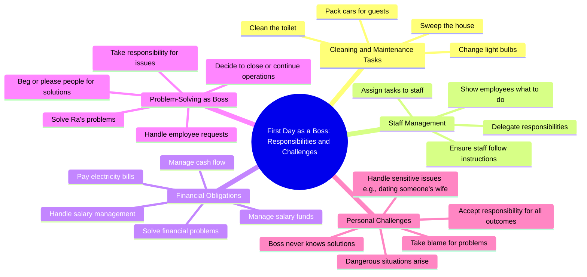

# First Day as Boss: Cleaning Toilets and Packing Cars

> 🌐 **Read this in:** **English** · [中文](../../zh-CN/2026-07/tiktok-transcript-replying-to-ng-c-vui-v-l-m-s-p-l-n-u-n-n-c-nhi-u-b-ng-th-cf18.md)

> **Creator:** [@hoanghaangels](https://www.tiktok.com/@hoanghaangels) · **Views:** 568.9K · **Posted:** 2026-07-27 · **Niche:** other
>
> **TL;DR:** Opens with a direct question that sets up a relatable scenario, then subverts expectations with absurd duties.

[Watch original video →](https://www.tiktok.com/@hoanghaangels/video/7567340447031446792)

## Why This Went Viral

## Hook (first 3 seconds)
- **Verbatim opening**: "So, on your first day as a boss, what did you report? If you come today, you clean the toilet, sweep the house, change the light bulb, and pack the car for the guests..."
- **Hook pattern**: **Contrast** (absurdly menial tasks vs. the title "boss") + **Rhetorical question**
- **Why it stops scroll**: The immediate mismatch between "boss" and "clean the toilet" creates cognitive dissonance. Viewers freeze to resolve the contradiction: Is this a joke? A parody of bad management? The absurdity is instantly shareable.

## Emotional Rhythm
- **Beat 1 – Curiosity (0–5s)**: "On your first day as a boss... clean the toilet?" — Viewer is confused and intrigued.
- **Beat 2 – Tension (5–15s)**: The speaker assigns impossible tasks ("pay electricity, pay cash") and blames the "boss" for everything. Frustration builds.
- **Beat 3 – Suspense (15–25s)**: "Now you're the boss, you have to solve these problems... Ra, you solve it." — The word "Ra" becomes a loaded trigger. Who is Ra? What will happen?
- **Beat 4 – Twist/Climax (25–30s)**: "Brother, I'm dating your wife." — The ultimate escalation. The joke lands with a betrayal punchline, flipping the power dynamic.
- **Beat 5 – Relief/Resonance**: Laughter or shock. The absurdity is resolved: the "boss" is being cuckolded by his own employee (Ra).

## Keyword Density
| Keyword/Phrase | Count (approx.) | Why it works |
|----------------|-----------------|--------------|
| **Boss** | 8+ | Algorithmic reach (high-search term for workplace content) + emotional pull (power dynamic) |
| **Ra** | 6+ | Emotional pull — becomes a character name and a punchline trigger |
| **Solve / Solve it** | 5+ | Emotional pull — creates tension (problem unsolved) and relief (resolution) |
| **Pay** | 4+ | Algorithmic reach (money/finance content) + emotional pull (stress of responsibility) |
| **Your wife / Dating your wife** | 3 | Emotional pull — betrayal, shock, humor (viral taboo topic) |
| **Clean the toilet** | 1 | Algorithmic reach (unexpected, absurd phrase) + emotional pull (humiliation) |

## Why It Spreads
1. **Absurd power inversion** — The "boss" is told to clean toilets and pack cars. This flips the expected hierarchy, making it instantly shareable as a joke about bad leadership. *(Transcript: "If you come today, you clean the toilet...")*
2. **Escalating tension with a taboo twist** — The climax ("I'm dating your wife") is a universal shock trope. It creates a "did he just say that?" moment that drives comments and shares. *(Transcript: "Brother, I'm dating your wife.")*
3. **Relatable workplace frustration** — Every employee has felt a boss who dodges responsibility. The video channels that resentment into comedy, making it easy to tag a coworker. *(Transcript: "Now you're the boss, you have to solve these problems...")*
4. **Mystery character "Ra"** — The name "Ra" is repeated like a meme. Viewers share to ask "Who is Ra?" or to laugh at the absurdity of Ra's actions. This drives engagement loops. *(Transcript: "Ra, you solve it...")*
5. **Short, punchy, loopable structure** — The video ends on the punchline, but the absurd setup invites re-watching. The circular logic ("you're the boss, you solve it") makes it easy to remix or quote.

## What You Can Steal
1. **Use a "power flip" hook** — Start with a title or role (boss, CEO, expert) and immediately contradict it with a humiliating or absurd task. The cognitive dissonance forces viewers to stop and watch.
2. **Build a mystery character** — Introduce a name (like "Ra") early, repeat it, and make it the punchline. Viewers will comment to ask or joke about it, boosting algorithmic signals.
3. **End on a taboo twist** — The "I'm dating your wife" punchline is risky but high-reward. In your niche, find a boundary-pushing but culturally acceptable twist (e.g., "I quit" or "I took your client") that flips the power dynamic.

## Mind Map

## Full Transcript (Generated by [TokTranscript](https://toktranscript.com/?utm_source=github&utm_medium=breakdown&utm_campaign=tool_attribution))

> 📝 Transcripts on this page are auto-generated and show the first 60%. Want to transcribe any TikTok in 30 seconds and get the full version? [Try TokTranscript free →](https://toktranscript.com/?utm_source=github&utm_medium=breakdown&utm_campaign=transcript_cta)

So, on your first day as a boss, what did you report? If you come today, you clean the toilet, sweep the house, change the light bulb, and pack the car for the guests, then you swear to always take the bait and save it, so you make the boss have to do something, your job is to show the staff to let it do it, ah, at 10: 30, you came but no friends came, so you didn't. Now you're the boss, you have to do what is required to pay the electricity, pay the cash, and now you assign that to any friend who is required to be assigned to any friend who is required to be assigned to himself, our brothers. Employees are given three deposits of salary management salary of the boss, the head is big, Ra to solve it, oh so that he Ra he begged people he Please people Give electricity for a while.

*[Read the full transcript on TokTranscript →](https://toktranscript.com/plaza/tiktok-transcript-replying-to-ng-c-vui-v-l-m-s-p-l-n-u-n-n-c-nhi-u-b-ng-th-cf18?utm_source=github&utm_medium=breakdown&utm_campaign=transcript_full)*

## Browse More

- All [other](../../by-niche/en/other.md) breakdowns
- All [Rhetorical question with unexpected twist](../../by-pattern/en/hook-rhetorical-question-with-unexpected-twist.md) examples

## Video Info

| | |
|---|---|
| Creator | [@hoanghaangels](https://www.tiktok.com/@hoanghaangels) |
| Original video | [https://www.tiktok.com/@hoanghaangels/video/7567340447031446792](https://www.tiktok.com/@hoanghaangels/video/7567340447031446792) |
| Original title | Replying to @Ngọc Vui Vẻ ❤️ làm sếp lần đầu nên có nhiều bỡ ngỡ 🥲 @Th... |
| Views | 568.9K (568900) |
| Posted | 2026-07-27 |
| Duration | 0s |
| Niche | `other` |
| Hook pattern | `Rhetorical question with unexpected twist` |
| Original language | `en` |
| Available languages | en, zh-CN |
| Generated | 2026-07-27 by [TokTranscript](https://toktranscript.com/) |

---

*This breakdown is for educational analysis under fair use. Original video © [@hoanghaangels](https://www.tiktok.com/@hoanghaangels). All transcripts are auto-generated and may contain errors.*

*Want to analyze your own TikToks like this? [try this transcription tool →](https://toktranscript.com/viral-breakdown?utm_source=github&utm_medium=breakdown&utm_campaign=footer_cta)*