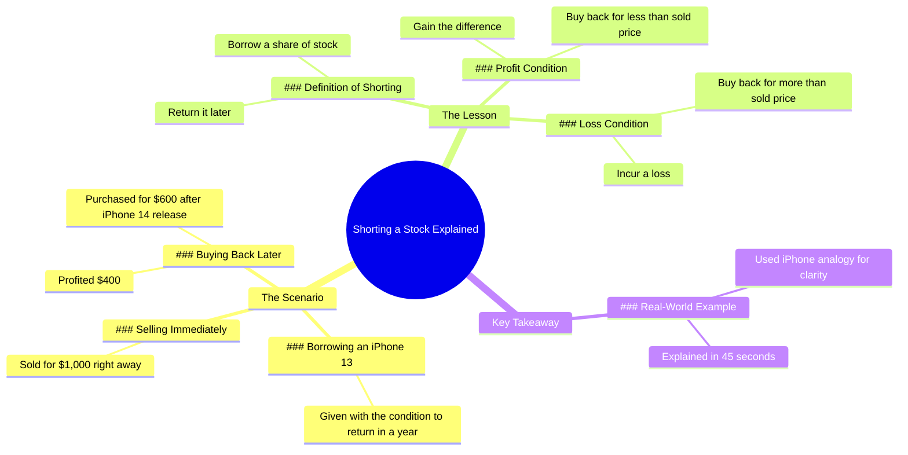

# Rich Dad Market Lesson with iPhone Analogy

> 🌐 **Read this in:** **English** · [中文](../../zh-CN/2026-07/tiktok-transcript-rich-dad-lesson-on-the-market-using-an-iphone-analogy-person-7e7f.md)

> **Creator:** [@humphreytalks](https://www.tiktok.com/@humphreytalks) · **Views:** 18.0M · **Posted:** 2026-07-22 · **Niche:** finance
>
> **TL;DR:** The unexpected condition creates immediate intrigue and compels viewers to watch.

[Watch original video →](https://vt.tiktok.com/ZSXpxMxBr/)

## Why This Went Viral

## Hook (first 3 seconds)
- **Verbatim opening line:** "I'm gonna give you this iPhone 13, but I want it back in a year, okay?"
- **Hook pattern:** Scene + Contrast (a generous offer with a weird condition)
- **Why it stops scrolling:** The condition ("I want it back in a year") breaks expectation. Generosity is normal; a return deadline is not. Viewers stop to ask: *Why would anyone do that?* The tension is immediate.

## Emotional Rhythm
- **Beat 1 – Curiosity (0–3s):** The weird condition creates a "what's the catch?" feeling.
- **Beat 2 – Tension (3–10s):** The recipient mentally calculates profit — selling now, buying back later. Viewer senses a scheme.
- **Beat 3 – Suspense (10–20s):** The return moment. Will he have the phone? Viewer anticipates conflict.
- **Beat 4 – Surprise + Relief (20–30s):** The twist — he sold it and bought it back cheaper. The tension breaks into a "gotcha" moment.
- **Beat 5 – Resonance (30–45s):** The lesson is revealed: "That's shorting a stock." Viewer feels smart for following along.
- **Climax:** "Then you've learned the lesson, my son." — The line that reframes the entire video as a teaching moment.

## Keyword Density
- **"iPhone 13" / "iPhone 14"** – Algorithmic reach (high search volume, product-specific)
- **"sell" / "sold" / "buy" / "bought"** – Emotional pull (transaction verbs drive the story)
- **"profit" / "profit"** – Emotional pull (money gain creates satisfaction)
- **"shorting a stock"** – Algorithmic + Emotional (financial education keyword + "aha" moment)
- **"lesson"** – Emotional pull (frames the video as valuable, not just entertainment)
- **"45 seconds"** – Algorithmic (self-referential meta-commentary on video length)

**Why they work:** Product names drive discoverability; transaction verbs create narrative tension; "shorting a stock" is a high-value educational keyword that signals niche authority.

## Why It Spreads
1. **The "hidden lesson" structure** – The video disguises a financial education as a personal story. Viewers share it because it's *useful* without feeling like a lecture. The line "I just showed you what shorting a stock is" is the reveal that makes the whole video feel like a gift.
2. **The "gotcha" twist** – The recipient's scheme (sell high, buy back low) is clever and satisfying. The line "So you made a profit on me" creates a moment of unexpected respect. Viewers want to share this "smart move" with friends.
3. **Self-referential meta-hook** – "That took a year for you to explain? No, it took about 45 seconds, which is the length of this video." This line breaks the fourth wall, makes the video feel crafted, and creates a "wow, that was efficient" reaction. It's shareable because it's *clever*.
4. **Relatable tension** – Everyone has been in a weird social situation where someone asks for something back. The video turns a mundane interaction into a financial lesson. The line "Random, but okay" is the viewer's internal voice, making them feel seen.
5. **High replay value** – Once you know the ending, the opening line ("I want it back in a year") becomes a punchline. Viewers rewatch to catch the foreshadowing. The line "If he wants it back in a year, I guess I could sell it now" is the key that makes the second watch feel like a puzzle solved.

## What You Can Steal
1. **The "conditional generosity" hook** – Give something valuable with a weird condition. It creates immediate curiosity. In your next video: "I'll give you my [valuable item] but [odd condition]." Example: "I'll give you $100, but you have to spend it on a stranger."
2. **The "lesson reveal" structure** – Tell a story first, then drop the educational punchline. Don't start with "Today I'll teach you about shorting stocks." Start with the iPhone. The line "Then you've learned the lesson, my son" is the payoff. In your next video: tell a story about a mistake, then reveal the business lesson.
3. **The "meta-timing" callback** – Reference the video's length as a punchline. It makes the content feel self-aware and efficient. The line "No, it took about 45 seconds" is a subtle flex. In your next video: "That took me [time] to learn, but it took you [video length] to understand."

## Mind Map

## Full Transcript (Generated by [the tool we used to generate this](https://toktranscript.com/?utm_source=github&utm_medium=breakdown&utm_campaign=tool_attribution))

> 📝 Transcripts on this page are auto-generated and show the first 60%. Want to transcribe any TikTok in 30 seconds and get the full version? [Try TokTranscript free →](https://toktranscript.com/?utm_source=github&utm_medium=breakdown&utm_campaign=transcript_cta)

I'm gonna give you this iPhone 13, but I want it back in a year, okay? Random, but okay. If he wants it back in a year, I guess I could sell it now for $1,000, and then when Apple inevitably comes out with the iPhone 14, they'll discount this model. I'll buy it back for $600, thus I'll profit $400. Hey, how's it going? Do you have that iPhone 13? Yeah, but to be honest, I sold it the day you gave it to me knowing the price would go down, and then I bought it back again now that it's cheaper. So you borrowed my iPhone and when it came to returning it, you bought it back for less than what you sold it for?

*[Read the full transcript on TokTranscript →](https://toktranscript.com/plaza/tiktok-transcript-rich-dad-lesson-on-the-market-using-an-iphone-analogy-person-7e7f?utm_source=github&utm_medium=breakdown&utm_campaign=transcript_full)*

## Browse More

- All [finance](../../by-niche/en/finance.md) breakdowns
- All [Curiosity Gap](../../by-pattern/en/hook-curiosity-gap.md) examples

## Video Info

| | |
|---|---|
| Creator | [@humphreytalks](https://www.tiktok.com/@humphreytalks) |
| Original video | [https://vt.tiktok.com/ZSXpxMxBr/](https://vt.tiktok.com/ZSXpxMxBr/) |
| Original title | Rich Dad Lesson on the Market using an iPhone analogy. #personalfinan... |
| Views | 18.0M (18000000) |
| Posted | 2026-07-22 |
| Duration | 0s |
| Niche | `finance` |
| Hook pattern | `Curiosity Gap` |
| Original language | `en` |
| Available languages | en, zh-CN |
| Generated | 2026-07-23 by [TokTranscript](https://toktranscript.com/) |

---

*This breakdown is for educational analysis under fair use. Original video © [@humphreytalks](https://www.tiktok.com/@humphreytalks). All transcripts are auto-generated and may contain errors.*

*Want to analyze your own TikToks like this? [TokTranscript.com →](https://toktranscript.com/viral-breakdown?utm_source=github&utm_medium=breakdown&utm_campaign=footer_cta)*