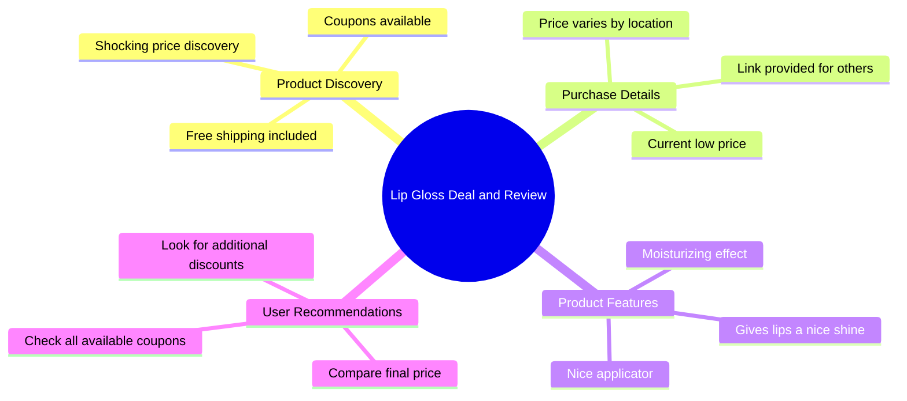

# See How Low This Price Can Go With Coupons

> 🌐 **Read this in:** **English** · [中文](../../zh-CN/2026-07/tiktok-transcript-see-how-low-you-can-get-the-price-on-this-i-am-getting-it-fo-ec1e.md)

> **Creator:** [@devotedtothelordjesus](https://www.tiktok.com/@devotedtothelordjesus) · **Views:** 1.4M · **Posted:** 2026-07-23 · **Niche:** beauty
>
> **TL;DR:** Opens with a surprising price reveal that triggers curiosity and urgency.

[Watch original video →](https://www.tiktok.com/@devotedtothelordjesus/video/7656936045262523679?shop_id=7496159694939589020&shop_region=US)

## Why This Went Viral

## Hook (first 3 seconds)
- **Verbatim opening line:** "Check out the price I'm getting this for right now!"
- **Hook pattern:** **Numbers + Scene** (price reveal + live demonstration)
- **Why it stops scrolling:** The phrase "right now" creates urgency and FOMO. The viewer instantly wants to see the price and compare it to their own expectations. The visual of the product + price on screen triggers a "deal-finding" reflex.

## Emotional Rhythm
- **Beats:** Curiosity (price reveal) → Shock (low price) → Urgency (free shipping, "right now") → Trust (nice applicator, moisturizing) → Action (link below, check coupons)
- **Suspense:** The pause before showing the price ("I was shocked") builds anticipation.
- **Resonance:** The phrase "literally getting sent to me for this price" makes the deal feel real and attainable.
- **Climax:** The moment the price is shown on screen (implied) — this is the peak emotional payoff.
- **Twist:** The call to "check all your coupons" adds a secondary layer of value — the viewer can potentially get an even better deal.

## Keyword Density
| Keyword/Phrase | Role |
|---|---|
| **price** | Algorithmic (deal-finding intent) + Emotional (value) |
| **right now** | Urgency, triggers FOMO |
| **free shipping** | Algorithmic (shopping intent) + Emotional (savings) |
| **link it below** | Call-to-action, drives clicks |
| **moisturizing gloss** | Product benefit, emotional (self-care) |
| **shocked** | Emotional hook, triggers curiosity |
| **coupons** | Algorithmic (coupon/deal content) + Emotional (savings) |
| **shipped to you** | Personalization, makes viewer imagine themselves |

**Algorithmic drivers:** price, free shipping, link it below, coupons  
**Emotional pull:** shocked, right now, shipped to you, moisturizing gloss

## Why It Spreads
1. **Urgency + FOMO loop** – "Check out the price I'm getting this for right now!" creates a "must-see" moment. The repetition of "right now" and "literally getting sent to me" makes the deal feel fleeting, driving immediate clicks.
2. **Personalized value proposition** – "I will link it below so you guys can all check out what price it can be shipped to you for as well" turns a personal purchase into a shared opportunity. Viewers feel they can replicate the deal.
3. **Low barrier to action** – The call to "check all your coupons and any other discounts" empowers the viewer to feel in control. It's not just a price reveal — it's a strategy they can copy.
4. **Trust-building through transparency** – The creator shows the product, describes its benefits (nice applicator, moisturizing, shine), and then immediately offers the link. This reduces skepticism and increases conversion.
5. **Algorithmic optimization** – Keywords like "price," "free shipping," and "coupons" signal shopping intent to the platform, pushing the video to users actively looking for deals.

## What You Can Steal
1. **Open with a price reveal + urgency** – Start your video with "Check out the price I'm getting this for right now!" This pattern works for any product — beauty, tech, home goods. It triggers immediate curiosity.
2. **Personalize the offer** – Use "shipped to you" language to make the viewer imagine themselves receiving the product. This turns a passive watch into an active desire.
3. **End with a "coupon check" call-to-action** – Don't just drop a link. Tell viewers to check for additional discounts themselves. This creates a sense of empowerment and increases the likelihood they'll actually click and buy.

## Mind Map

## Full Transcript (Generated by [TokTranscript](https://toktranscript.com/?utm_source=github&utm_medium=breakdown&utm_campaign=tool_attribution))

> 📝 Transcripts on this page are auto-generated and show the first 60%. Want to transcribe any TikTok in 30 seconds and get the full version? [Try TokTranscript free →](https://toktranscript.com/?utm_source=github&utm_medium=breakdown&utm_campaign=transcript_cta)

Check out the price I'm getting this for right now! I was shocked to see the coupons available and also free shipping! It is literally getting sent to me for this price right now. I will link it below so you guys can all check out what price it can be shipped to you for as well!

*[Read the full transcript on TokTranscript →](https://toktranscript.com/plaza/tiktok-transcript-see-how-low-you-can-get-the-price-on-this-i-am-getting-it-fo-ec1e?utm_source=github&utm_medium=breakdown&utm_campaign=transcript_full)*

## Browse More

- All [beauty](../../by-niche/en/beauty.md) breakdowns
- All [Price Shock + Curiosity Gap](../../by-pattern/en/hook-price-shock-curiosity-gap.md) examples

## Video Info

| | |
|---|---|
| Creator | [@devotedtothelordjesus](https://www.tiktok.com/@devotedtothelordjesus) |
| Original video | [https://www.tiktok.com/@devotedtothelordjesus/video/7656936045262523679?shop_id=7496159694939589020&shop_region=US](https://www.tiktok.com/@devotedtothelordjesus/video/7656936045262523679?shop_id=7496159694939589020&shop_region=US) |
| Original title | See how low you can get the price on this. I am getting it for less t... |
| Views | 1.4M (1400000) |
| Posted | 2026-07-23 |
| Duration | 0s |
| Niche | `beauty` |
| Hook pattern | `Price Shock + Curiosity Gap` |
| Original language | `en` |
| Available languages | en, zh-CN |
| Generated | 2026-07-23 by [TokTranscript](https://toktranscript.com/) |

---

*This breakdown is for educational analysis under fair use. Original video © [@devotedtothelordjesus](https://www.tiktok.com/@devotedtothelordjesus). All transcripts are auto-generated and may contain errors.*

*Want to analyze your own TikToks like this? [the tool we used to generate this →](https://toktranscript.com/viral-breakdown?utm_source=github&utm_medium=breakdown&utm_campaign=footer_cta)*