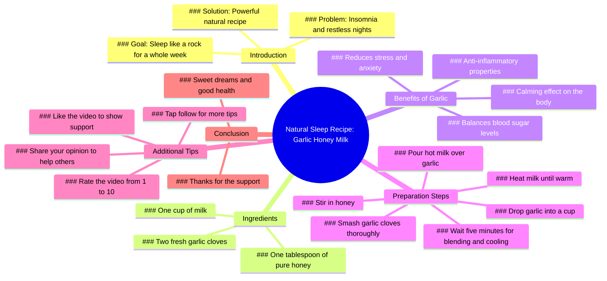

# Natural Sleep Recipe for Deep Rest All Week

> 🌐 **Read this in:** **English** · [中文](../../zh-CN/2026-07/tiktok-transcript-sleep-like-a-baby-again-bettersleep-naturalremedy-bedtime-sl-422f.md)

> **Creator:** [@jeremymidkiff99](https://www.tiktok.com/@jeremymidkiff99) · **Views:** 1.2M · **Posted:** 2026-07-06 · **Niche:** other
>
> **TL;DR:** Immediately resonates with a common struggle, drawing in viewers who suffer from insomnia.

[Watch original video →](https://www.tiktok.com/@jeremymidkiff99/video/7603953192191200525?is_from_webapp=1&sender_device=pc&web_id=7652559874152564254)

## Why This Went Viral

## Hook (first 3 seconds)
- **Verbatim opening:** "Can't sleep at night. Tired of endless tossing and turning. Brain won't shut off. You pray for sleep, but nothing helps, not even meds."
- **Hook pattern:** Scene + empathy + bold claim — immediately paints a relatable pain point, then promises a solution.
- **Why it stops scrolling:** The first 5 seconds mirror the exact internal monologue of someone with chronic insomnia. It uses "you" and "nothing helps, not even meds" to create an emotional bridge and a "this is me" moment. The bold claim ("powerful natural recipe that gets you sleeping like a rock for a whole week") follows instantly, creating irresistible curiosity.

## Emotional Rhythm
- **Beat 1: Empathy / Pain (0–3s)** — "Can't sleep at night…" Viewer feels seen.
- **Beat 2: Frustration / Desperation (3–6s)** — "Nothing helps, not even meds." Tension rises.
- **Beat 3: Relief / Hope (6–10s)** — "Relax. I'm sharing a powerful natural recipe…" Promise of solution.
- **Beat 4: Trust / Authority (10–12s)** — "Trust me, once you start, you won't go back." Social proof.
- **Beat 5: Action / Compliance (12–16s)** — "Tap follow… Like this." Micro-commitment.
- **Beat 6: Education / Calm (16–30s)** — Step-by-step recipe. Low energy, instructional.
- **Beat 7: Engagement / Reward (30–35s)** — "Rate this video one to ten below." Asks for interaction.
- **Climax:** The moment they say "Trust me, once you start, you won't go back." It's the emotional pivot from pain to belief.

## Keyword Density
- **sleep** (8x) — algorithmic reach (high-volume search term)
- **natural** (3x) — emotional pull (trust, safety, anti-pharma)
- **garlic** (5x) — curiosity driver (unexpected ingredient)
- **milk** (3x) — familiarity + comfort
- **honey** (2x) — sweet, comforting, natural
- **anti-inflammatory / calming / blood sugar balancing** (3 terms) — authority + health credibility
- **tossing and turning / brain won't shut off** (2x) — emotional resonance (pain point repetition)
- **follow / like / rate** (3x) — algorithmic engagement triggers

**Algorithmic drivers:** "sleep," "natural," "garlic" — high search volume, low competition, curiosity gap.
**Emotional drivers:** "tossing and turning," "brain won't shut off," "trust me" — build empathy and trust.

## Why It Spreads
1. **Extreme pain point specificity** — "Nothing helps, not even meds" targets the hardest-to-treat insomnia sufferers. This is a high-engagement, low-competition niche. Viewers who try everything will share this with friends who also "can't sleep."
2. **Unexpected ingredient = curiosity gap** — "Garlic" is not a typical sleep aid. This creates a "wait, what?" moment that drives comments (e.g., "Garlic for sleep? Really?"), which boosts algorithmic ranking.
3. **Micro-commitment chain** — "Tap follow… Like this… Rate this video one to ten below." Each request is small, easy, and builds momentum. The "rate this video" is a low-friction engagement hack that signals high watch time and interaction to the algorithm.
4. **Promise of a "whole week" of sleep** — This is a specific, measurable outcome. Viewers who try it and it works will tag friends, comment results, and save the video — all viral signals.
5. **No equipment, no cost** — "Just two fresh garlic cloves and a cup…" Low barrier to try. The recipe is so simple that viewers feel compelled to test it immediately, then report back.

## What You Can Steal
1. **Open with the exact internal monologue of your target audience.** Don't describe the problem — *be* the problem. Use second-person ("you") and mirror their exact thoughts ("Brain won't shut off"). This creates instant emotional resonance.
2. **Use an unexpected ingredient or method to create a curiosity gap.** If everyone uses lavender or melatonin, use garlic. The surprise forces viewers to watch longer and comment ("Wait, what?"), which boosts both retention and engagement.
3. **End with a low-friction, specific engagement ask.** Instead of "like and subscribe," say "Rate this video one to ten below." It's novel, easy, and feels like a conversation. This drives comments and signals high interaction to the algorithm.

## Mind Map

## Full Transcript (Generated by [TokTranscript](https://toktranscript.com/?utm_source=github&utm_medium=breakdown&utm_campaign=tool_attribution))

> 📝 Transcripts on this page are auto-generated and show the first 60%. Want to transcribe any TikTok in 30 seconds and get the full version? [Try TokTranscript free →](https://toktranscript.com/?utm_source=github&utm_medium=breakdown&utm_campaign=transcript_cta)

Can't sleep at night. Tired of endless tossing and turning. Brain won't shut off. You pray for sleep, but nothing helps, not even meds. Relax. I'm sharing a powerful natural recipe today that gets you sleeping like a rock for a whole week. Trust me, once you start, you won't go back. First things first. Tap, follow. So you catch every tip. Like this. Let's make it. You need just two fresh garlic cloves and a cup garlic secret. Anti inflammatory, calming, blood sugar balancing. It cuts stress and anxiety so you actually rest deeply.

*[Read the full transcript on TokTranscript →](https://toktranscript.com/plaza/tiktok-transcript-sleep-like-a-baby-again-bettersleep-naturalremedy-bedtime-sl-422f?utm_source=github&utm_medium=breakdown&utm_campaign=transcript_full)*

## Browse More

- All [other](../../by-niche/en/other.md) breakdowns
- All [Pain point empathy](../../by-pattern/en/hook-pain-point-empathy.md) examples

## Video Info

| | |
|---|---|
| Creator | [@jeremymidkiff99](https://www.tiktok.com/@jeremymidkiff99) |
| Original video | [https://www.tiktok.com/@jeremymidkiff99/video/7603953192191200525?is_from_webapp=1&sender_device=pc&web_id=7652559874152564254](https://www.tiktok.com/@jeremymidkiff99/video/7603953192191200525?is_from_webapp=1&sender_device=pc&web_id=7652559874152564254) |
| Original title | Sleep like a baby again #bettersleep #naturalremedy #bedtime #sleep #... |
| Views | 1.2M (1200000) |
| Posted | 2026-07-06 |
| Duration | 0s |
| Niche | `other` |
| Hook pattern | `Pain point empathy` |
| Original language | `en` |
| Available languages | en, zh-CN |
| Generated | 2026-07-07 by [TokTranscript](https://toktranscript.com/) |

---

*This breakdown is for educational analysis under fair use. Original video © [@jeremymidkiff99](https://www.tiktok.com/@jeremymidkiff99). All transcripts are auto-generated and may contain errors.*

*Want to analyze your own TikToks like this? [the tool we used to generate this →](https://toktranscript.com/viral-breakdown?utm_source=github&utm_medium=breakdown&utm_campaign=footer_cta)*