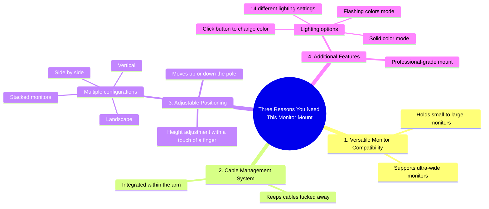

# RGB Monitor Mount Stack, Spin and Shine

> 🌐 **Read this in:** **English** · [中文](../../zh-CN/2026-07/tiktok-transcript-stack-spin-shine-rgb-monitor-mount-does-it-all-odyssey-ole-b4d9.md)

> **Creator:** [@huanuo_live](https://www.tiktok.com/@huanuo_live) · **Views:** 1.7M · **Posted:** 2026-07-09 · **Niche:** tech
>
> **TL;DR:** The hook promises a clear, numbered list of benefits, instantly creating curiosity and a reason to watch.

[Watch original video →](https://www.tiktok.com/@huanuo_live/video/7589509215559879967)

## Why This Went Viral

## Hook (first 3 seconds)
- **Verbatim opening:** "I'm gonna tell you why. Three reasons you need this monitor mount here."
- **Hook pattern:** Bold claim + numbers (three reasons) + direct address ("you need")
- **Why it stops scroll:** The "I'm gonna tell you why" creates a promise of insider knowledge, and "three reasons" triggers a pattern-interrupt — viewers instinctively want to know what those reasons are before they can swipe away.

## Emotional Rhythm
- **Curiosity** (0–2s): "I'm gonna tell you why" — sets up a knowledge gap.
- **Anticipation** (2–5s): "Three reasons" — viewer mentally counts along.
- **Satisfaction / Validation** (5–15s): Each reason is delivered cleanly (holds small-to-big, cable management, adjustable height). The "ultra wide monitor" reveal adds a subtle flex.
- **Surprise / Delight** (15–20s): "With a click of a button, you can change the colour" — the RGB lighting feature is an unexpected bonus, not a core functional reason.
- **Climax / Authority close** (20–22s): "You want the most professional mount, it's that one." — decisive, confident, no hedging.

## Keyword Density
- **"monitor"** (x5) — drives search and product intent (algorithm reach).
- **"mount"** (x4) — core product category, high search volume.
- **"cable"** (x2) — pain-point word, triggers emotional pull for messy-desk viewers.
- **"click of a button"** (x1, but visually reinforced) — ease-of-use emotional trigger.
- **"professional"** (x1, final line) — aspirational identity word, emotional pull.
- **"colour / lighting"** (x2) — surprise feature, drives shareability (aesthetic appeal).

## Why It Spreads
1. **Promise + rapid delivery** — "I'm gonna tell you why" followed immediately by three concrete reasons. No fluff. Viewers feel rewarded for staying.
2. **Visual proof of claims** — "That's an ultra wide monitor, by the way" is a subtle brag that validates the mount's strength without saying "it's strong."
3. **Unexpected delight feature** — The RGB lighting reveal (colour change, flashing, 14 settings) is not in the "three reasons" list, so it feels like a bonus. This triggers surprise and makes the video more shareable to people who love desk setups.
4. **Strong closing authority** — "You want the most professional mount, it's that one" is a definitive recommendation. No "maybe" or "I think." This builds trust and reduces purchase hesitation.

## What You Can Steal
1. **The "three reasons" structure** — Always list a small, odd number of points. It creates a mental checklist viewers want to complete. Works for any product, tutorial, or opinion.
2. **Bury a bonus feature after the list** — Deliver the promised reasons, then add one unexpected benefit (like RGB lighting) after. This feels like a gift and increases perceived value.
3. **End with a declarative, no-hedge recommendation** — Replace "I think this is good" with "You want X, it's that one." Confidence drives trust and shareability.

## Mind Map

## Full Transcript (Generated by [TokTranscript](https://toktranscript.com/?utm_source=github&utm_medium=breakdown&utm_campaign=tool_attribution))

> 📝 Transcripts on this page are auto-generated and show the first 60%. Want to transcribe any TikTok in 30 seconds and get the full version? [Try TokTranscript free →](https://toktranscript.com/?utm_source=github&utm_medium=breakdown&utm_campaign=transcript_cta)

I'm gonna tell you why. Three reasons you need this monitor mount here. It can hold from small to big monitors. It keeps all your cables tucked away within the arm cable management system. And you can place this monitor at any given height with a touch of a finger. That's an ultra wide monitor, by the way.

*[Read the full transcript on TokTranscript →](https://toktranscript.com/plaza/tiktok-transcript-stack-spin-shine-rgb-monitor-mount-does-it-all-odyssey-ole-b4d9?utm_source=github&utm_medium=breakdown&utm_campaign=transcript_full)*

## Browse More

- All [tech](../../by-niche/en/tech.md) breakdowns
- All [List-based promise](../../by-pattern/en/hook-list-based-promise.md) examples

## Video Info

| | |
|---|---|
| Creator | [@huanuo_live](https://www.tiktok.com/@huanuo_live) |
| Original video | [https://www.tiktok.com/@huanuo_live/video/7589509215559879967](https://www.tiktok.com/@huanuo_live/video/7589509215559879967) |
| Original title | Stack, Spin & Shine! RGB Monitor Mount Does It All 💡🖥️🔥 #odyssey #ole... |
| Views | 1.7M (1700000) |
| Posted | 2026-07-09 |
| Duration | 0s |
| Niche | `tech` |
| Hook pattern | `List-based promise` |
| Original language | `en` |
| Available languages | en, zh-CN |
| Generated | 2026-07-10 by [TokTranscript](https://toktranscript.com/) |

---

*This breakdown is for educational analysis under fair use. Original video © [@huanuo_live](https://www.tiktok.com/@huanuo_live). All transcripts are auto-generated and may contain errors.*

*Want to analyze your own TikToks like this? [try this transcription tool →](https://toktranscript.com/viral-breakdown?utm_source=github&utm_medium=breakdown&utm_campaign=footer_cta)*