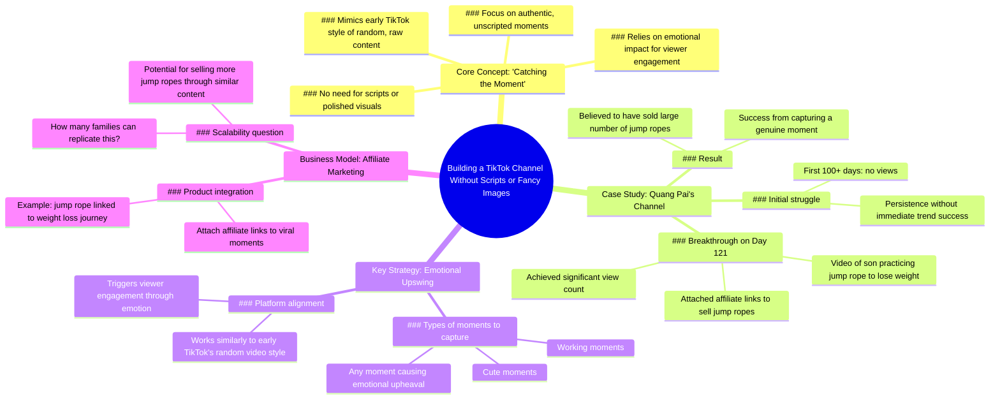

# TikTok Channel Idea From @nguyenquang4998

> 🌐 **Read this in:** **English** · [中文](../../zh-CN/2026-07/tiktok-transcript-t-ng-t-k-nh-anh-nguyenquang4998-nguoimoixaykenh-tutruyenthon-4887.md)

> **Creator:** [@duymuoi](https://www.tiktok.com/@duymuoi) · **Views:** 960.5K · **Posted:** 2026-07-30 · **Niche:** other
>
> **TL;DR:** Challenges the common belief that TikTok success requires polished content, immediately grabbing attention.

[Watch original video →](https://www.tiktok.com/@duymuoi/video/7549159211914038535)

## Why This Went Viral

## Hook (first 3 seconds)
- **Verbatim opening:** "There is a kind of building a TikTok channel that doesn't need a script, you don't need to be fussy about the image to do anything."
- **Hook pattern:** **Bold claim** ("doesn't need a script" / "don't need to be fussy") + **mystery** ("a kind of building…" — what kind?).
- **Why it stops scrolling:** The claim contradicts the common belief that going viral requires polished production. It promises a low-effort path to success, which triggers curiosity in creators who feel overwhelmed or excluded by high-production norms.

## Emotional Rhythm
1. **Curiosity** — "There is a kind of building… that doesn't need a script…" (what is this secret method?)
2. **Skepticism / tension** — "Doing this type of channel will definitely not get the trend at first…" (you have to endure failure — this creates tension).
3. **Relief / hope** — "…but it will get the trend later." (the promise of delayed payoff).
4. **Validation** — Specific success story: "day 121… this video has achieved a view… attached affiliate links to sell people."
5. **Inspiration / call to action** — "How many families will dare to go up here to lose weight and jump rope together to sell more." (challenges viewer to replicate the model).
- **Climax moment:** "This video has achieved a view and everyone remembers that this video has attached affiliate links to sell people." — the exact moment the strategy proves profitable.

## Keyword Density
| Keyword / Phrase | Count (approx.) | Purpose |
|---|---|---|
| "channel" | 5+ | Algorithmic — signals content about channel growth, triggers recommendation for "how to grow" queries. |
| "trend / get the trend" | 3 | Algorithmic — high search volume for "TikTok trending" and "viral." |
| "jump rope / jump" | 5+ | Emotional + Niche — specific product category; anchors the story in a tangible, relatable activity. |
| "moment / catch the moment" | 3 | Emotional — frames the strategy as spontaneous and authentic, not scripted. |
| "sell / sell goods / sell more" | 3 | Emotional + Algorithmic — taps into creator monetization desire; "sell" triggers commerce-related content interest. |
| "day 121 / 100 days" | 2 | Algorithmic — numbers in titles/hooks boost CTR; "day 121" signals a long-term proof point. |

## Why It Spreads
1. **Low-barrier entry promise** — "doesn't need a script, you don't need to be fussy about the image" directly appeals to overwhelmed creators who feel they lack time or equipment. This is the core shareable insight.
2. **Specific, replicable case study** — "day 121… attached affiliate links to sell jump ropes" gives a concrete, measurable outcome. Viewers can picture themselves doing the same thing with their own niche (e.g., "I could do this with my kid's piano practice").
3. **Emotional rollercoaster of delayed success** — "no one watched it but started it up in the range of more than 100 days" normalizes the painful early phase and then rewards patience. This creates a "if they can, I can" identification loop.
4. **Monetization reveal** — "sold a large number of jump wires" is the payoff that turns a story into a business blueprint. Viewers share it because it feels like a secret cheat code.
5. **Challenge / dare ending** — "How many families will dare to go up here to lose weight and jump rope together to sell more." This rhetorical question acts as a subtle call-to-action that invites engagement (comments, tags, shares).

## What You Can Steal
1. **Open with a "no-skill-required" claim** — Start your next video with a bold statement like "You don't need a script, you don't need good lighting" to immediately hook creators who feel stuck.
2. **Show the exact day-count payoff** — Mention a specific number (e.g., "Day 47") when the strategy started working. Numbers add credibility and make the timeline feel achievable.
3. **End with a dare / challenge question** — Instead of a generic "like and subscribe," close with a question that dares the viewer to try the same method (e.g., "How many of you will actually film your kid's practice session today?"). This drives comments and shares.

## Mind Map

## Full Transcript (Generated by [TokTranscript](https://toktranscript.com/?utm_source=github&utm_medium=breakdown&utm_campaign=tool_attribution))

> 📝 Transcripts on this page are auto-generated and show the first 60%. Want to transcribe any TikTok in 30 seconds and get the full version? [Try TokTranscript free →](https://toktranscript.com/?utm_source=github&utm_medium=breakdown&utm_campaign=transcript_cta)

There is a kind of building a TikTok channel that doesn't need a script, you don't need to be fussy about the image to do anything. Doing this type of channel will definitely not get the trend at first, but it will get the trend later. Today I just found out that his channel is also called Quang Pai, and this channel only focuses on the moment his son practiced jumping rope to lose weight in the first days of posting, no one watched it but started it up in the range of more than 100 days coming back here on day 121.

*[Read the full transcript on TokTranscript →](https://toktranscript.com/plaza/tiktok-transcript-t-ng-t-k-nh-anh-nguyenquang4998-nguoimoixaykenh-tutruyenthon-4887?utm_source=github&utm_medium=breakdown&utm_campaign=transcript_full)*

## Browse More

- All [other](../../by-niche/en/other.md) breakdowns
- All [Contrarian opener](../../by-pattern/en/hook-contrarian-opener.md) examples

## Video Info

| | |
|---|---|
| Creator | [@duymuoi](https://www.tiktok.com/@duymuoi) |
| Original video | [https://www.tiktok.com/@duymuoi/video/7549159211914038535](https://www.tiktok.com/@duymuoi/video/7549159211914038535) |
| Original title | Ý tưởng từ kênh anh @nguyenquang4998  #nguoimoixaykenh #tutruyenthong... |
| Views | 960.5K (960500) |
| Posted | 2026-07-30 |
| Duration | 0s |
| Niche | `other` |
| Hook pattern | `Contrarian opener` |
| Original language | `en` |
| Available languages | en, zh-CN |
| Generated | 2026-07-30 by [TokTranscript](https://toktranscript.com/) |

---

*This breakdown is for educational analysis under fair use. Original video © [@duymuoi](https://www.tiktok.com/@duymuoi). All transcripts are auto-generated and may contain errors.*

*Want to analyze your own TikToks like this? [free TikTok transcript generator →](https://toktranscript.com/viral-breakdown?utm_source=github&utm_medium=breakdown&utm_campaign=footer_cta)*