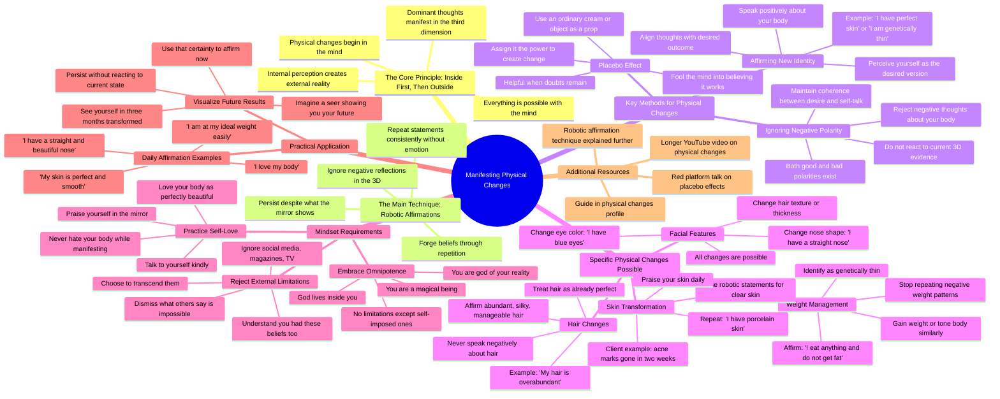

# Get Your Dream Body Once and For All

> 🌐 **Read this in:** **English** · [中文](../../zh-CN/2026-07/tiktok-transcript-ten-el-f-sico-de-tus-sue-os-de-una-vez-por-todas-k-5d53.md)

> **Creator:** [@karimemindsetcoach](https://www.tiktok.com/@karimemindsetcoach) · **Views:** 2.9M · **Posted:** 2026-07-19 · **Niche:** other
>
> **TL;DR:** Promises a radical physical change without surgery, instantly grabbing attention.

[Watch original video →](https://www.tiktok.com/@karimemindsetcoach/video/7636573080025943326?is_from_webapp=1&sender_device=pc&web_id=7664062104052139534)

## Why This Went Viral

## Hook (first 3 seconds)
- **Verbatim opening:** "Hey, let's talk about physical changes. I can change my nose and get it super fluffy without surgery. Yes, you can."
- **Hook pattern:** Bold claim + direct address ("Hey") + specific, impossible-sounding promise (change nose without surgery)
- **Why it stops scrolling:** The claim is instantly provocative — it promises a supernatural ability (mind over body) in a concrete, visual way ("super fluffy nose"). The "Yes, you can" repetition creates a hypnotic, authoritative rhythm that challenges skepticism head-on.

## Emotional Rhythm
- **Beat 1 — Curiosity/Challenge:** "I can change my nose... without surgery" → viewer thinks "bullshit, prove it"
- **Beat 2 — Escalation of impossibility:** "I can change my eye color... I want them blue. Yes, you can." → tension builds, the claims get more absurd
- **Beat 3 — Tension release via authority:** "You can do everything with your mind. It's very easy." → tone shifts to calm certainty
- **Beat 4 — Resonance/Relatability:** "Testimonies are coming to us every day" → social proof, you're not alone
- **Beat 5 — Emotional climax:** "I am god of my reality. The capacity that my mind has is that you can't even imagine it." → peak empowerment, almost religious fervor
- **Beat 6 — Relief/Reassurance:** "I already recorded a video on youtube... I have a guide" → solution offered, path forward
- **Beat 7 — Final push:** "This is what you will see in three months. All you have to do is affirm." → hope + concrete timeline

## Keyword Density
1. **"Manifest" / "Manifesting"** (8+ times) — algorithmic reach (high-search volume on TikTok/YouTube)
2. **"Repeat" / "Repeating"** (10+ times) — emotional pull (reinforces the "robotic affirmation" technique)
3. **"Inside" / "Outside"** (6+ times) — conceptual anchor (mind-body connection, easy to visualize)
4. **"Perfect skin" / "Perfect"** (7+ times) — emotional pull (desire for flawlessness, aspirational)
5. **"Lose weight" / "Fat"** (6+ times) — algorithmic reach (high-competition, high-demand topic)
6. **"Eye color" / "Nose" / "Hair"** (5+ times) — specificity (makes the abstract claim tangible)
7. **"Third dimension"** (3 times) — niche jargon (builds community identity, signals insider knowledge)
8. **"God" / "All-powerful" / "Magical beings"** (4 times) — emotional pull (spiritual empowerment, identity shift)

## Why It Spreads
- **1. Extreme, testable claims create "curiosity gaps"** — "Change your eye color without surgery" is so outrageous that viewers must watch to see if she backs it up. The transcript literally says "Who says there are limitations?" — this dares the viewer to disprove it.
- **2. Repetition as a memory hack** — The phrase "First it's inside and then it's outside" is repeated 4 times in rapid succession. This makes the concept sticky and shareable — viewers can repeat it to friends. The "robotic statements" technique is itself a viral format.
- **3. Social proof via client testimonial** — "I have a client that she wants to eliminate her acne marks... two weeks, has nothing." This is a concrete, time-bound result that feels believable despite the wild premise. It lowers skepticism.
- **4. Identity transformation framing** — "Start identifying yourself as the person who eats anything and does not get fat" — this isn't just a tip, it's a new identity. People share content that helps them redefine who they are (e.g., "I am god of my reality").
- **5. "Future-seer" visualization hook** — "Pretend I am a seer and I can show you your future... This is how you will look in three months." This turns the video into a mini-ritual, making it feel like a secret revealed. Viewers will tag friends: "Try this with me."

## What You Can Steal
- **1. The "Impossible List" opener** — Start with 3 specific, outrageous claims in rapid succession ("I can change my nose... eye color... lose weight"). This creates instant intrigue and signals that the video contains "forbidden knowledge."
- **2. The "Inside-Outside" mantra loop** — Pick a 4-word phrase that summarizes your core concept and repeat it 3–4 times in a row, slightly varying the emphasis. This makes the idea feel like a law of nature, not just an opinion.
- **3. The "Future-seer" visualization** — Ask viewers to imagine you showing them a photo of their future self. Then say "All you have to do is [your action]." This turns a vague promise into a concrete, emotionally charged call to action that feels like a cheat code.

## Mind Map

## Full Transcript (Generated by [TokTranscript.com](https://toktranscript.com/?utm_source=github&utm_medium=breakdown&utm_campaign=tool_attribution))

> 📝 Transcripts on this page are auto-generated and show the first 60%. Want to transcribe any TikTok in 30 seconds and get the full version? [Try TokTranscript free →](https://toktranscript.com/?utm_source=github&utm_medium=breakdown&utm_campaign=transcript_cta)

Hey, let's talk about physical changes. I can change my nose and get it super fluffy. without surgery. Yes, you can. I can change my eye color. I just have dark brown, but I want them blue. Yes, you can, I can lose weight, can't I lose weight? Yes, you can. You can do everything with your mind. It's very easy. Manifesting physical changes is very easy. What's up? We are, honey, manipulating external energy outside of us. Okay, yes. Specific person. There is no free will. We are expressing it. Testimonies are coming to us every day. For you to tell me that you can't change your eye color, lose weight, your straight Chinese hair is even easier if I can manipulate the outside. Because it started here. Now, imagine manipulate my body here. Inside is first and then outside. First it is inside and then it is outside. The same for your body. First is Tuesday and then it's outside. First it's inside and then it's outside. Not everything. Everything. Everything. Everything. Everything in general. Okay. So, you want to be a thin person. Perceive yourself as a thin person. You want to be a person who can eat anything. and not get fat. Perceive yourself as a person who eats anything and does not get fat. You're full of acne marks. Realize that you have a porcelain skin. I, for example, I'm going to tell you. I have repeated many times that I have perfect skin. that my skin is perfect that I have porcelain skin, I don't even get a pimple, I have superb skin. And I no longer repeat it because with so much repetition I forged a belief. But at first I had to repeat it here. The same as we do for other statements, sorry, for other manifestations or other wishes. We will do the same in physical changes. The technique is the same and the one I will always tell you, crazy in her little head, lulus babies in their little heads, robotic statements. You know that's my technique. I will always show them and I am going to say that this is the way to manifest. You don't need a thrill, you need to repeat. Your thoughts dominant manifest and your dominant thinking about you, the physique, is what is going to be shown in your third dimension. so, for example, I have a client, that she wants to eliminate her acne marks, was stating two weeks, has nothing, nothing. what did he do? He persisted, persisted, persisted, persisted. I have perfect skin, I have perfect skin. Okay, what do we do? For example, also when we want to lose weight a little at a time, there are not two extremes, the person who wants to lose weight and who cannot, because even though it is lived on a diet, never lowers anything, breathes and fattens, and the person who eats anything and never gets fat. And what does this person say? It's my genetics. I can eat anything and never get fat? Is it my genetics? Yes, that is what is constantly being repeated. And he got his genetics done because they are constantly saying it, are repeating and repeating and repeating. It is a fact for those people who eat and do not get fat. and that is what shows its reality. Unlike other people who live it on a diet and always repeat themselves. I just don't know why I get fat and fat, because I have heard that phrase, I have been told, is that I lose and get fat. I can't lose weight, it's super hard for me. I don't know why I can't. I just live it on a diet. You are constantly repeating that to yourself is constantly what you're going to see in your third dimension. Start identifying yourself as the person who eats anything and does not get fat, begin to identify with the person which is genetically thin, begins to meet that person who eats anything and does not put on weight. And now it is an example, losing weight can also be the other way around, gain weight or have a toned body, or your nose to change from one shape to another.. , very possible. Affirm, I have a straight nose, I have a perfectly straight nose. Karime is possible, change eye color, also possible. Who says there are limitations? The limitation is set by you and the social networks. And what we see magazines and what we see on television programs. and what everyone says. I understand why they have them, you know? I had them too. But once that we understand that we are magical beings and that we are all-powerful, because the universe live of us and god lives inside us, and I am god of my reality. The capacity that my mind has is that you can't even imagine it. Then we have the capacity to show everything and to have everything we want. I already recorded a video on youtube about this, much deeper, much longer in case you want to go see it. And I also have a guide in my physical changes profile. so that's all they have to do, begin to perceive themselves as that person. Remember my dominant thoughts, create my reality and apply for physical changes easier. Challenging eye, yes, challenger. And I don't want to put limiting beliefs on you, much less. But you have constant aging. Then I need you to grab your pants and affirm despite what the mirror is showing you.

*[Read the full transcript on TokTranscript →](https://toktranscript.com/plaza/tiktok-transcript-ten-el-f-sico-de-tus-sue-os-de-una-vez-por-todas-k-5d53?utm_source=github&utm_medium=breakdown&utm_campaign=transcript_full)*

## Browse More

- All [other](../../by-niche/en/other.md) breakdowns
- All [Impossible Claim](../../by-pattern/en/hook-impossible-claim.md) examples

## Video Info

| | |
|---|---|
| Creator | [@karimemindsetcoach](https://www.tiktok.com/@karimemindsetcoach) |
| Original video | [https://www.tiktok.com/@karimemindsetcoach/video/7636573080025943326?is_from_webapp=1&sender_device=pc&web_id=7664062104052139534](https://www.tiktok.com/@karimemindsetcoach/video/7636573080025943326?is_from_webapp=1&sender_device=pc&web_id=7664062104052139534) |
| Original title | Ten el físico de tus sueños de una vez por todas 👏🏻👏🏻👏🏻🫰🏻🫰🏻🫰🏻🫰🏻😁😁😁 #k... |
| Views | 2.9M (2900000) |
| Posted | 2026-07-19 |
| Duration | 0s |
| Niche | `other` |
| Hook pattern | `Impossible Claim` |
| Original language | `en` |
| Available languages | en, zh-CN |
| Generated | 2026-07-20 by [TokTranscript](https://toktranscript.com/) |

---

*This breakdown is for educational analysis under fair use. Original video © [@karimemindsetcoach](https://www.tiktok.com/@karimemindsetcoach). All transcripts are auto-generated and may contain errors.*

*Want to analyze your own TikToks like this? [TokTranscript.com →](https://toktranscript.com/viral-breakdown?utm_source=github&utm_medium=breakdown&utm_campaign=footer_cta)*