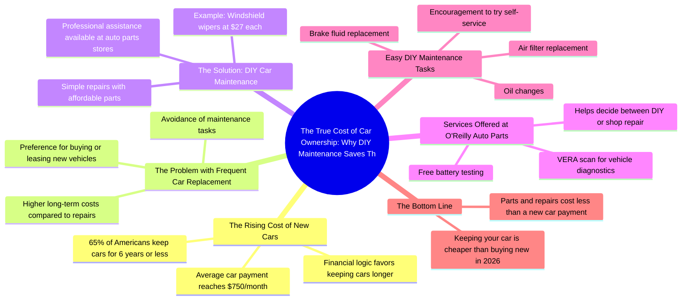

# Average New Car Payment Hits $750 Monthly

> 🌐 **Read this in:** **English** · [中文](../../zh-CN/2026-07/tiktok-transcript-the-average-new-car-payment-nearly-750-dollars-a-month-now-o-e2b6.md)

> **Creator:** [@humphreytalks](https://www.tiktok.com/@humphreytalks) · **Views:** 3.9M · **Posted:** 2026-07-08 · **Niche:** finance
>
> **TL;DR:** Opens with a surprising dollar amount to grab attention immediately.

[Watch original video →](https://vt.tiktok.com/ZSCwGuoya/)

## Why This Went Viral

## Hook (first 3 seconds)
- **Verbatim opening:** "$750 a month? Why is that the new average car payment in America now?"
- **Hook pattern:** **Numbers + Bold Claim** — a shocking dollar amount ($750) paired with a rhetorical question.
- **Why it stops scrolling:** The number is absurdly high (most people expect ~$500), triggering immediate financial anxiety. The question implies "you're being ripped off," which compels viewers to stay for the answer.

## Emotional Rhythm
1. **Shock/Anxiety** — $750 car payment lands like a gut punch.
2. **Resonance** — "65% of Americans keep cars for six years or less" — viewer recognizes their own behavior.
3. **Tension** — "But it makes so much more financial sense to keep your car for as long as you can" — creates a gap between what people do and what they should do.
4. **Relief/Curiosity** — "Doing simple car repairs yourself…" — offers a solution path.
5. **Trust-building** — Pedro at O'Reilly does the work for free (battery test, VERA scan) — reduces perceived effort.
6. **Satisfaction** — "That was painless" — low-friction success moment.
7. **Call to action (empowerment)** — "I would encourage you… try getting your parts at O'Reilly Auto Parts and do it yourself."
8. **Climax** — "Keeping your car and paying for parts and repairs is still way cheaper than buying a new car in 2026" — closes the loop with a concrete, future-oriented win.

## Keyword Density
| Keyword/Phrase | Count | Driver Type |
|---|---|---|
| "car" | 8 | Algorithmic (broad search) |
| "save money" / "cheaper" | 4 | Emotional + Algorithmic (value-driven) |
| "yourself" / "DIY" | 4 | Emotional (empowerment) |
| "O'Reilly Auto Parts" | 3 | Branded (sponsor/partnership) |
| "maintenance" | 3 | Algorithmic (how-to intent) |
| "parts" | 3 | Algorithmic (product search) |
| "new car" | 3 | Contrast hook (old vs. new) |
| "affordable" / "only $27" | 2 | Emotional (relief, price anchoring) |
| "fix" / "repair" | 2 | Algorithmic (problem-solution) |
| "2026" | 1 | Emotional (urgency, future-proofing) |

**Why they work:** "Car" and "maintenance" drive search discoverability. "Save money," "yourself," and "DIY" trigger emotional resonance (frugality, independence). "O'Reilly Auto Parts" is the branded payoff — the video is essentially a native ad wrapped in a viral format.

## Why It Spreads
1. **Financial anxiety + concrete solution** — The opening "$750 a month" triggers a universal pain point. The solution ("do it yourself with affordable parts") is specific, achievable, and immediately actionable. *Transcript: "Doing simple car repairs yourself with affordable parts is one of the easiest ways to save money."*
2. **Low-effort demonstration** — Pedro does the work for free (battery test, VERA scan, wiper install). This removes the "I'm not handy" objection. *Transcript: "Pedro here at O'Reilly Auto Parts said he would do it for me, which is really dope."*
3. **Social proof + free value** — The VERA scan is a free diagnostic tool that gives the viewer a clear next step ("decide if it's a fix I can do myself or if I should take it to a shop"). *Transcript: "He also tested my battery, and then he performed a VERA scan…"*
4. **Future-oriented urgency** — "Still way cheaper than buying a new car in 2026" frames the action as a long-term win, not just a one-time tip. *Transcript: "Keeping your car and paying for parts and repairs is still way cheaper than buying a new car in 2026."*
5. **Shareability through relatability** — 65% of Americans keep cars ≤6 years. That statistic makes the viewer feel "everyone does this, but it's dumb" — which creates a natural share impulse ("my friend needs to see this").

## What You Can Steal
1. **Open with a shocking number + rhetorical question** — Lead with a specific, emotionally charged number ($750, $1,000, 65%) and a question that implies the viewer is missing something. This forces a "I need to know" loop.
2. **Embed a free, low-friction "hero moment"** — Have an expert or employee do one small task for you on camera (free battery test, free scan, free install). This makes the solution feel effortless and trustworthy, not salesy.
3. **Close with a future-anchored comparison** — End with a specific year (2026, 2027) and a direct cost comparison. This creates urgency and makes the tip feel like a strategic decision, not a random hack.

## Mind Map

## Full Transcript (Generated by [free TikTok transcript generator](https://toktranscript.com/?utm_source=github&utm_medium=breakdown&utm_campaign=tool_attribution))

> 📝 Transcripts on this page are auto-generated and show the first 60%. Want to transcribe any TikTok in 30 seconds and get the full version? [Try TokTranscript free →](https://toktranscript.com/?utm_source=github&utm_medium=breakdown&utm_campaign=transcript_cta)

$750 a month? Why is that the new average car payment in America now? A recent survey showed that 65% of Americans keep their current cars for six years or less. But it makes so much more financial sense to keep your car for as long as you can. But many people don't want to deal with maintenance themselves, so they just end up buying or leasing a new car. But doing simple car repairs yourself with affordable parts is one of the easiest ways to save money. I found these windshield wipers for my car, and they only cost $27 each, so let's go replace them. So I was gonna do it myself, but then Pedro here at O'reilly Auto Parts said he would do it for me, which is really dope.

*[Read the full transcript on TokTranscript →](https://toktranscript.com/plaza/tiktok-transcript-the-average-new-car-payment-nearly-750-dollars-a-month-now-o-e2b6?utm_source=github&utm_medium=breakdown&utm_campaign=transcript_full)*

## Browse More

- All [finance](../../by-niche/en/finance.md) breakdowns
- All [Shocking Statistic](../../by-pattern/en/hook-shocking-statistic.md) examples

## Video Info

| | |
|---|---|
| Creator | [@humphreytalks](https://www.tiktok.com/@humphreytalks) |
| Original video | [https://vt.tiktok.com/ZSCwGuoya/](https://vt.tiktok.com/ZSCwGuoya/) |
| Original title | The average new car payment nearly $750 dollars a month now. One of t... |
| Views | 3.9M (3900000) |
| Posted | 2026-07-08 |
| Duration | 0s |
| Niche | `finance` |
| Hook pattern | `Shocking Statistic` |
| Original language | `en` |
| Available languages | en, zh-CN |
| Generated | 2026-07-09 by [TokTranscript](https://toktranscript.com/) |

---

*This breakdown is for educational analysis under fair use. Original video © [@humphreytalks](https://www.tiktok.com/@humphreytalks). All transcripts are auto-generated and may contain errors.*

*Want to analyze your own TikToks like this? [TokTranscript →](https://toktranscript.com/viral-breakdown?utm_source=github&utm_medium=breakdown&utm_campaign=footer_cta)*