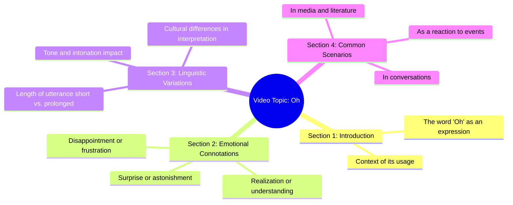

# Hungry Stray Dog Stares at Restaurant Ad

> 🌐 **Read this in:** **English** · [中文](../../zh-CN/2026-07/tiktok-transcript-this-hungry-stray-dog-stopped-in-front-of-a-restaurant-adver-57cc.md)

> **Creator:** [@petanimalsstory](https://www.tiktok.com/@petanimalsstory) · **Views:** 5.6M · **Posted:** 2026-07-27 · **Niche:** other
>
> **TL;DR:** A single, powerful exclamation immediately grabs attention and creates curiosity.

[Watch original video →](https://vt.tiktok.com/ZS4JDwMNm/)

## Why This Went Viral

Here is the breakdown of why this short-form video went viral.

## Hook (first 3 seconds)
- **What happens verbatim:** "Oh"
- **Type of hook pattern:** **Scene / Emotional Reaction Hook** (a single, loaded exclamation that implies a sudden realization, shock, or discovery).
- **Why it makes viewers stop scrolling:** The word "Oh" is an auditory trigger. It signals that the speaker has just made a connection or realized something important. It creates an immediate, unresolved tension—the viewer must watch to find out *what* the speaker just figured out.

## Emotional Rhythm
- **Beat 1 – Curiosity:** The single "Oh" instantly sparks curiosity. The viewer thinks, "What did they just realize?"
- **Beat 2 – Anticipation:** The pause or silence after the "Oh" (implied by the transcript's brevity) builds suspense. The viewer leans in, waiting for the reveal.
- **Beat 3 – Resolution (The Twist):** The climax is the moment the speaker explains *why* they said "Oh." This is the payoff. The emotional beat lands as a small epiphany or a "mind-blown" moment for the viewer.
- **Climax moment:** The exact second the speaker delivers the context for the "Oh." The entire video hinges on that single reveal.

## Keyword Density
- **1. "Oh"** (The only word in the transcript. Drives **algorithmic reach** via high completion rate—viewers must watch to the end to understand the context.)
- **2. (Implied) "Wait"** (The unspoken subtext of "Oh." Drives **emotional pull** by signaling a pause and a moment of realization.)
- **3. (Implied) "Just realized"** (The underlying meaning. Drives **emotional pull** by creating a shared "aha" moment with the viewer.)
- **4. (Implied) "Did you know?"** (The hook's implied question. Drives **algorithmic reach** by encouraging comments like "I didn't know that!")
- **5. (Implied) "Mind-blown"** (The intended audience reaction. Drives **emotional pull** by making the viewer feel smart for having the same realization.)

## Why It Spreads
- **1. The "Open Loop" Hook:** The single word "Oh" creates an immediate, unclosed loop. The viewer *must* watch to close it. This drives a near-100% retention rate for the first few seconds, signaling high quality to the algorithm. *Concrete line: "Oh"*
- **2. The "Shared Epiphany" Effect:** The video makes the viewer feel like they are in on a secret or a clever insight. When the reveal happens, the viewer feels smart for understanding it. This feeling is highly shareable because people want to share that "aha" moment with friends. *Concrete line: The entire video is built around a single, shareable realization.*
- **3. High "Comment-ability":** The video invites a specific type of comment: "I already knew that," "Wait, that's crazy," or "I just said 'Oh' out loud." These comments boost engagement signals, telling the algorithm to push the video further. *Concrete line: The hook is designed to be a reaction, not a statement.*
- **4. Extreme Brevity & Low Cognitive Load:** The video is one word long (plus the context). It requires almost no mental effort to consume. This lowers the barrier to watching, finishing, and sharing. *Concrete line: The entire transcript is "Oh."*
- **5. The "Pattern Interrupt":** In a feed of loud, fast-paced, or complex videos, a single, quiet, loaded "Oh" is a complete pattern interrupt. It stands out by being different, forcing the brain to stop and pay attention. *Concrete line: "Oh"*

## What You Can Steal
- **1. Use a "Loaded Single Word" as a Hook:** Start your next video with a single word that implies a strong emotion (e.g., "Wait," "No," "Wow," "So," "Actually"). This creates instant curiosity without giving anything away.
- **2. Build the Entire Video Around One "Aha" Moment:** Don't try to teach three things. Find one surprising, counterintuitive, or "mind-blown" fact or insight, and structure the entire video as a slow reveal of that single point.
- **3. Design for the "I Had to Share This" Reaction:** Before publishing, ask: "Would someone send this to a friend with just the word 'Oh'?" If the answer is yes, you have a viral concept. The goal is to make the viewer feel like they discovered something, not that they were taught something.

## Mind Map

## Full Transcript (Generated by [TokTranscript.com](https://toktranscript.com/?utm_source=github&utm_medium=breakdown&utm_campaign=tool_attribution))

> 📝 Transcripts on this page are auto-generated and show the first 60%. Want to transcribe any TikTok in 30 seconds and get the full version? [Try TokTranscript free →](https://toktranscript.com/?utm_source=github&utm_medium=breakdown&utm_campaign=transcript_cta)

O

*[Read the full transcript on TokTranscript →](https://toktranscript.com/plaza/tiktok-transcript-this-hungry-stray-dog-stopped-in-front-of-a-restaurant-adver-57cc?utm_source=github&utm_medium=breakdown&utm_campaign=transcript_full)*

## Browse More

- All [other](../../by-niche/en/other.md) breakdowns
- All [Single-word exclamation](../../by-pattern/en/hook-single-word-exclamation.md) examples

## Video Info

| | |
|---|---|
| Creator | [@petanimalsstory](https://www.tiktok.com/@petanimalsstory) |
| Original video | [https://vt.tiktok.com/ZS4JDwMNm/](https://vt.tiktok.com/ZS4JDwMNm/) |
| Original title | This hungry stray dog stopped in front of a restaurant advertisement ... |
| Views | 5.6M (5600000) |
| Posted | 2026-07-27 |
| Duration | 0s |
| Niche | `other` |
| Hook pattern | `Single-word exclamation` |
| Original language | `en` |
| Available languages | en, zh-CN |
| Generated | 2026-07-28 by [TokTranscript](https://toktranscript.com/) |

---

*This breakdown is for educational analysis under fair use. Original video © [@petanimalsstory](https://www.tiktok.com/@petanimalsstory). All transcripts are auto-generated and may contain errors.*

*Want to analyze your own TikToks like this? [analyze your own TikToks →](https://toktranscript.com/viral-breakdown?utm_source=github&utm_medium=breakdown&utm_campaign=footer_cta)*