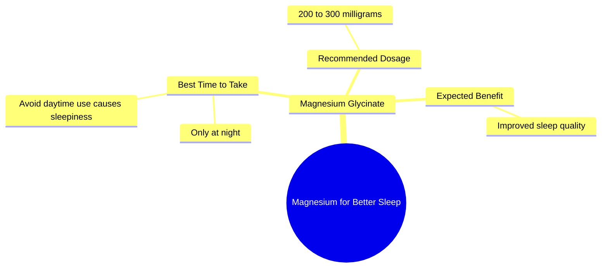

# Magnesium Glycinate For Better Sleep: Dosage Guide

> 🌐 **Read this in:** **English** · [中文](../../zh-CN/2026-07/tiktok-transcript-this-supplement-will-change-your-life-menopause-magnesium-su-603d.md)

> **Creator:** [@drmartinkinsella](https://www.tiktok.com/@drmartinkinsella) · **Views:** 3.6M · **Posted:** 2026-07-01 · **Niche:** fitness
>
> **TL;DR:** Starts with a strong, inclusive directive that immediately positions the advice as essential for a common problem.

[Watch original video →](https://www.tiktok.com/@drmartinkinsella/video/7400083642480905505?is_from_webapp=1&sender_device=pc&web_id=7652559874152564254)

## Why This Went Viral

## Hook (first 3 seconds)
- **Verbatim:** "Everyone should take magnesium if they're struggling to sleep."
- **Hook pattern:** Bold claim + direct problem-solution
- **Why it stops scrolling:** It's a universal health claim ("everyone") targeting a massive pain point (poor sleep). The authoritative tone ("should") triggers immediate curiosity: *Is this true? Do I need this?*

## Emotional Rhythm
- **Beat 1 – Curiosity:** "Everyone should take magnesium if they're struggling to sleep." → Viewer thinks, *I struggle to sleep, tell me more.*
- **Beat 2 – Tension/Correction:** "Magnesium glycinate should only be taken at night. If you take it in the day, you'll get sleepy." → Creates a "gotcha" moment (many people take it wrong). Viewer feels *I might be doing this wrong.*
- **Beat 3 – Relief/Clarity:** "Take 2 to 300 milligrams of that at night and see how much better you sleep." → Simple, actionable dosage. Resolves tension with a clear payoff.
- **Climax:** The precise dosage range ("2 to 300 milligrams") — it feels scientific, trustworthy, and instantly usable.

## Keyword Density
1. **Magnesium** – 3x (core topic, drives search/algorithm)
2. **Sleep** – 3x (high-volume pain point, emotional pull)
3. **Night** – 2x (timing specificity, builds trust)
4. **Take** – 3x (action verb, drives conversion)
5. **Milligrams** – 1x (precision, algorithmic authority signal)
6. **Glycinate** – 1x (specific form, niche keyword for informed viewers)
- **Algorithmic drivers:** "Magnesium," "sleep" — high search volume, trending health topic.
- **Emotional pull:** "Struggling," "sleepy," "better" — directly tap into frustration and hope.

## Why It Spreads
1. **Universal problem, zero gatekeeping:** "Everyone should take magnesium" removes hesitation. It's not "if you have a deficiency" — it's an inclusive command. *Transcript line: "Everyone should take magnesium if they're struggling to sleep."*
2. **Correction creates shareability:** The warning about daytime sleepiness is a "myth-busting" moment. Viewers who have taken it wrong feel compelled to share with friends who might also be making the mistake. *Transcript line: "If you take it in the day, you'll get sleepy."*
3. **Actionable specificity drives saves:** "2 to 300 milligrams at night" is a concrete, repeatable instruction. Viewers save the video for later reference, boosting retention signals. *Transcript line: "Take 2 to 300 milligrams of that at night."*
4. **Authority via brevity:** No fluff, no hesitation. The clipped, confident cadence mimics a doctor's advice. Viewers perceive high credibility, increasing trust and willingness to share. *Transcript line: "Magnesium glycinate should only be taken at night."*

## What You Can Steal
1. **Start with a universal command + pain point:** Open with "Everyone should [do X] if they're struggling with [Y]." It instantly hooks anyone with that problem.
2. **Include a "mistake correction" beat:** Add one line that reveals a common error (e.g., "most people take it wrong"). This triggers the "I need to fix this" emotion and boosts shareability.
3. **End with a precise, numbered action:** Give a specific dose, time, or quantity. Vague advice doesn't get saved. "Take 2 to 300 milligrams at night" is a recipe — viewers bookmark it.

## Mind Map

## Full Transcript (Generated by [free TikTok transcript generator](https://toktranscript.com/?utm_source=github&utm_medium=breakdown&utm_campaign=tool_attribution))

> 📝 Transcripts on this page are auto-generated and show the first 60%. Want to transcribe any TikTok in 30 seconds and get the full version? [Try TokTranscript free →](https://toktranscript.com/?utm_source=github&utm_medium=breakdown&utm_campaign=transcript_cta)

Everyone should take magnesium if they're struggling to sleep. Magnesium glycinate should only be taken at night.

*[Read the full transcript on TokTranscript →](https://toktranscript.com/plaza/tiktok-transcript-this-supplement-will-change-your-life-menopause-magnesium-su-603d?utm_source=github&utm_medium=breakdown&utm_campaign=transcript_full)*

## Browse More

- All [fitness](../../by-niche/en/fitness.md) breakdowns
- All [Universal Command](../../by-pattern/en/hook-universal-command.md) examples

## Video Info

| | |
|---|---|
| Creator | [@drmartinkinsella](https://www.tiktok.com/@drmartinkinsella) |
| Original video | [https://www.tiktok.com/@drmartinkinsella/video/7400083642480905505?is_from_webapp=1&sender_device=pc&web_id=7652559874152564254](https://www.tiktok.com/@drmartinkinsella/video/7400083642480905505?is_from_webapp=1&sender_device=pc&web_id=7652559874152564254) |
| Original title | This supplement will change your life! 🤯 #menopause #magnesium #suppl... |
| Views | 3.6M (3600000) |
| Posted | 2026-07-01 |
| Duration | 0s |
| Niche | `fitness` |
| Hook pattern | `Universal Command` |
| Original language | `en` |
| Available languages | en, zh-CN |
| Generated | 2026-07-02 by [TokTranscript](https://toktranscript.com/) |

---

*This breakdown is for educational analysis under fair use. Original video © [@drmartinkinsella](https://www.tiktok.com/@drmartinkinsella). All transcripts are auto-generated and may contain errors.*

*Want to analyze your own TikToks like this? [free TikTok transcript generator →](https://toktranscript.com/viral-breakdown?utm_source=github&utm_medium=breakdown&utm_campaign=footer_cta)*