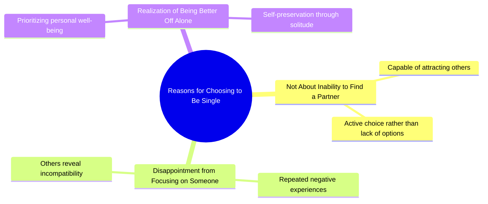

# Tom Hardy Explains Why He Chooses to Be Single

> 🌐 **Read this in:** **English** · [中文](../../zh-CN/2026-07/tiktok-transcript-tom-hardy-motivation-tomhardy-relationshipgoals-relationship-9d4f.md)

> **Creator:** [@jimmy__jon](https://www.tiktok.com/@jimmy__jon) · **Views:** 4.0M · **Posted:** 2026-07-02 · **Niche:** other
>
> **TL;DR:** The hook reframes a common assumption about singleness, creating intrigue and relatability.

[Watch original video →](https://www.tiktok.com/t/ZP8GBfDW1/)

## Why This Went Viral

## Hook (first 3 seconds)
- **Verbatim opening:** "I'm not single because I can't get anyone. I'm single because every time I focus on someone, they show me exactly why I'm better off alone."
- **Hook pattern:** Bold claim + contrast (negative reframe of a common stigma)
- **Why it stops scroll:** It flips the victim narrative into empowered self-awareness. The viewer expects a sob story ("I'm lonely") but gets a defiant, relatable truth. The cadence ("I'm... I'm not...") creates a stutter that signals vulnerability, then the twist lands hard.

## Emotional Rhythm
- **Beat 1 – Curiosity (0–2s):** "I'm not single because I can't get anyone" — viewer leans in, expecting a boast or excuse.
- **Beat 2 – Tension (2–4s):** "Every time I focus on someone" — sets up a pattern of disappointment.
- **Beat 3 – Resonance (4–6s):** "They show me exactly why I'm better off alone" — the punchline. The viewer feels seen (shared experience of being let down).
- **Beat 4 – Relief / Empowerment (6–8s):** The emotional release. No self-pity, only clarity. The viewer nods, not cries.
- **Climax:** The final phrase "better off alone" — it lands as a mic-drop, not a lament.

## Keyword Density
| Word/Phrase | Count (approx) | Drive |
|-------------|----------------|-------|
| "single" | 2 | Algorithm: high-search, high-identity keyword (dating niche) |
| "I'm not" | 2 | Emotional pull: reframes identity (defiance) |
| "because" | 2 | Algorithm: causal connector drives retention (viewers want explanation) |
| "every time" | 1 | Emotional pull: universal pattern, not one-off |
| "focus on someone" | 1 | Emotional pull: relatable action (dating effort) |
| "show me" | 1 | Emotional pull: passive victim → active observer |
| "better off alone" | 1 | Emotional pull: empowering conclusion, shareable mantra |

**Algorithm drivers:** "single" + "because" — high search volume, high completion rate (causal hook).  
**Emotional pull:** "better off alone" — sticky, quotable, re-shareable as a caption or affirmation.

## Why It Spreads
1. **Reframes a stigmatized identity (single = failure → single = self-respect).** The line "I'm not single because I can't get anyone" directly attacks the common judgment. Viewers who feel defensive about their single status now have a weapon to share.
2. **Uses a "pattern interrupt" structure.** The stutter "I'm. I'm not" signals raw, unscripted authenticity. It feels like a confession, not a script — which drives trust and saves.
3. **Ends with a quotable mic-drop.** "Better off alone" is a 4-word mantra that works as a text overlay, a tweet, a bio. It's easy to repeat, easy to remix.
4. **Triggers the "same experience" algorithm.** The phrase "every time I focus on someone, they show me" implies a recurring pattern — viewers who've had multiple bad relationships feel personally targeted. This drives high completion rate and comments like "this is literally me."
5. **No call to action, but high implicit shareability.** The video doesn't ask for anything, but the emotional payoff ("I'm better off alone") is so satisfying that viewers *want* to share it as a status update or group chat.

## What You Can Steal
1. **Lead with a negative reframe of a common label.** Take a stigma (lonely, broke, messy, anxious) and flip it into a power statement. "I'm not broke because I'm lazy. I'm broke because I refuse to work for people who don't value me."
2. **Use a verbal stutter or hesitation in the first 2 seconds.** "I'm. I'm not..." signals realness. Record yourself starting the sentence, then restarting. It breaks the polished-TikTok feel and builds instant trust.
3. **End with a 4–6 word mantra that can stand alone.** The last line should be quotable without context. Test it: if you put it on a T-shirt or as a text overlay, does it still hit? If yes, it will spread.

## Mind Map

## Full Transcript (Generated by [TokTranscript](https://toktranscript.com/?utm_source=github&utm_medium=breakdown&utm_campaign=tool_attribution))

> 📝 Transcripts on this page are auto-generated and show the first 60%. Want to transcribe any TikTok in 30 seconds and get the full version? [Try TokTranscript free →](https://toktranscript.com/?utm_source=github&utm_medium=breakdown&utm_campaign=transcript_cta)

I'm. I'm not single because I can't get anyone.

*[Read the full transcript on TokTranscript →](https://toktranscript.com/plaza/tiktok-transcript-tom-hardy-motivation-tomhardy-relationshipgoals-relationship-9d4f?utm_source=github&utm_medium=breakdown&utm_campaign=transcript_full)*

## Browse More

- All [other](../../by-niche/en/other.md) breakdowns
- All [Contradiction/Reframe](../../by-pattern/en/hook-contradiction-reframe.md) examples

## Video Info

| | |
|---|---|
| Creator | [@jimmy__jon](https://www.tiktok.com/@jimmy__jon) |
| Original video | [https://www.tiktok.com/t/ZP8GBfDW1/](https://www.tiktok.com/t/ZP8GBfDW1/) |
| Original title | Tom Hardy motivation #tomhardy #relationshipgoals #relationships #rel... |
| Views | 4.0M (4000000) |
| Posted | 2026-07-02 |
| Duration | 0s |
| Niche | `other` |
| Hook pattern | `Contradiction/Reframe` |
| Original language | `en` |
| Available languages | en, zh-CN |
| Generated | 2026-07-03 by [TokTranscript](https://toktranscript.com/) |

---

*This breakdown is for educational analysis under fair use. Original video © [@jimmy__jon](https://www.tiktok.com/@jimmy__jon). All transcripts are auto-generated and may contain errors.*

*Want to analyze your own TikToks like this? [TokTranscript.com →](https://toktranscript.com/viral-breakdown?utm_source=github&utm_medium=breakdown&utm_campaign=footer_cta)*