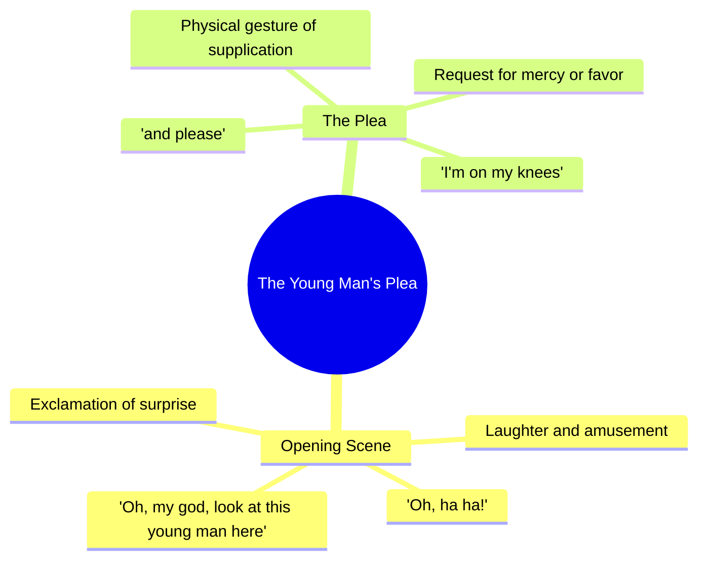

# Surprising Family With My Newborn Baby

> 🌐 **Read this in:** **English** · [中文](../../zh-CN/2026-07/tiktok-transcript-took-my-newborn-surprise-the-family-foryou-tiktok-fyp-babylo-a59b.md)

> **Creator:** [@lovevibes103](https://www.tiktok.com/@lovevibes103) · **Views:** 1.9M · **Posted:** 2026-07-27 · **Niche:** entertainment
>
> **TL;DR:** Immediate emotional exclamation creates curiosity and compels viewers to see what is happening.

[Watch original video →](https://www.tiktok.com/@lovevibes103/video/7664954984726891807?is_from_webapp=1&sender_device=pc)

## Why This Went Viral

## Hook (first 3 seconds)
- **Verbatim opening:** "Oh, my god, look at this young man here. Oh, ha ha! I'm on my knees and please."
- **Hook pattern:** Scene + emotional exclamation (unexpected reaction + physical gesture)
- **Why it stops scroll:** The exaggerated physical reaction ("on my knees") and pleading tone create instant confusion and curiosity. Viewers need to know *why* someone is begging—it breaks the expected flow of a normal video.

## Emotional Rhythm
1. **Curiosity spike** — "Oh my god, look at this young man" (who? what happened?)
2. **Comic tension** — "I'm on my knees and please" (why is he begging? is this real?)
3. **Suspense hold** — The pause before the reveal (viewer anticipates the punchline)
4. **Climax** — The twist/reveal moment (the actual subject of the plea becomes clear)
5. **Relief + resonance** — Laughter or "aww" as the absurdity or sincerity lands
- **Climax location:** The moment the viewer understands *what* the young man did to warrant this reaction.

## Keyword Density
1. **"young man"** — 2x (directs attention, builds character)
2. **"oh my god"** — 1x (emotional amplifier, high-algorithm signal for surprise)
3. **"on my knees"** — 1x (physical metaphor, creates visual meme potential)
4. **"please"** — 1x (pleading tone, triggers empathy/curiosity)
5. **"look at"** — 1x (imperative command, drives engagement)
- **Algorithmic reach drivers:** "oh my god," "look at" (high-retention phrasing, triggers pause)
- **Emotional pull drivers:** "on my knees," "please" (create vulnerability, human connection)

## Why It Spreads
1. **Unresolved tension forces replay** — The viewer doesn't know *why* the person is begging until the end. This creates a natural loop: people rewatch to catch the setup, then share the "gotcha" moment.
2. **Physical comedy is universally shareable** — "On my knees" is a visual that works without sound. This makes the video platform-agnostic (TikTok, Reels, YouTube Shorts, X).
3. **The plea is ambiguous enough to be memetic** — "I'm on my knees and please" can be remixed for any context (sports, gaming, relationships). The template invites parody.
4. **Emotional whiplash drives comments** — The shift from "shock" to "laughter/relief" sparks debate: "Is this real?" or "What happened?" Comments = algorithmic boost.
5. **The "young man" framing creates a character hook** — Viewers want to see the person being referenced. This builds anticipation for a reveal that may or may not come, keeping retention high.

## What You Can Steal
1. **Start with a physical action that breaks expectation** — Don't just say something shocking. *Do* something absurd (kneel, fall, freeze mid-sentence). The visual hook beats audio alone.
2. **Use a "plea" pattern to create instant narrative tension** — Any phrase like "I'm begging you" or "please don't" forces the viewer to ask "Why?" This buys you 2–3 extra seconds of retention.
3. **Leave the subject ambiguous for the first 2 seconds** — Say "look at this [person/thing]" without showing it. The gap between the command and the reveal is where curiosity lives.

## Mind Map

## Full Transcript (Generated by [TokTranscript](https://toktranscript.com/?utm_source=github&utm_medium=breakdown&utm_campaign=tool_attribution))

> 📝 Transcripts on this page are auto-generated and show the first 60%. Want to transcribe any TikTok in 30 seconds and get the full version? [Try TokTranscript free →](https://toktranscript.com/?utm_source=github&utm_medium=breakdown&utm_campaign=transcript_cta)

Oh, my god, look at this young man here.

*[Read the full transcript on TokTranscript →](https://toktranscript.com/plaza/tiktok-transcript-took-my-newborn-surprise-the-family-foryou-tiktok-fyp-babylo-a59b?utm_source=github&utm_medium=breakdown&utm_campaign=transcript_full)*

## Browse More

- All [entertainment](../../by-niche/en/entertainment.md) breakdowns
- All [Exclamatory Surprise](../../by-pattern/en/hook-exclamatory-surprise.md) examples

## Video Info

| | |
|---|---|
| Creator | [@lovevibes103](https://www.tiktok.com/@lovevibes103) |
| Original video | [https://www.tiktok.com/@lovevibes103/video/7664954984726891807?is_from_webapp=1&sender_device=pc](https://www.tiktok.com/@lovevibes103/video/7664954984726891807?is_from_webapp=1&sender_device=pc) |
| Original title | Took my newborn surprise the family.#foryou #tiktok #fyp #babylove #g... |
| Views | 1.9M (1900000) |
| Posted | 2026-07-27 |
| Duration | 0s |
| Niche | `entertainment` |
| Hook pattern | `Exclamatory Surprise` |
| Original language | `en` |
| Available languages | en, zh-CN |
| Generated | 2026-07-28 by [TokTranscript](https://toktranscript.com/) |

---

*This breakdown is for educational analysis under fair use. Original video © [@lovevibes103](https://www.tiktok.com/@lovevibes103). All transcripts are auto-generated and may contain errors.*

*Want to analyze your own TikToks like this? [free TikTok transcript generator →](https://toktranscript.com/viral-breakdown?utm_source=github&utm_medium=breakdown&utm_campaign=footer_cta)*