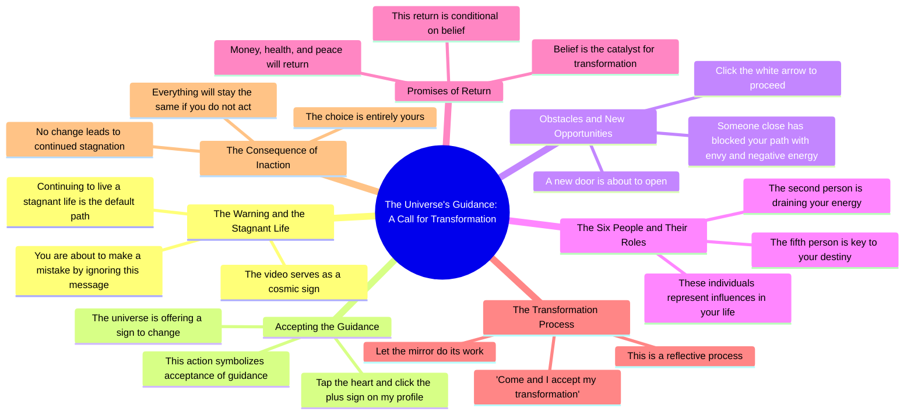

# Universe Tarot Warning: Stop Ignoring This Sign

> 🌐 **Read this in:** **English** · [中文](../../zh-CN/2026-07/tiktok-transcript-universe-tarotok-viral-tarot-foryou-fypviraltiktok-tarotr-fc1e.md)

> **Creator:** [@blythe.sidney8](https://www.tiktok.com/@blythe.sidney8) · **Views:** 1.5M · **Posted:** 2026-07-08 · **Niche:** entertainment
>
> **TL;DR:** Creates immediate tension and fear of missing out.

[Watch original video →](https://www.tiktok.com/t/ZP8G9SywS/)

## Why This Went Viral

## Hook (first 3 seconds)
- **Verbatim opening:** "You're about to make a mistake. You're going to ignore this video and continue living a stagnant life."
- **Hook pattern:** **Bold claim + direct address** (accusatory, confrontational, personalized)
- **Why it stops scrolling:** It creates immediate cognitive dissonance — the viewer feels called out personally. The word "mistake" triggers a fear of missing out (FOMO) and the accusation of "stagnant life" attacks the viewer's self-image, forcing them to watch to prove the claim wrong or seek validation.

## Emotional Rhythm
1. **Urgency + Fear** (0:00–0:05) — "You're about to make a mistake... stagnant life" → triggers anxiety and self-doubt
2. **Hope + Reward** (0:05–0:10) — "universe is giving you a sign... accept the guidance" → offers a way out, creates relief
3. **Suspicion + Curiosity** (0:10–0:15) — "someone close... blocked your path with envy" → introduces a secret enemy, builds mystery
4. **Anticipation + Action** (0:15–0:20) — "click the white arrow... look at the six people" → gamifies the experience, viewer becomes participant
5. **Climax** (0:20–0:25) — "the second person is draining your energy, but the fifth is key to your destiny" → highest tension, reveals hidden truth
6. **Resolution + Empowerment** (0:25–0:30) — "Money, health and peace will return... only if you believe" → offers a clear reward for compliance
7. **Final Ultimatum** (0:30–end) — "The choice is yours" → places responsibility on viewer, creates closure

## Keyword Density
| Keyword/Phrase | Frequency (approx.) | Function |
|---|---|---|
| **you / your** | 12+ | Direct address — algorithmic engagement (high CTR, comments) + emotional personalization |
| **mistake / stagnant / draining** | 4 | Fear triggers — emotional pull, keeps retention |
| **sign / guidance / destiny** | 4 | Spiritual framing — emotional resonance, shareability |
| **accept / believe / transformation** | 4 | Call-to-action language — drives comments, saves, shares |
| **money, health, peace** | 3 | Universal desires — emotional pull, broad appeal |
| **choice** | 2 | Empowerment — drives engagement (comments like "I choose") |
| **universe / energy / mirror** | 3 | Mystical / new-age vocabulary — algorithmic reach in spiritual niche |

**Algorithmic reach drivers:** "you," "sign," "universe," "energy" — these are high-volume search terms in the spiritual growth niche.  
**Emotional pull drivers:** "mistake," "stagnant," "draining," "destiny," "money, health, peace" — these trigger fear, hope, and desire.

## Why It Spreads
1. **Interactive gamification** — "Tap the heart... click the white arrow... look at the six people" forces physical action. This increases watch time, saves, and shares because viewers feel they're participating in a ritual, not just watching content. *Evidence: "Click the white arrow and look at the six people who appear."*

2. **Personalized threat + reward loop** — The video claims to know something specific about the viewer ("someone close... blocked your path"). This creates a sense of exclusivity and urgency, making viewers share to see if others get the same message. *Evidence: "Someone close to you has blocked your path with envy."*

3. **Low-barrier, high-stakes call-to-action** — "Come and I accept my transformation" is a simple phrase viewers can comment or repeat, creating engagement signals. The ultimatum ("if you don't, everything will stay the same") raises the perceived cost of inaction. *Evidence: "The choice is yours."*

4. **Universal fear of being left behind** — The opening frames ignoring the video as a life-defining mistake. This taps into FOMO and existential anxiety, making viewers watch to avoid regret. *Evidence: "You're going to ignore this video and continue living a stagnant life."*

5. **Mystery + social proof bait** — "Look at the six people who appear" implies the video will reveal hidden enemies or allies. This creates a cliffhanger that drives completion rate and encourages viewers to tag friends. *Evidence: "The second person is draining your energy, but the fifth is key to your destiny."*

## What You Can Steal
1. **Open with a direct accusation or prediction** — Start with "You're about to..." or "You're making a mistake if you..." This creates immediate tension and forces the viewer to watch for resolution. Works for any niche (fitness: "You're about to waste your workout"; business: "You're about to lose a client").

2. **Build a step-by-step interactive ritual** — Give viewers 2–3 simple physical actions (tap, click, comment a word) that feel like a secret handshake. This increases engagement metrics and makes the video feel like a personalized experience. Use phrases like "the universe is giving you a sign" or "accept the guidance" to frame it as meaningful.

3. **End with a binary choice / ultimatum** — Close with "The choice is yours" or "Only if you believe." This forces a psychological commitment and drives comments (people will say "I accept" or "I choose"). It also creates a sense of empowerment, making viewers more likely to share.

## Mind Map

## Full Transcript (Generated by [TokTranscript.com](https://toktranscript.com/?utm_source=github&utm_medium=breakdown&utm_campaign=tool_attribution))

> 📝 Transcripts on this page are auto-generated and show the first 60%. Want to transcribe any TikTok in 30 seconds and get the full version? [Try TokTranscript free →](https://toktranscript.com/?utm_source=github&utm_medium=breakdown&utm_campaign=transcript_cta)

You're about to make a mistake. You're going to ignore this video and continue living a stagnant life. But if you're watching this, the universe is giving you a sign. Tap the heart and click the plus sign on my profile to accept the guidance. Someone close to you has blocked your path with envy and negative energy, but a new door is about to open. Click the white arrow and look at the six people who appear.

*[Read the full transcript on TokTranscript →](https://toktranscript.com/plaza/tiktok-transcript-universe-tarotok-viral-tarot-foryou-fypviraltiktok-tarotr-fc1e?utm_source=github&utm_medium=breakdown&utm_campaign=transcript_full)*

## Browse More

- All [entertainment](../../by-niche/en/entertainment.md) breakdowns
- All [Urgent Warning](../../by-pattern/en/hook-urgent-warning.md) examples

## Video Info

| | |
|---|---|
| Creator | [@blythe.sidney8](https://www.tiktok.com/@blythe.sidney8) |
| Original video | [https://www.tiktok.com/t/ZP8G9SywS/](https://www.tiktok.com/t/ZP8G9SywS/) |
| Original title | #universe #tarotok #viral #tarot #foryou #fypviraltiktok🖤シ゚☆♡ #tarotr... |
| Views | 1.5M (1500000) |
| Posted | 2026-07-08 |
| Duration | 0s |
| Niche | `entertainment` |
| Hook pattern | `Urgent Warning` |
| Original language | `en` |
| Available languages | en, zh-CN |
| Generated | 2026-07-09 by [TokTranscript](https://toktranscript.com/) |

---

*This breakdown is for educational analysis under fair use. Original video © [@blythe.sidney8](https://www.tiktok.com/@blythe.sidney8). All transcripts are auto-generated and may contain errors.*

*Want to analyze your own TikToks like this? [TokTranscript →](https://toktranscript.com/viral-breakdown?utm_source=github&utm_medium=breakdown&utm_campaign=footer_cta)*