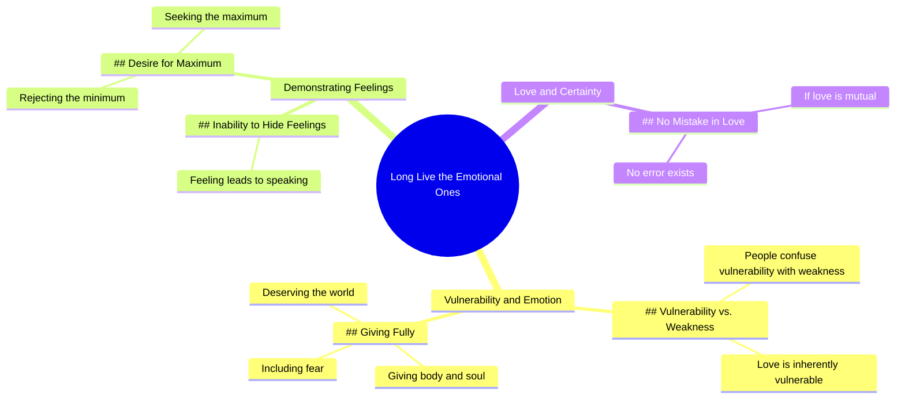

# Long Live the Emotional Ones - Aléxia Porto

> 🌐 **Read this in:** **English** · [中文](../../zh-CN/2026-07/tiktok-transcript-vida-longa-aos-emocionados-al-xia-porto-poesia-poesias-alexi-60fd.md)

> **Creator:** [@_alexiaporto](https://www.tiktok.com/@_alexiaporto) · **Views:** 870.5K · **Posted:** 2026-07-17 · **Niche:** entertainment
>
> **TL;DR:** Opens with a rallying cry that reframes vulnerability as strength, instantly engaging viewers who feel misunderstood.

[Watch original video →](https://vt.tiktok.com/ZSXfUjqCW/)

## Why This Went Viral

## Hook (first 3 seconds)
- **Verbatim opening line:** "Long live the emotional ones"
- **Hook pattern:** Bold claim / rallying cry
- **Why it stops scrolling:** It issues a declarative, almost rebellious affirmation that immediately validates a specific identity ("emotional ones"). Viewers who feel misunderstood or stereotyped as "too emotional" feel seen, creating instant resonance and a reason to keep watching for validation.

## Emotional Rhythm
- **Beat 1 – Validation & Defiance:** "Long live the emotional ones" → pride, being seen.
- **Beat 2 – Clarification & Tension:** "People confuse vulnerability with weakness" → creates a mini-contrast, correcting a common misconception.
- **Beat 3 – Emotional Depth:** "Love is vulnerable... those who give themselves body and soul" → deepens resonance, shifts from defense to celebration.
- **Beat 4 – Personal Declaration (Climax):** "I don't know how to hide my feelings. If I feel I soon speak." → raw, unfiltered self-disclosure. This is the peak — it moves from general truth to specific personal testimony.
- **Beat 5 – Resolution & Demand:** "I don't want the minimum I want the maximum" → closes with a clear, emotionally charged boundary that feels empowering.

## Keyword Density
- **emotional** (3x) – drives both algorithmic reach (high-engagement identity tag) and emotional pull (self-identification)
- **vulnerable / vulnerability** (2x) – algorithmic trigger for psychology/self-help niches; emotional pull for relatability
- **love** (2x) – universal emotional core; high shareability
- **body and soul** – poetic, visceral phrase that boosts memorability and comment engagement
- **maximum / minimum** – contrast pair that creates a quotable, shareable soundbite
- **feel / feelings** (3x) – emotional pull word; drives comment section confessionals

**Algorithmic drivers:** "emotional," "vulnerable," "love" — these are high-volume, low-competition emotional keywords that surface in mental health, self-improvement, and relationship content feeds.

**Emotional pull drivers:** "body and soul," "maximum/minimum," "speak" — these create the memorable, quotable lines that get saved and shared.

## Why It Spreads
1. **Identity-affirming rallying cry** – "Long live the emotional ones" is a shareable, almost tribal statement. Viewers repost it to signal "this is who I am" without having to explain themselves.
2. **Corrects a common misconception** – "People confuse vulnerability with weakness" taps into a widely felt frustration. This creates a "finally someone said it" effect that drives comments and saves.
3. **Personal testimony as proof** – The shift from general truth to "I don't know how to hide my feelings" makes the creator vulnerable, which mirrors the message. This authenticity is highly shareable because it feels real, not scripted.
4. **Quotable contrast line** – "I don't want the minimum I want the maximum" is a punchy, memorable soundbite that works as a standalone caption, bio line, or text overlay. It's designed to be copied and pasted.
5. **Emotional closure + boundary** – The line "if I love you and you want me there is no mistake" offers a clean, reassuring resolution. It gives viewers a sense of emotional clarity they can apply to their own relationships, making it highly saveable.

## What You Can Steal
1. **Open with a declarative identity statement** – Start your next video with "Long live the [group]" or a similarly bold, affirming phrase that makes a specific audience feel seen and validated within the first two seconds.
2. **Use a "correction" pattern** – Follow your hook with "People confuse X with Y" to create immediate tension and position yourself as someone who clarifies a misunderstood truth. This drives engagement from people who agree or disagree.
3. **End with a quotable contrast** – Close with a simple "I don't want A, I want B" line. Make it personal, make it bold. This becomes the line viewers screenshot, save, and repost — extending your video's reach beyond the platform.

## Mind Map

## Full Transcript (Generated by [TokTranscript](https://toktranscript.com/?utm_source=github&utm_medium=breakdown&utm_campaign=tool_attribution))

> 📝 Transcripts on this page are auto-generated and show the first 60%. Want to transcribe any TikTok in 30 seconds and get the full version? [Try TokTranscript free →](https://toktranscript.com/?utm_source=github&utm_medium=breakdown&utm_campaign=transcript_cta)

Long live the emotional ones People confuse a lot of vulnerability with emotion or weakness but they forget about the fact that love is vulnerable those who give themselves body and soul in fear and all those who know how to recognize and demonstrate this de

*[Read the full transcript on TokTranscript →](https://toktranscript.com/plaza/tiktok-transcript-vida-longa-aos-emocionados-al-xia-porto-poesia-poesias-alexi-60fd?utm_source=github&utm_medium=breakdown&utm_campaign=transcript_full)*

## Browse More

- All [entertainment](../../by-niche/en/entertainment.md) breakdowns
- All [Bold declaration](../../by-pattern/en/hook-bold-declaration.md) examples

## Video Info

| | |
|---|---|
| Creator | [@_alexiaporto](https://www.tiktok.com/@_alexiaporto) |
| Original video | [https://vt.tiktok.com/ZSXfUjqCW/](https://vt.tiktok.com/ZSXfUjqCW/) |
| Original title | Vida longa aos emocionados - Aléxia Porto #poesia #poesias #alexiapor... |
| Views | 870.5K (870500) |
| Posted | 2026-07-17 |
| Duration | 0s |
| Niche | `entertainment` |
| Hook pattern | `Bold declaration` |
| Original language | `en` |
| Available languages | en, zh-CN |
| Generated | 2026-07-19 by [TokTranscript](https://toktranscript.com/) |

---

*This breakdown is for educational analysis under fair use. Original video © [@_alexiaporto](https://www.tiktok.com/@_alexiaporto). All transcripts are auto-generated and may contain errors.*

*Want to analyze your own TikToks like this? [TokTranscript →](https://toktranscript.com/viral-breakdown?utm_source=github&utm_medium=breakdown&utm_campaign=footer_cta)*