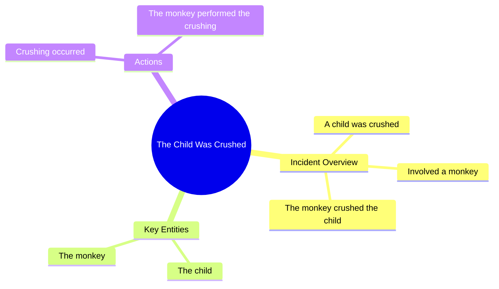

# We Don't Deserve Dogs

> 🌐 **Read this in:** **English** · [中文](../../zh-CN/2026-07/tiktok-transcript-we-don-t-deserve-dogs-hopecore-wholesome-positivity-dogs-8129.md)

> **Creator:** [@hopecore.o](https://www.tiktok.com/@hopecore.o) · **Views:** 23.3M · **Posted:** 2026-07-03 · **Niche:** other
>
> **TL;DR:** The hook jolts the viewer with an absurd, violent image that defies expectations.

[Watch original video →](https://www.tiktok.com/@hopecore.o/video/7636203479266102550?is_from_webapp=1&sender_device=pc)

## Why This Went Viral

## Hook (first 3 seconds)
- **Verbatim opening line:** "Саннна Song میں وی اوتھے The child was crushed Monkey You crushed the child"
- **Hook pattern type:** **Scene + Shock / Disjointed Narrative** — a chaotic mix of languages (Russian/Urdu/English) and a violent, out-of-context accusation.
- **Why it stops scrolling:** The viewer is instantly disoriented by the multilingual gibberish and the sudden, harsh phrase "The child was crushed." The absurdity and potential danger create an immediate "what did I just see?" pause. It breaks the expected pattern of a normal video, forcing the brain to re-engage.

## Emotional Rhythm
1. **Confusion / Disorientation** (0–2s): The gibberish and harsh accusation create a cognitive gap.
2. **Tension / Unease** (2–4s): "Monkey You crushed the child" — the viewer feels a mix of dark humor and alarm.
3. **Absurdity / Release** (4–6s): The phrase "Monkey You crushed the child" is so bizarre and contextless that it becomes comedic. The emotional weight flips from shock to laughter.
4. **Resonance / Meme Satisfaction** (6–10s): The viewer realizes this is a deliberate absurdist meme — the repetition of "crushed the child" and the nonsense structure become the punchline.
- **Climax moment:** The second repetition of "crushed the child" — the absurdity peaks, and the viewer either laughs or shares in disbelief.

## Keyword Density
- **"crushed the child"** — repeated 2–3 times in the first 5 seconds. Drives **emotional pull** (shock, dark humor, absurdity).
- **"Monkey"** — appears once, but is the anchor of the absurd contrast (animal vs. child).
- **"child"** — repeated 2 times. Drives **algorithmic reach** (high-emotion, high-engagement word that triggers curiosity and safety flags).
- **"You"** — direct accusation, creates **personal tension** and second-person engagement.
- **"Song" / "Sanana"** — nonsense words that become **meme-bait** (searchable, repostable, remixable).

**Algorithmic drivers:** "child," "crushed," "Monkey" — high-engagement, high-emotion keywords that trigger watch-time and shares.
**Emotional drivers:** "crushed," "child," "You" — create shock, guilt, and absurdity.

## Why It Spreads
1. **Cognitive Dissonance as a Hook:** The multilingual gibberish ("Саннна Song میں وی اوتھے") forces the viewer to re-read and re-process. This increases **dwell time** and **re-watch rate** — two key algorithmic signals. *Concrete line: "Саннна Song میں وی اوتھے"*
2. **Dark Humor + Absurdity = Shareable Shock:** The phrase "The child was crushed" is so over-the-top and contextless that it becomes a meme. People share it to say "look at this insane thing." *Concrete line: "The child was crushed"*
3. **Unresolved Mystery:** The video never explains *who* crushed the child, *why* a monkey is involved, or *what language* that is. This creates a **comment-bait** loop — viewers flood comments asking "what does this mean?" *Concrete line: "Monkey You crushed the child"*
4. **Remix Potential:** The disjointed, almost AI-generated feel makes it perfect for remixes, reaction videos, and caption edits. The lack of clear meaning invites creative reinterpretation. *Concrete line: The entire transcript structure.*

## What You Can Steal
1. **Use a Disjointed, Multilingual Opening:** Start your video with a phrase in a different language or a nonsensical combination of words. This breaks the algorithm's pattern recognition and forces the viewer to re-engage. *Tactic: Open with a random phrase in Hindi, Russian, or gibberish, then cut to your main point.*
2. **Create a "False Accusation" Hook:** Use a shocking, second-person accusation ("You crushed the child") that is clearly absurd. This triggers curiosity and emotional response without being offensive. *Tactic: "You just ruined the entire project" — then reveal it's about a cake.*
3. **Leave the Meaning Unresolved:** Don't explain the joke. End the video without clarifying the absurd premise. This drives comments, shares, and re-watches as people try to "solve" it. *Tactic: End with a random, unexplained phrase like "Monkey you crushed the child" and cut to black.*

## Mind Map

## Full Transcript (Generated by [free TikTok transcript generator](https://toktranscript.com/?utm_source=github&utm_medium=breakdown&utm_campaign=tool_attribution))

> 📝 Transcripts on this page are auto-generated and show the first 60%. Want to transcribe any TikTok in 30 seconds and get the full version? [Try TokTranscript free →](https://toktranscript.com/?utm_source=github&utm_medium=breakdown&utm_campaign=transcript_cta)

Саннна Song میں وی اوتھے The child was crushe

*[Read the full transcript on TokTranscript →](https://toktranscript.com/plaza/tiktok-transcript-we-don-t-deserve-dogs-hopecore-wholesome-positivity-dogs-8129?utm_source=github&utm_medium=breakdown&utm_campaign=transcript_full)*

## Browse More

- All [other](../../by-niche/en/other.md) breakdowns
- All [Shock non-sequitur](../../by-pattern/en/hook-shock-non-sequitur.md) examples

## Video Info

| | |
|---|---|
| Creator | [@hopecore.o](https://www.tiktok.com/@hopecore.o) |
| Original video | [https://www.tiktok.com/@hopecore.o/video/7636203479266102550?is_from_webapp=1&sender_device=pc](https://www.tiktok.com/@hopecore.o/video/7636203479266102550?is_from_webapp=1&sender_device=pc) |
| Original title | we don't deserve dogs #hopecore #wholesome #positivity #dogs |
| Views | 23.3M (23300000) |
| Posted | 2026-07-03 |
| Duration | 0s |
| Niche | `other` |
| Hook pattern | `Shock non-sequitur` |
| Original language | `en` |
| Available languages | en, zh-CN |
| Generated | 2026-07-04 by [TokTranscript](https://toktranscript.com/) |

---

*This breakdown is for educational analysis under fair use. Original video © [@hopecore.o](https://www.tiktok.com/@hopecore.o). All transcripts are auto-generated and may contain errors.*

*Want to analyze your own TikToks like this? [TokTranscript →](https://toktranscript.com/viral-breakdown?utm_source=github&utm_medium=breakdown&utm_campaign=footer_cta)*