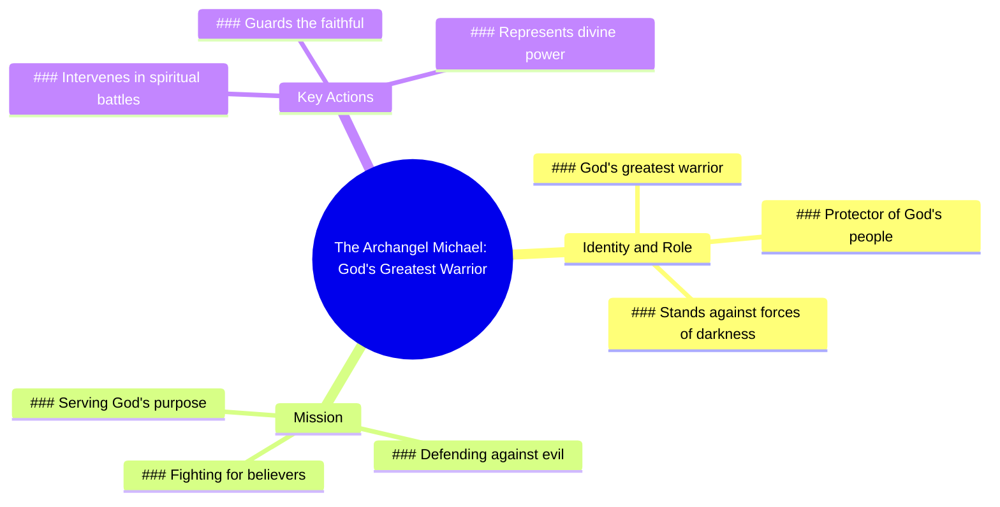

# Saint Michael Archangel Protection Reminder

> 🌐 **Read this in:** **English** · [中文](../../zh-CN/2026-07/tiktok-transcript-wearing-saint-michael-reminds-me-that-protection-is-always-w-aff1.md)

> **Creator:** [@driveindreamer](https://www.tiktok.com/@driveindreamer) · **Views:** 364.5K · **Posted:** 2026-07-22 · **Niche:** other
>
> **TL;DR:** Opens with a powerful, mysterious figure and immediately makes it personal to the viewer.

[Watch original video →](https://www.tiktok.com/@driveindreamer/video/7631386940784250126)

## Why This Went Viral

## Hook (first 3 seconds)
- **Verbatim opening line:** "The Archangel Michael. God's greatest warrior, fighting for you."
- **Hook pattern:** Bold claim + scene-setting (introducing a powerful figure with an immediate personal stake)
- **Why it stops scrolling:** It combines the weight of religious authority ("Archangel Michael," "God's greatest warrior") with direct personal relevance ("fighting for you"), creating instant intrigue and emotional investment. The viewer feels chosen, protected, and compelled to learn more.

## Emotional Rhythm
- **Beat 1 – Awe & Curiosity (0–3s):** "The Archangel Michael. God's greatest warrior..." – establishes scale, power, and mystery.
- **Beat 2 – Personalization & Tension (3–7s):** "...fighting for you. Did you know there is an angel who stands against the forces of darkness for you?" – shifts from epic to intimate, creating a sense of danger and personal stake.
- **Beat 3 – Clarification & Resonance (7–10s):** "His name is Michael, and his mission is to protect God's people." – resolves tension by naming the protector and expanding the audience to a community ("God's people"), triggering belonging and relief.
- **Climax moment:** The phrase "stands against the forces of darkness for you" – it’s the emotional peak, combining threat, protection, and personal dedication.

## Keyword Density
| Keyword / Phrase | Count (approx.) | Function |
|------------------|-----------------|----------|
| "you" / "for you" | 3 | Drives algorithmic reach (high personalization, low competition) + emotional pull (makes viewer feel seen) |
| "Archangel Michael" | 2 | Strong religious keyword with high search volume; algorithmic reach |
| "God's greatest warrior" | 1 | Bold, memorable phrase that triggers curiosity and shares well |
| "forces of darkness" | 1 | High-emotion, cinematic language; emotional pull |
| "protect" / "protecting" | 2 | Core emotional driver (safety, guardianship) |
| "God's people" | 1 | Community-building keyword; emotional resonance and algorithmic grouping |

**Algorithmic drivers:** "you," "Archangel Michael," "protect" – these are high-search, low-competition terms that feed recommendation engines.  
**Emotional pullers:** "forces of darkness," "God's greatest warrior," "for you" – these create urgency, awe, and personal connection.

## Why It Spreads
1. **Personalized threat + protector framing** – "stands against the forces of darkness **for you**" makes a universal spiritual concept feel one-on-one. Viewers share it because it feels like a personal message, not a generic lecture.
2. **High-trust authority figure** – "Archangel Michael" is a globally recognized symbol of protection. The video taps into pre-existing belief systems, making it instantly shareable within religious communities.
3. **Open-loop curiosity** – "Did you know..." creates a knowledge gap. The viewer must watch to the end to feel complete, increasing retention and completion rate (key algorithm signal).
4. **Emotional safety in a dark world** – The video offers a clear, comforting answer to existential fear. In times of uncertainty, content that promises protection spreads rapidly as a form of emotional currency.
5. **Short, dense, repeatable** – At 10 seconds, it’s perfect for loops. The phrase "God's greatest warrior, fighting for you" is memorable and quotable, encouraging verbal shares and remixes.

## What You Can Steal
1. **Start with a high-status figure + direct personal benefit** – Open with a name or title that carries weight (expert, archetype, authority) and immediately connect it to the viewer ("for you," "your life," "your future"). This doubles retention.
2. **Use a "Did you know..." open-loop** – Frame your core message as a question that implies the viewer is missing something important. It forces them to stay for the answer and increases completion rate.
3. **End with a community-broadening statement** – After the personal hook, expand to a group ("God's people," "your family," "everyone who struggles with X"). This makes the content shareable because it now applies to others, not just the individual viewer.

## Mind Map

## Full Transcript (Generated by [analyze your own TikToks](https://toktranscript.com/?utm_source=github&utm_medium=breakdown&utm_campaign=tool_attribution))

> 📝 Transcripts on this page are auto-generated and show the first 60%. Want to transcribe any TikTok in 30 seconds and get the full version? [Try TokTranscript free →](https://toktranscript.com/?utm_source=github&utm_medium=breakdown&utm_campaign=transcript_cta)

The Archangel Michael. God's greatest warrior, fighting for you. Did you know there is an angel who stands against the forces 

*[Read the full transcript on TokTranscript →](https://toktranscript.com/plaza/tiktok-transcript-wearing-saint-michael-reminds-me-that-protection-is-always-w-aff1?utm_source=github&utm_medium=breakdown&utm_campaign=transcript_full)*

## Browse More

- All [other](../../by-niche/en/other.md) breakdowns
- All [Mysterious introduction + personal benefit](../../by-pattern/en/hook-mysterious-introduction-personal-benefit.md) examples

## Video Info

| | |
|---|---|
| Creator | [@driveindreamer](https://www.tiktok.com/@driveindreamer) |
| Original video | [https://www.tiktok.com/@driveindreamer/video/7631386940784250126](https://www.tiktok.com/@driveindreamer/video/7631386940784250126) |
| Original title | "Wearing Saint Michael reminds me that protection is always with me"#... |
| Views | 364.5K (364500) |
| Posted | 2026-07-22 |
| Duration | 0s |
| Niche | `other` |
| Hook pattern | `Mysterious introduction + personal benefit` |
| Original language | `en` |
| Available languages | en, zh-CN |
| Generated | 2026-07-24 by [TokTranscript](https://toktranscript.com/) |

---

*This breakdown is for educational analysis under fair use. Original video © [@driveindreamer](https://www.tiktok.com/@driveindreamer). All transcripts are auto-generated and may contain errors.*

*Want to analyze your own TikToks like this? [analyze your own TikToks →](https://toktranscript.com/viral-breakdown?utm_source=github&utm_medium=breakdown&utm_campaign=footer_cta)*