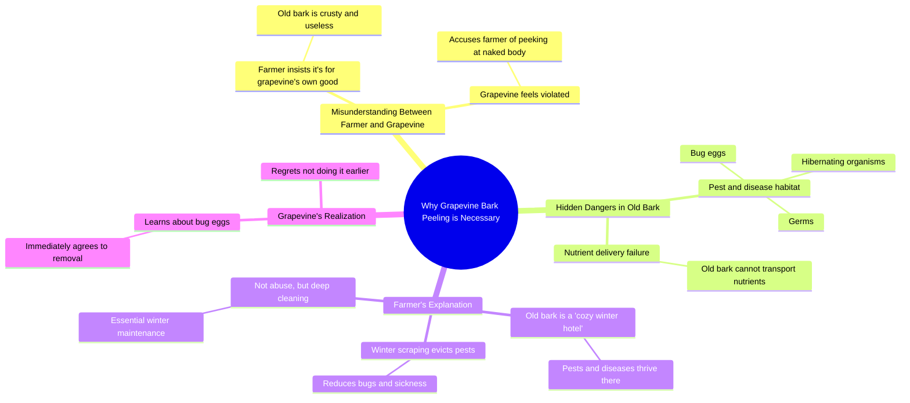

# Why Grapevine Bark Is Stripped in Winter

> 🌐 **Read this in:** **English** · [中文](../../zh-CN/2026-07/tiktok-transcript-why-is-the-bark-of-grapevines-stripped-in-winter-60fe.md)

> **Creator:** [@Dr.bananapu](https://www.tiktok.com/@Dr.bananapu) · **Views:** 694.6K · **Posted:** 2026-07-30 · **Niche:** entertainment
>
> **TL;DR:** Opens with a shocking accusation that immediately creates curiosity and tension.

[Watch original video →](https://www.facebook.com/reel/3256077654564312)

## Why This Went Viral

## Hook (first 3 seconds)
- **Verbatim opening line:** "Hey! What are you peeling my skin for?"
- **Hook pattern:** **Dialogue-driven conflict** (personified object vs. human) with a **shocking question**.
- **Why it stops the scroll:** The viewer hears a seemingly absurd accusation ("peeling my skin") from a non-human voice, creating immediate cognitive dissonance. They must watch to resolve the absurdity.

## Emotional Rhythm
1. **Confusion / Shock** (0-3s): The personified grapevine protests, viewer is jarred by the bizarre premise.
2. **Tension / Suspicion** (3-6s): The farmer defends the action, the vine accuses him of perversion ("peek at my naked body"). Viewer leans in.
3. **Curiosity / Revelation** (6-12s): Farmer reveals "bug eggs," "germs," "hibernating." The absurdity flips to practical logic.
4. **Relief / Understanding** (12-18s): Vine suddenly agrees ("Then why didn't you say so earlier?"). Viewer laughs at the twist.
5. **Resolution / Education** (18-24s): Farmer explains the real agricultural reason. Viewer feels satisfied and informed.
- **Climax moment:** "Wait! Bug eggs?" — the pivot from absurd conflict to real-world utility.

## Keyword Density
| Word/Phrase | Count (approx.) | Driver |
|-------------|-----------------|--------|
| **skin / bark** | 5 | **Algorithmic reach** (searchable gardening term) + emotional (gross-out) |
| **peeling / strip off** | 4 | **Emotional pull** (creates visceral reaction) |
| **bug eggs / germs** | 3 | **Algorithmic reach** (high-engagement keywords for pest control) |
| **old** | 3 | **Emotional pull** (frames the action as necessary, not cruel) |
| **winter / deep clean** | 2 | **Algorithmic reach** (seasonal, timely content) |
| **naked body** | 1 | **Emotional pull** (taboo humor, drives comments/shares) |

- **Algorithmic drivers:** "skin," "bark," "bug eggs," "winter" — these are high-volume search terms in gardening/DIY niches.
- **Emotional drivers:** "naked body," "peeling," "germs" — these trigger disgust, humor, and curiosity, boosting watch time and shares.

## Why It Spreads
1. **Personified conflict creates instant emotional investment.** The vine's protest ("What are you peeling my skin for?") makes the viewer care about an inanimate object. This is a proven hook for storytelling.
2. **The "gross-out" pivot triggers shareability.** The reveal of "bug eggs" and "germs" is disgusting enough to make viewers want to show friends, but not so graphic it repels. It's the perfect "eww, but interesting" threshold.
3. **Educational twist subverts expectations.** The viewer expects a joke or absurdity, but instead gets a real farming tip. This surprise learning moment makes the video feel valuable, increasing saves and shares.
4. **Dialogue format is inherently rewatchable.** The back-and-forth mimics a skit, encouraging rewatches to catch the humor or the lesson. The punchline ("It's not abuse. It's the farmer's winter deep clean") is quotable.
5. **Seasonal relevance drives search traffic.** "Winter grapevine care" is a specific, high-intent search query. The video capitalizes on a real pain point (pest control) with a memorable framing.

## What You Can Steal
1. **Personify an inanimate object to create instant conflict.** Give a plant, tool, or even a piece of furniture a voice that argues against the necessary action. This immediately hooks viewers with absurdity.
2. **Use a "gross-out → education" arc.** Start with something that triggers disgust or shock (e.g., "bug eggs"), then pivot to a practical explanation. This keeps viewers watching for the resolution.
3. **End with a one-sentence takeaway.** The farmer's final line ("It's not abuse. It's the farmer's winter deep clean.") is short, memorable, and shareable. Always summarize the lesson in a way that could be a tweet or caption.

## Mind Map

## Full Transcript (Generated by [free TikTok transcript generator](https://toktranscript.com/?utm_source=github&utm_medium=breakdown&utm_campaign=tool_attribution))

> 📝 Transcripts on this page are auto-generated and show the first 60%. Want to transcribe any TikTok in 30 seconds and get the full version? [Try TokTranscript free →](https://toktranscript.com/?utm_source=github&utm_medium=breakdown&utm_campaign=transcript_cta)

Hey! What are you peeling my skin for? I'm doing this for your own good! Peeling my skin is for my own good? Your skin's all old and crusty! It's not doing you any favors! I think you're just trying to peek at my naked body! It can't even deliver nutrients anymore! And it's full of bug eggs! Wait! Bug eggs? I had no idea! Take a good look! It's loaded with eggs and germs and they're all hibernating in there. You'd better strip off all that old bark now.

*[Read the full transcript on TokTranscript →](https://toktranscript.com/plaza/tiktok-transcript-why-is-the-bark-of-grapevines-stripped-in-winter-60fe?utm_source=github&utm_medium=breakdown&utm_campaign=transcript_full)*

## Browse More

- All [entertainment](../../by-niche/en/entertainment.md) breakdowns
- All [False accusation / misunderstanding](../../by-pattern/en/hook-false-accusation-misunderstanding.md) examples

## Video Info

| | |
|---|---|
| Creator | [@Dr.bananapu](https://www.tiktok.com/@Dr.bananapu) |
| Original video | [https://www.facebook.com/reel/3256077654564312](https://www.facebook.com/reel/3256077654564312) |
| Original title | Why is the bark of grapevines stripped in winter? |
| Views | 694.6K (694611) |
| Posted | 2026-07-30 |
| Duration | 0s |
| Niche | `entertainment` |
| Hook pattern | `False accusation / misunderstanding` |
| Original language | `en` |
| Available languages | en, zh-CN |
| Generated | 2026-07-31 by [TokTranscript](https://toktranscript.com/) |

---

*This breakdown is for educational analysis under fair use. Original video © [@Dr.bananapu](https://www.tiktok.com/@Dr.bananapu). All transcripts are auto-generated and may contain errors.*

*Want to analyze your own TikToks like this? [try this transcription tool →](https://toktranscript.com/viral-breakdown?utm_source=github&utm_medium=breakdown&utm_campaign=footer_cta)*