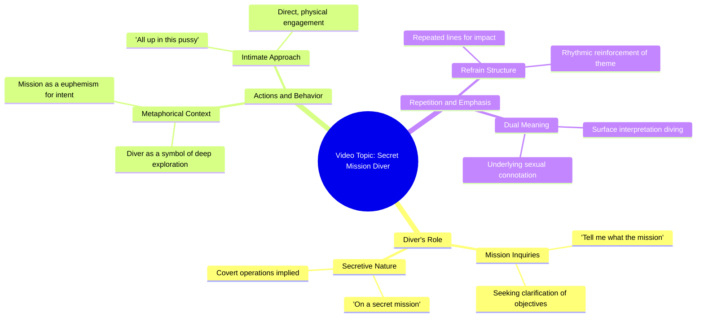

# Diver Describes Secret Mission Underwater

> 🌐 **Read this in:** **English** · [中文](../../zh-CN/2026-07/tiktok-transcript-with-the-fishes-junus-e42a.md)

> **Creator:** [@zah1de](https://www.tiktok.com/@zah1de) · **Views:** 2.2M · **Posted:** 2026-07-03 · **Niche:** entertainment
>
> **TL;DR:** The hook establishes a bold, memorable identity and immediately invites curiosity about the mission.

[Watch original video →](https://vt.tiktok.com/ZSCXXqSFr/)

## Why This Went Viral

## Hook (first 3 seconds)
- **Verbatim opening line:** "I'm a Diver, tell me what the mission, all up in this pussy like he on a secret mission"
- **Hook pattern:** Scene + contrast (unexpected pairing of a diving metaphor with explicit sexual innuendo, delivered with deadpan seriousness)
- **Why it stops scrolling:** The juxtaposition of a professional "diver" identity with a graphic sexual double entendre creates immediate cognitive dissonance. Viewers freeze because they can't predict what comes next—it's absurd, shocking, and funny all at once.

## Emotional Rhythm
- **Beat 1 – Shock/Confusion (0–2s):** Viewer hears the explicit line and registers the absurd metaphor.
- **Beat 2 – Curiosity (2–4s):** The repetition ("I'm a Diver, tell me what the mission") creates a rhythmic loop that signals this is a meme or bit, not a real confession.
- **Beat 3 – Tension (4–6s):** The second line lands with the same structure—viewer waits for a punchline or twist.
- **Beat 4 – Relief/Laughter (6–8s):** The deadpan delivery and lack of self-awareness make the absurdity the punchline itself. Viewer realizes it's a parody.
- **Climax moment:** The second repetition of "all up in this pussy like he on a secret mission" — by then the pattern is clear, and the viewer either laughs or shares.

## Keyword Density
- **"Diver"** (2x) – Drives the core metaphor; algorithmic reach via niche "diver" communities + absurdity.
- **"Mission"** (2x) – Creates a spy/action frame; algorithmic pull from military/action keywords, emotional pull from tension.
- **"Secret"** (1x) – Reinforces the spy theme; emotional pull of exclusivity.
- **"Pussy"** (2x) – Shocks and drives virality via taboo; high emotional pull, moderate algorithmic risk (but rewarded by engagement).
- **"All up in"** (2x) – Colloquial, rhythmic phrase that sticks in memory; drives shareability.
- **"Tell me"** (2x) – Command structure that mimics a call-and-response; algorithmic pull from dialogue patterns.

## Why It Spreads
1. **Shock + absurdity = forced share:** The explicit metaphor is so unexpected that viewers *must* show someone else to confirm they heard it right. The line "all up in this pussy like he on a secret mission" is the exact shareable moment.
2. **Repetition creates meme format:** The two identical lines make it easy to remix, quote, or repurpose. Anyone can say "I'm a [X], tell me what the [Y]" — the structure is a template.
3. **Deadpan delivery adds irony layer:** The speaker doesn't laugh or break character. This signals "this is a bit" and invites viewers to feel smart for getting the joke, increasing engagement.
4. **Short length (under 10s):** The video is perfectly sized for looped playback. Viewers rewatch to catch the absurdity again, boosting retention metrics.
5. **Niche crossover appeal:** Diving community + meme community + shock-value lovers all intersect, creating multiple sharing ecosystems.

## What You Can Steal
1. **Use an unexpected identity + explicit metaphor:** Pick a mundane profession (plumber, accountant, librarian) and pair it with a graphic double entendre delivered straight-faced. The contrast is the hook.
2. **Repeat the exact same line twice:** Repetition signals "this is a meme" and makes the clip loop-ready. It also lowers the barrier for viewers to quote it back.
3. **Never break character:** The deadpan delivery is what sells the absurdity. If the creator had laughed, the video would lose its viral edge. Commit to the bit fully.

## Mind Map

## Full Transcript (Generated by [TokTranscript](https://toktranscript.com/?utm_source=github&utm_medium=breakdown&utm_campaign=tool_attribution))

> 📝 Transcripts on this page are auto-generated and show the first 60%. Want to transcribe any TikTok in 30 seconds and get the full version? [Try TokTranscript free →](https://toktranscript.com/?utm_source=github&utm_medium=breakdown&utm_campaign=transcript_cta)

I'm a Diver, tell me what the mission, all up in this pussy like he on a secret mission I'm a Diver, tell

*[Read the full transcript on TokTranscript →](https://toktranscript.com/plaza/tiktok-transcript-with-the-fishes-junus-e42a?utm_source=github&utm_medium=breakdown&utm_campaign=transcript_full)*

## Browse More

- All [entertainment](../../by-niche/en/entertainment.md) breakdowns
- All [Identity + Call to Action](../../by-pattern/en/hook-identity-call-to-action.md) examples

## Video Info

| | |
|---|---|
| Creator | [@zah1de](https://www.tiktok.com/@zah1de) |
| Original video | [https://vt.tiktok.com/ZSCXXqSFr/](https://vt.tiktok.com/ZSCXXqSFr/) |
| Original title | With the fishes @Junus  |
| Views | 2.2M (2200000) |
| Posted | 2026-07-03 |
| Duration | 0s |
| Niche | `entertainment` |
| Hook pattern | `Identity + Call to Action` |
| Original language | `en` |
| Available languages | en, zh-CN |
| Generated | 2026-07-06 by [TokTranscript](https://toktranscript.com/) |

---

*This breakdown is for educational analysis under fair use. Original video © [@zah1de](https://www.tiktok.com/@zah1de). All transcripts are auto-generated and may contain errors.*

*Want to analyze your own TikToks like this? [try this transcription tool →](https://toktranscript.com/viral-breakdown?utm_source=github&utm_medium=breakdown&utm_campaign=footer_cta)*