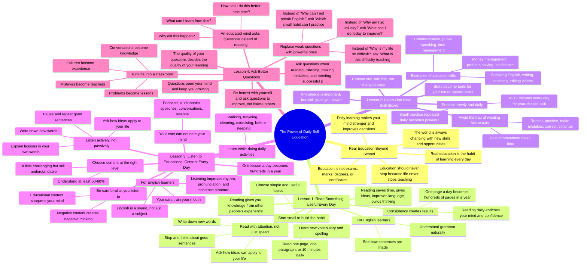

# Learn Daily: Real Education Beyond School

> 🌐 **Read this in:** **English** · [中文](../../zh-CN/2026-08/tiktok-transcript-1-1m-views-29k-reactions-educated-yourself-everyday-please-v-3751.md)

> **Creator:** [@Simple EnglishMan](https://www.tiktok.com/@Simple EnglishMan) · **Views:** 424.9K · **Posted:** 2026-08-21 · **Niche:** other
>
> **TL;DR:** It challenges the audience's core assumption about education, instantly creating curiosity and relevance.

[Watch original video →](https://www.facebook.com/share/v/195gNEYHd4/)

## Why This Went Viral

## Hook (first 3 seconds)
- **Verbatim opening line:** "Education is not only something you get in school."
- **Hook pattern:** Bold claim / reframe — it directly challenges a deeply held societal assumption within the first 5 words.
- **Why it stops the scroll:** The viewer expects a generic "motivation" video, but this immediately invalidates the traditional definition of education. This creates instant cognitive dissonance, forcing the viewer to ask, "Wait, what is it then?" It targets a universal pain point (the feeling that school didn't prepare you for life) and promises a secret alternative.

## Emotional Rhythm
1.  **Challenge/Tension (0:00–0:10):** The speaker dismantles the institutional view of education ("exams, marks, degrees"). This creates a slight rebellious tension against the system.
2.  **Clarity/Resonance (0:10–0:20):** The shift to "habit" and "improving your mind" provides relief. The viewer feels seen—this aligns with their internal desire for growth outside of formal structures.
3.  **Urgency/Fear (0:20–0:30):** "If you do not keep learning, you slowly fall behind." This injects a spike of anxiety, making the content feel immediately relevant and necessary.
4.  **Empowerment/Relief (0:30–0:40):** The list of benefits ("better decisions," "speak better") offers a clear reward. The tension from the fear is resolved with a promise of strength.
5.  **Accessibility/Comfort (0:40–0:50):** "Even 10 minutes can help you." This lowers the barrier to entry, removing the overwhelm and making the advice feel easy to implement.
6.  **Aspiration/Climax (0:50–1:10):** The climax is the transformation: "The person who educates himself every day creates a better future for himself." This is the peak emotional payoff—a vision of the ideal self.
7.  **Actionable Descent (1:10–End):** The emotional intensity drops as the video pivots into specific, numbered lessons (Reading, Skills, Listening, Questions). This maintains engagement by shifting from "why" to "how."

## Keyword Density
- **Learn/Learning:** (Highest frequency) Drives the core theme and algorithmic relevance for self-improvement and study niches.
- **Every day:** (High frequency) Creates the habit-loop rhythm and reinforces the video's specific value proposition (daily action).
- **Skill/Skills:** (High frequency) Taps into the practical, career-oriented search intent (algorithmic reach) and the emotional need for competence.
- **Mind/Thinking:** (High frequency) Appeals to the intellectual growth niche and creates an emotional pull of self-mastery.
- **Read/Reading:** (High frequency in Lesson 1) Targets specific search queries for book lovers and learners.
- **Listen/Listening:** (High frequency in Lesson 3) Targets the podcast/audio-learning audience.
- **Better:** (High frequency) Simple, aspirational word that drives the emotional promise of improvement.
- **Habit:** (Medium frequency) A high-performing keyword in the productivity niche.

## Why It Spreads
- **The "Anti-School" Validation:** The opening line ("Education is not only something you get in school") validates the frustration of millions who feel their formal education didn't teach them real-world skills. It gives them a quote to share that defines their own belief. *Concrete line: "Many people stop learning after school or college. They think, now my education is finished."*
- **The "10-Minute" Permission Slip:** The video removes the intimidation factor of learning. By saying "Even 10 minutes can help you. One page can help you," it removes the excuse of "I don't have time." This makes the advice shareable because it feels achievable. *Concrete line: "It means you learn something useful every day. Even 10 minutes can help you."*
- **The "Small Steps" Visual Proof:** The video provides a clear, repeatable framework (Lesson 1, 2, 3, 4). This structure makes it easy for viewers to screenshot, save, or repost as a "guide." The repetition of "One page a day becomes 30 pages in a month" gives a concrete, mathematical proof of success that viewers love to share. *Concrete line: "One page a day becomes 30 pages in a month. 30 pages a month becomes hundreds of pages in a year."*
- **The "Ears vs. Eyes" Multitasking Hack:** The section on listening ("You can listen while walking") appeals to busy people. It frames learning as something that doesn't require extra time, just smarter use of existing time. This is a high-share insight for productivity-focused audiences. *Concrete line: "You can listen while walking. You can listen while traveling."*

## What You Can Steal
- **The "Definition Reframe" Hook:** Start your video by challenging the common definition of a popular concept. (e.g., "Success is not...", "Confidence is not..."). This immediately creates a knowledge gap that hooks the viewer.
- **The "10-Minute" Rule:** Always include a section that drastically lowers the barrier to entry. If you're teaching a complex skill, explicitly state the minimum viable daily action (e.g., "You only need 10 minutes"). This reduces viewer anxiety and increases the chance they'll start.
- **The "Numbers as Proof" Pattern:** Use simple arithmetic to show the power of consistency. (e.g., "1 page a day = 365 pages a year"). This transforms abstract advice into a concrete, undeniable visual for the viewer's brain, making the benefit feel tangible and real.

## Mind Map

## Full Transcript (Generated by [free TikTok transcript generator](https://toktranscript.com/?utm_source=github&utm_medium=breakdown&utm_campaign=tool_attribution))

> 📝 Transcripts on this page are auto-generated and show the first 60%. Want to transcribe any TikTok in 30 seconds and get the full version? [Try TokTranscript free →](https://toktranscript.com/?utm_source=github&utm_medium=breakdown&utm_campaign=transcript_cta)

Education is not only something you get in school. Education is not only about exams, marks, degrees, or certificates. Real education is the habit of learning every day. It is the habit of improving your mind. It is the habit of asking questions. It is the habit of understanding life better. Many people stop learning after school or college. They think, now my education is finished. But the truth is, education should never stop. Because life never stops teaching. Every day, the world is changing. New skills are becoming important. New opportunities are coming. New problems are appearing. And if you do not keep learning, you slowly fall behind. But if you educate yourself every day, your mind becomes stronger. You make better decisions. You speak better. You think better. You solve problems better. You understand people better. You understand yourself better. Educating yourself every day does not mean you have to study for 10 hours. It means you learn something useful every day. Even 10 minutes can help you. One page can help you. One new word can help you. One good idea can help you. One useful lesson can change your thinking. And when your thinking changes, your life also starts changing. So do not wait for someone to teach you everything. Become your own teacher. Become your own student. Learn from books. Learn from people. Learn from mistakes. Learn from experience. Learn from silence. Learn from every day. Because the person who learns every day becomes wiser every day. The person who improves every day becomes stronger every day. And the person who educates himself every day creates a better future for himself. Lesson 1 Read something useful every day. One of the best ways to educate yourself every day is reading. Reading is powerful because it gives you knowledge from other people's experience. Think about this. A person may spend 20 years learning an important lesson in life, but when you read their book, article, story, or message, you can understand that lesson in a short time. This is why reading is so valuable. Reading saves your time. Reading gives you ideas. Reading improves your language. Reading builds your thinking. Reading teaches you things you may never learn from normal conversation. But many people say, I do not like reading. The problem is not always reading. The problem is that they try to read too much at once. They start with a big book. They force themselves to read many pages. Then they feel bored. Then they stop. So do not start too big. Start small. Read one page every day. Read one paragraph every day. Read for only 10 minutes every day. Choose something useful and simple. Read about discipline. Read about communication. Read about English learning. Read about health. read about money, read about history, read about successful people, read about habits, read about the mind, read anything that makes you better. The goal is not to finish a book quickly. The goal is to build the habit of reading. Because when you read daily, your mind becomes active. You start thinking more clearly. You get new words. You get new ideas. You get new examples. You become better at explaining things. You become better at understanding life. For English learners, reading is even more powerful. When you read English every day, you see how sentences are made. You understand grammar naturally. You learn new vocabulary. You improve your spelling. You understand how words are used in real life. Reading does not only help your knowledge, it also helps your English. But remember, do not only read fast, read with attention. When you find a good sentence, stop and think. When you find a new word, write it down. When you find a powerful idea, ask yourself, how can I use this in my life? This is how reading becomes education. Do not read only to finish pages. Read to understand. Read to grow. to improve your mind. Even one page a day can make a big difference if you stay consistent. One page a day becomes 30 pages in a month. 30 pages a month becomes hundreds of pages in a year. And after one year, your thinking will not be the same. Your words will not be the same. Your confidence will not be the same. Your mind will become richer. So make reading a daily habit. Before sleeping, read something useful. After waking up, read something positive. During free time, read something educational. Instead of wasting your time only on entertainment, give some time to reading. Because every useful page you read is an investment in your future. Lesson 2 Learn one new skill slowly. If you want to educate yourself every day, do not only collect information, build skills. Knowledge is important, but skill gives you power. A person may know many things, but if they cannot use that knowledge, it does not change their life. This is why skill is important. A skill can help you earn. A skill can help you communicate. A skill can help you create. A skill can help you become independent. A skill can help you build confidence. Speaking English is a skill. Writing is a skill. Teaching is a skill. Editing videos is a skill. Communication is a skill. Public speaking is a skill. Time management is a skill. Money management is a skill. Problem solving is a skill. Even confidence can become a skill when you practice it every day. So ask yourself one important question. What skill can improve my future? Do not choose ten skills at the same time. Choose one skill first. When you try to learn too many things together, your mind becomes confused. You start many things, but you finish nothing. So choose one important skill and practice it slowly. If you want to improve English, practice English every day. Speak for 10 minutes. Read one paragraph. Listen to one short conversation. Learn five new words. Write a few sentences. Small practice every day will make your English stronger. If you want to become a better speaker, practice speaking. Stand in front of a mirror. Choose one simple topic. Speak for two minutes. Record your voice. Listen again. Notice your mistakes. Then improve. If you want to become a better writer, write every day. Write about your day. Write your thoughts. Write what you learned. Write a short paragraph. Writing will make your thinking clear. If you want to become better at video editing, learn one tool at a time. Today, learn cutting. Tomorrow, learn adding text. Next day, learn sound. Step by step, your skill will grow. This is the secret. Do not try to become perfect quickly. Try to become better slowly. Most people fail because they want fast results. They practice for two days, then they stop. They learn for one week, then they quit. They say, I am not improving. But real improvement takes time. A seed does not become a tree in one day. A skill does not become strong in one practice. You must repeat. You must practice. You must make mistakes. You must correct yourself. You must continue. That is how skill is built. Every day, give at least 10 to 15 minutes to your chosen skill. Make it simple. Make it daily. Make it part of your routine. Because small practice repeated every day becomes powerful. One day people will look at you and say, You have improved so much. But they will not see your small daily efforts. They will not see your quiet practice. They will not see the days when you were learning alone. They will only see the result. So do not worry if nobody notices your practice today. Keep learning. Keep improving. Keep building your skill. Because every skill you build becomes a tool for your future. And the more skills you have, the more opportunities you can create in your life. Lesson 3. Listen to educational content every day. If you want to educate yourself every day, reading is powerful, but listening is also very important. Many people say, I do not have time to learn. But the truth is, you can learn while doing normal daily activities. You can listen while walking. You can listen while traveling You can listen while cleaning your room You can listen while exercising You can listen before sleeping You can listen in your free time instead of wasting that time on useless content. This is the power of listening. Your ears can educate your mind. You do not always need a book in your hand. You do not always need a classroom. You do not always need a teacher sitting in front of you. Sometimes, one good podcast, one good audiobook, one good speech, one good English conversation, or one useful lesson can teach you something valuable. But you must be careful about what you listen to. Because your mind becomes influenced by what you hear every day. If you listen to negative things all the time, your thinking becomes negative. If you listen to useless gossip all the time, your mind becomes weak and distracted. If you listen to only entertainment all the time, your mind does not grow enough. But if you listen to educational content, your mind starts becoming sharper. You learn new ideas. You understand life better. You improve your vocabulary. You improve your English listening power. You improve your speaking style. You learn how educated people explain things. For English learners, listening is one of the most important habits. Because English is not only a subject. English is a sound. You must listen to English again and again so your brain becomes familiar with the rhythm, pronunciation, and sentence structure. When you listen to English daily, slowly your brain starts understanding words faster. You begin to catch common phrases. You understand how native or fluent speakers connect words. You learn natural expressions. You start speaking better because your ears are training your mouth. This is why listening should be part of your daily education. Start simple. Do not choose very difficult content in the beginning. Choose something you can understand at least 50 or 60%. If the content is too difficult, you may feel frustrated. If the content is too easy, you may not grow enough. So choose content that is a little challenging, but still understandable. Listen to English conversations. Listen to slow English stories. Listen to motivational speeches. Listen to educational podcasts. Listen to audiobooks. Listen to interviews with successful people. Listen to topics about health, discipline, confidence, communication, money, history, and personal growth. But do not only listen passively. Listen actively. Active listening means you listen with attention. When you hear a good sentence, pause and repeat it. When you hear a new word, write it down. When you hear a powerful idea, ask yourself, How can I use this in my life? When you hear a useful lesson, explain it in your own words. This is how listening becomes real education. Many people listen to content, but they forget everything because they do not think about it. Do not do that. After listening, take one minute and ask yourself, What did I learn? Maybe you learned a new word. Maybe you learned a new habit. Maybe you learned a new way to think. Maybe you learned a better way to speak. Maybe you learned one mistake you should avoid. Even one lesson a day is powerful. Because one lesson a day becomes 30 lessons in a month. 30 lessons in a month become hundreds of lessons in a year. And after one year, your mind will be full of better ideas. So use your ears wisely. Do not allow your ears to receive only noise. Give your mind something valuable. Turn your free time into learning time. Turn your traveling time into education time. Turn your quiet time into growth time. Because when you listen to educational content every day, you are not just passing time, you are building your mind. Lesson 4. Ask better questions. If you want to educate yourself every day, you must learn how to ask better questions. Questions are powerful because questions open your mind. A person who does not ask questions stays limited. A person who asks good questions keeps growing. Many people only accept things as they are. They hear something and they believe it immediately. They face a problem and they complain immediately. They make a mistake and they feel bad immediately. but an educated mind does not react like that. An educated mind asks questions. Why did this happen? What can I learn from this? How can I do this better next time? What is the real reason behind this problem? What skill do I need to improve? What habit is stopping me? What action can help me move forward. These questions can change your thinking, because the quality of your questions decides the quality of your learning. If you ask weak questions, you get weak answers. If you ask powerful questions, your mind starts searching for powerful answers. For example, many people ask, why am I so unlucky? This question makes them feel weak. A better question is, what can I do today to improve my situation? This question gives power back to them. Many people ask, why can I not speak English? This question creates frustration. A better question is, which small English habit can I practice every day? This question creates action. Many people ask, why is my life so difficult? This question increases pain. A better question is, what is this difficulty teaching me? This question creates wisdom. So if you want to educate yourself, change your questions. Do not only ask questions that make you feel helpless. Ask questions that make you responsible. Ask questions that make you active. Ask questions that make you think deeply. Ask questions that push you toward improvement. Questions also help you understand any topic better. When you read something, ask questions. What is the main idea? Why is this important? How can I use this? Where have I seen this in real life? Can I explain this in simple words? When you listen to something, ask questions. What did the speaker teach? Which sentence was useful? Which idea can improve my life? What should I remember? When you make a mistake, ask questions. What went wrong? What was my role in this? What can I change next time? What did this mistake teach me? When you meet successful people, ask questions. What habits helped them? What problems did they face? What can I learn from their journey? What can I apply in my own life? This is how you educate yourself from everything. You do not need to wait for a classroom. Your questions can turn life into a classroom. A problem becomes a lesson. A mistake becomes a teacher. A conversation becomes knowledge. A failure becomes experience. A normal day becomes education. But remember, asking better questions also means being honest with yourself. Do not ask questions only to blame others. Ask questions to improve yourself. Instead of asking, Why did they not support me? Ask, How can I become stronger even without support? Instead of asking, Why is this so hard? Ask, How can I become capable enough to handle this? Instead of asking, why am I behind? Ask, what can I do today to move one step forward? This habit is life-changing. Because when you ask better questions, your mind becomes solution-focused. You stop wasting energy on complaints. You start looking for answers. You start finding better ways. You start becoming wiser. So from today, do not only collect information. Train your mind to question, understand, and apply. Ask better questions every day. Because the person who asks better questions learns faster, thinks deeper, and grows stronger. Lesson 5. Learn from your mistakes. If you want to educate yourself every day, you must learn from your mistakes. Mistakes are not only problems. Mistakes are lessons. Mistakes are feedback. Mistakes are signs that show you what you need to improve. Many people hate mistakes because mistakes make them feel embarrassed. They think, I failed, so I'm not good enough. But this thinking is wrong. A mistake does not mean you are useless A mistake means you are learning something A mistake means you tried something A mistake means you found one way that does not work And if you understand the lesson, that mistake can make you smarter. Every successful person has made mistakes. Every confident speaker has made mistakes. Every good teacher has made mistakes. Every strong person has made mistakes. The difference is this. Weak people repeat the same mistake again and again without learning. Wise people study their mistake and improve. So when you make a mistake, do not only feel bad. Ask yourself, what is this mistake teaching me? If you made a mistake while speaking English, ask yourself, Which word or sentence should I practice? If you wasted time, ask yourself What distracted me? If you failed in a plan, ask yourself What can I do differently next time? If you trusted the wrong person, ask yourself What sign did I ignore? If you lost confidence, ask yourself What thought made me weak? This is how mistakes become education Do not run away from your mistakes. Do not hide from them. Do not punish yourself again and again. Look at them honestly. Understand them. Learn from them. Then move forward with better thinking. For example, if you are learning English and you say something wrong, do not stop speaking. Correct the sentence and say it again. If you forget a word, learn that word. If your pronunciation is weak, practice that sound. If you cannot speak fluently, practice short sentences every day. This is real learning. Education is not only reading books. Education is also correcting yourself. Education is also improving after failure. Education is also becoming wiser after experience. A mistake becomes dangerous only when you ignore it. But a mistake becomes powerful when you learn from it. So do not be afraid of mistakes. Be afraid of repeating mistakes without learning. Every night, take one minute and ask yourself, What mistake did I make today? And what did it teach me? This small question can make you wiser every day. Because when you learn from your mistakes, your past does not become a burden. Your past becomes a teacher. Lesson 6. Write down what you learn. Writing is one of the simplest and most powerful learning habits. Many people listen to good ideas. They read useful lessons. They watch educational videos. They hear powerful advice. But after some time, they forget everything. Why? Because they do not write it down. Your mind cannot remember everything. If you want to keep your learning strong, you must collect your ideas in one place. Keep a notebook. Use a diary. Use your phone notes. Use any simple place where you can write daily. Write new words. Write good sentences. Write important lessons. Write useful ideas. Write your mistakes. Write your goals. Write questions. write thoughts that can help you improve. When you write something down, your brain takes it more seriously. Writing makes your learning clear. Writing helps you remember. Writing helps you organize your thoughts. Writing also shows you your growth. After one month, when you open your old notes, you will see how much you have learned. This gives you confidence.

*[Read the full transcript on TokTranscript →](https://toktranscript.com/plaza/tiktok-transcript-1-1m-views-29k-reactions-educated-yourself-everyday-please-v-3751?utm_source=github&utm_medium=breakdown&utm_campaign=transcript_full)*

## Browse More

- All [other](../../by-niche/en/other.md) breakdowns
- All [Reframe common belief](../../by-pattern/en/hook-reframe-common-belief.md) examples

## Video Info

| | |
|---|---|
| Creator | [@Simple EnglishMan](https://www.tiktok.com/@Simple EnglishMan) |
| Original video | [https://www.facebook.com/share/v/195gNEYHd4/](https://www.facebook.com/share/v/195gNEYHd4/) |
| Original title | 1.1M views · 29K reactions | Educated Yourself everyday please visit my channel URL 👇 https://youtube.com/@simpleenglish-e8e?si=C1wWz59FEIXPUYSe | Simple EnglishMan |
| Views | 424.9K (424894) |
| Posted | 2026-08-21 |
| Duration | 0s |
| Niche | `other` |
| Hook pattern | `Reframe common belief` |
| Original language | `en` |
| Available languages | en, zh-CN |
| Generated | 2026-08-22 by [TokTranscript](https://toktranscript.com/) |

---

*This breakdown is for educational analysis under fair use. Original video © [@Simple EnglishMan](https://www.tiktok.com/@Simple EnglishMan). All transcripts are auto-generated and may contain errors.*

*Want to analyze your own TikToks like this? [TokTranscript →](https://toktranscript.com/viral-breakdown?utm_source=github&utm_medium=breakdown&utm_campaign=footer_cta)*