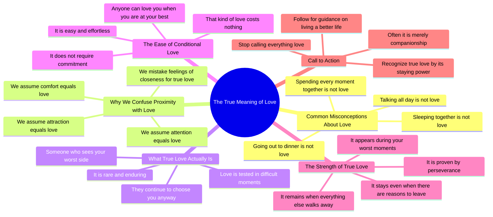

# True Love Stays When Everything Else Leaves

> 🌐 **Read this in:** **English** · [中文](../../zh-CN/2026-08/tiktok-transcript-1-6m-views-26k-reactions-dormire-insieme-non-amore-parlare-t-d733.md)

> **Creator:** [@Spiritualità Moderna](https://www.tiktok.com/@Spiritualità Moderna) · **Views:** 713.6K · **Posted:** 2026-08-27 · **Niche:** other
>
> **TL;DR:** The hook uses a series of relatable but false assumptions, immediately challenging the viewer's beliefs.

[Watch original video →](https://www.facebook.com/share/r/1EBWsGU6Bm/)

## Why This Went Viral

## Hook (first 3 seconds)
- **Verbatim opening:** "Dormire insieme non è amore." (Sleeping together isn't love.)
- **Hook pattern:** **Contrast / Negation reset.** It takes a universally accepted assumption and flips it into a negative claim.
- **Why it stops the scroll:** It creates immediate cognitive dissonance. The viewer *thinks* sleeping together is intimacy, but the speaker denies it. This forces a micro-decision: "Wait, what *is* love then?" — the viewer must watch to resolve the contradiction.

## Emotional Rhythm
1. **Challenge/Defiance** (0:00–0:05): "Sleeping together isn't love. Talking all day isn't love." — Directly attacks the viewer's comfort zone.
2. **Confusion → Curiosity** (0:05–0:10): "Often we confuse closeness with true love." — Offers a rational bridge, easing the tension while deepening the question.
3. **Escalating Denial** (0:10–0:15): "Comfort isn't love. Attraction isn't love. Attention isn't love." — Rhythmic repetition creates a trance-like build-up, stripping away all false substitutes.
4. **The Turn / Definition** (0:15–0:20): "Love is someone who sees the worst side of you and still chooses you." — The climax. A crisp, memorable definition that reframes the entire premise.
5. **Validation** (0:20–0:30): "Anyone can love you at your best... true love shows when you're at your worst." — Reinforces the climax with a relatable, painful truth.
6. **Call to Action / Resolution** (0:30–0:40): "Stop calling everything love... true love is rare and you'll recognize it because it stays." — Delivers a takeaway, then pivots to the follow CTA.

**Climax moment:** "L'amore è qualcuno che vede il lato peggiore di te e continua a sceglierti" — This is the line that gets quoted, shared, and screenshotted.

## Keyword Density
- **Amore (love):** 8 occurrences — The core topic; drives algorithmic topic classification.
- **Non è (is not):** 6 occurrences — The structural negation; creates the rhetorical pattern.
- **Vero (true):** 3 occurrences — Qualifier that elevates the message from generic to aspirational.
- **Compagnia (company/companionship):** 1 occurrence — The sharp contrast word that creates the "aha" moment.
- **Resta / rimane (stays/remains):** 2 occurrences — The emotional anchor; drives the "loyalty" theme.
- **Peggiore (worst):** 2 occurrences — The vulnerability trigger; drives emotional pull.

**Algorithmic reach drivers:** "Amore" and "non è" (high-search, high-engagement topic in the romance niche).  
**Emotional pull drivers:** "Vero" and "peggiore" (tap into insecurity and the desire for validation).

## Why It Spreads
- **Universal insecurity targeting:** "Spesso confondiamo la sensazione di vicinanza con il vero amore" — This speaks directly to anyone who has ever doubted their relationship. It validates a hidden fear, making viewers feel *seen* and compelled to share with a partner or friend ("this reminded me of us").
- **Screenshot-worthy definition:** "L'amore è qualcuno che vede il lato peggiore di te e continua a sceglierti" — This is a standalone, quotable line. It functions as a "text post" within a video format, making it easy to repost on Stories, tweets, or captions.
- **The "hard truth" format:** The entire script is a series of negations that dismantle common beliefs. This creates a "tough love" persona that feels authoritative. Viewers share it to project wisdom onto their own profile ("I know what real love is").
- **Open-loop resolution:** The video doesn't say *how* to find this love — it only says "you'll recognize it." This leaves a gap that drives comments ("How do I know if he's the one?") and follows (for the next video).
- **Low-barrier CTA:** "Se sei nuovo qui, ricordati di seguirmi" — The follow request is framed as a self-improvement promise ("help you live a better life"), not a self-promotional plea.

## What You Can Steal
1. **The Negation Ladder:** Start with 3–5 short, punchy negations of common beliefs ("X isn't Y. Z isn't Y.") to create rhythm and cognitive dissonance. Then deliver a single, crisp definition that flips the script.
2. **The "Worst Moment" Test:** Build your message around a *vulnerability threshold* — not what feels good, but what survives when things feel bad. This instantly raises the perceived value of your advice.
3. **The Screenshot Line:** Write one sentence in the middle of the script that can stand alone as a quote. Make it the climax. If a viewer screenshots your video, you've won the algorithm — they'll re-share it as an image, driving traffic back to you.

## Mind Map

## Full Transcript (Generated by [free TikTok transcript generator](https://toktranscript.com/?utm_source=github&utm_medium=breakdown&utm_campaign=tool_attribution))

> 📝 Transcripts on this page are auto-generated and show the first 60%. Want to transcribe any TikTok in 30 seconds and get the full version? [Try TokTranscript free →](https://toktranscript.com/?utm_source=github&utm_medium=breakdown&utm_campaign=transcript_cta)

Dormire insieme non è amore. Parlare tutto il giorno non è amore. Passare ogni momento insieme non è amore. Uscire a cena non è amore. Spesso confondiamo la sensazione di vicinanza con il vero amore. Pensiamo che solo perché qualcosa ci fa stare bene allora debba essere amore. Ma il conforto non è amore. L'attrazione non è amore. L'attenzione non è amore. L'amore è qualcuno che vede il lato peggiore di te e continua a sceglierti allo stesso modo. Chiunque può amarti quando sei al meglio. Quello è facile, non costa nulla.

*[Read the full transcript on TokTranscript →](https://toktranscript.com/plaza/tiktok-transcript-1-6m-views-26k-reactions-dormire-insieme-non-amore-parlare-t-d733?utm_source=github&utm_medium=breakdown&utm_campaign=transcript_full)*

## Browse More

- All [other](../../by-niche/en/other.md) breakdowns
- All [Repetition with negation](../../by-pattern/en/hook-repetition-with-negation.md) examples

## Video Info

| | |
|---|---|
| Creator | [@Spiritualità Moderna](https://www.tiktok.com/@Spiritualità Moderna) |
| Original video | [https://www.facebook.com/share/r/1EBWsGU6Bm/](https://www.facebook.com/share/r/1EBWsGU6Bm/) |
| Original title | 1.6M views · 26K reactions | Dormire insieme non è amore. Parlare tutto il giorno non è amore. Passare ogni momento insieme non è amore. Uscire a cena non è amore. Spesso confondiamo la sensazione di vicinanza con il vero amore. Pensiamo che, solo perché qualcosa ci fa stare bene, allora debba essere amore. Ma il conforto non è amore. L'attrazione non è amore. L'attenzione non è amore. L'amore è qualcuno che vede il lato peggiore di te e continua a sceglierti allo stesso modo. È qualcuno che ti vede crollare e non se ne va. È qualcuno che conosce i tuoi difetti, le tue ferite, i tuoi momenti più bui... e decide comunque di restare. Chiunque può amarti quando sei al meglio. Quello è facile. Non costa nulla. Il vero amore si manifesta quando sei nel tuo momento peggiore, quando avrebbe tutte le ragioni per andarsene... e invece resta. Smetti di chiamare amore qualunque cosa. Molto spesso è soltanto compagnia. Il vero amore è raro. E lo riconoscerai perché rimane, quando tutto il resto se ne andrebbe. Se queste parole ti hanno fatto riflettere, scrivi “Vivere” nei commenti, e ti manderò gratis la raccolta delle 10 riflessioni più importanti del mio libro "Come vivere una vita migliore", da cui è stato ispirato questo reel. Leggile, e capirai come questo libro abbia già aiutato più di 3000 italiani a vivere meglio le proprie relazioni, il proprio lavoro e la propria vita.🙌🏻🍃 Sei d’accordo con ciò che ho detto?🔥 Doppiaggio a cura di: @ivanouli #spiritualità #vita #filosofia #gratitudine #crescitapersonale | Spiritualità Moderna |
| Views | 713.6K (713556) |
| Posted | 2026-08-27 |
| Duration | 0s |
| Niche | `other` |
| Hook pattern | `Repetition with negation` |
| Original language | `en` |
| Available languages | en, zh-CN |
| Generated | 2026-08-28 by [TokTranscript](https://toktranscript.com/) |

---

*This breakdown is for educational analysis under fair use. Original video © [@Spiritualità Moderna](https://www.tiktok.com/@Spiritualità Moderna). All transcripts are auto-generated and may contain errors.*

*Want to analyze your own TikToks like this? [try this transcription tool →](https://toktranscript.com/viral-breakdown?utm_source=github&utm_medium=breakdown&utm_campaign=footer_cta)*