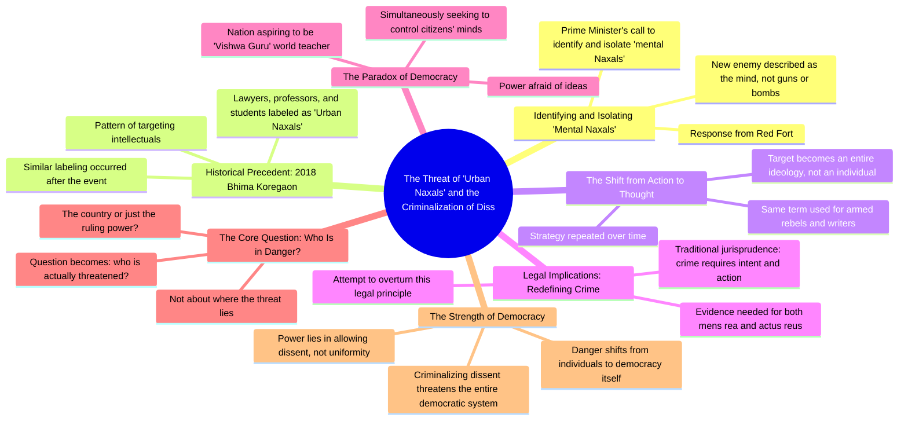

# Is It a Crime to Think in India Now?

> 🌐 **Read this in:** **English** · [中文](../../zh-CN/2026-08/tiktok-transcript-1-7m-views-124k-reactions-is-it-a-crime-to-think-in-india-no-664b.md)

> **Creator:** [@Vijender Chauhan](https://www.tiktok.com/@Vijender Chauhan) · **Views:** 1.5M · **Posted:** 2026-08-19 · **Niche:** other
>
> **TL;DR:** Opens with a provocative question that challenges the viewer's knowledge and creates immediate curiosity.

[Watch original video →](https://www.facebook.com/reel/1081511094771620/?mibextid=rS40aB7S9Ucbxw6v)

## Why This Went Viral

## Hook (first 3 seconds)
- **Verbatim opening line:** "इन दिमागी नक्सलियों को पहचाना होगा, को आइसूलेट करना होगा क्या आपको पता चला देश का सबसे नया दुश्मन कौन है?"
- **Hook pattern:** Bold claim + rhetorical question (contrast). It drops a provocative, politically charged phrase ("दिमागी नक्सल") and immediately challenges the viewer with "do you know who the new enemy is?"
- **Why it stops scroll:** It weaponizes a trending political term, creates an "us vs. them" tension, and dares the viewer to have an opinion. The contrast between "बंदूक" (gun) and "दिमाग" (mind) is jarring and curiosity-spiking.

## Emotional Rhythm
1. **Outrage/Provocation (0–3s):** The term "दिमागी नक्सल" triggers immediate political alertness.
2. **Curiosity (3–8s):** "देश का सबसे नया दुश्मन कौन है?" — viewer must watch to get the answer.
3. **Tension (8–15s):** Reference to Bhima Koregaon 2018 and labeling of lawyers, professors, students as "urban Naxals" — builds a sense of historical injustice.
4. **Intellectual escalation (15–25s):** Shift from specific events to legal/philosophical critique (jurisprudence, intent vs. action) — viewer feels smarter for following.
5. **Resonance/Twist (25–35s):** "जो देश श्वैम को विश्व गुरू कहता है वही अपने ही नागरिक के दिमाग को नियंतरण में रखना चाहता है" — irony lands hard.
6. **Climax (35–45s):** The pivot: "सवाल यह नहीं रहे जाता कि खत्रा कहा है... आकिर किसे खत्रा है?" — flips the entire narrative from "enemy outside" to "danger to democracy itself."
7. **Resolution (45s–end):** Final philosophical punch: "जिस दिन असहमती को अपराद बना दिया जाए... खत्रा पूरे लोकतंत्र बनाता।" — leaves viewer with a haunting, shareable conclusion.

## Keyword Density
- **दिमागी नक्सल** (mind Naxal) — 3x. Drives algorithmic reach (trending political term) + emotional pull (fear/outrage).
- **खत्रा** (danger/threat) — 4x. Emotional anchor; creates urgency and stakes.
- **सत्ता** (power/regime) — 3x. Political resonance; drives ideological sharing.
- **असहमती** (dissent) — 2x. Core philosophical value; emotional pull for democratic audiences.
- **अपराध** (crime) — 2x. Legal/moral weight; triggers justice-seeking viewers.
- **लोकतंत्र** (democracy) — 2x. High-emotion keyword; algorithmic reach among politically engaged users.
- **निशाना** (target) — 2x. Visual, threatening imagery; emotional pull.

## Why It Spreads
- **Provocative framing with a twist:** The video takes a government phrase ("दिमागी नक्सल") and recontextualizes it as a threat to democracy, not to the nation. This inversion ("देश को खत्रा है या सत्ता को?") is the shareable "aha" moment — viewers share to spread the counter-narrative.
- **Historical anchoring:** Referencing Bhima Koregaon 2018 (a real, controversial event) gives the argument factual gravity. It signals "this isn't new" — making the video feel like an exposé rather than opinion, which boosts credibility and shares.
- **Escalating intellectual stakes:** The video moves from news headline → historical pattern → legal theory → philosophical climax. Each step raises the intellectual reward, making viewers feel they've gained insight worth passing on.
- **Universal democratic appeal:** The final lines ("dissent is democracy's strength") transcend partisan lines. Even moderate viewers can share it as a "pro-democracy" statement, widening the potential sharing pool beyond just one political camp.
- **Emotional closure with a call to think:** The ending doesn't tell viewers what to do — it leaves them with a question ("किसे खत्रा है?"). Unresolved tension drives comments, debates, and re-shares.

## What You Can Steal
- **Start with a trending phrase + a question:** Take a term already circulating in your niche (news, tech, culture) and immediately challenge the viewer: "Do you know what this really means?" — it forces engagement.
- **Use historical precedent to build authority:** Don't just state an opinion; anchor it to a past event (even 5 years old). This transforms a hot take into a "pattern reveal," which feels more valuable and shareable.
- **End with a philosophical pivot, not a conclusion:** Instead of summarizing, flip the question back on the viewer ("Who is really in danger?"). Leave them with an open-ended, powerful line that begs to be quoted or argued with — that's the comment-section fuel.

## Mind Map

## Full Transcript (Generated by [TokTranscript](https://toktranscript.com/?utm_source=github&utm_medium=breakdown&utm_campaign=tool_attribution))

> 📝 Transcripts on this page are auto-generated and show the first 60%. Want to transcribe any TikTok in 30 seconds and get the full version? [Try TokTranscript free →](https://toktranscript.com/?utm_source=github&utm_medium=breakdown&utm_campaign=transcript_cta)

इन दिमागी नक्सलियों को पहचाना होगा, को आइसूलेट करना होगा क्या आपको पता चला देश का सबसे नया दुश्मन कौन है? बंदूक नहीं, बम नहीं, लाल किले से जवाब आया है दिमाग पधान मंत्री ने कहा दिमागी नकसल को पहचानो और आईसूलेट करो पर यह कोई नया खेल नहीं है 2018 में भीमा कोरे गाउं के बाद यही हुआ था लिखने पढ़ने वाले वकील, प्रोफेसर, विद्यार्थी, अर्बन नकसल कहे दिये गई और यह कोई संयोग नहीं है जब एक ही शब्द बंदूक उठाने वाले और कलम उठाने वाले दोनों के लिए इस्टेमाण होने हैं तो निशाना एक इंसान नहीं रहता, निशाना पुरी सोच बन जाने हैं यह एक सूची समची रणनी ती है जो बार बार दोराई जाए जाए जूरिस्प्रुडेंस के अनुसार अब तक अपराध मंशा और एक्षन दोनों के मिलने से डिफाइन होता था क्या नियत थी तथा क्या किया इसके सबूतों से दोनों मिलकर अपराध बनते थे उस प्रमाइस को पलटने की कोशिश करता ह

*[Read the full transcript on TokTranscript →](https://toktranscript.com/plaza/tiktok-transcript-1-7m-views-124k-reactions-is-it-a-crime-to-think-in-india-no-664b?utm_source=github&utm_medium=breakdown&utm_campaign=transcript_full)*

## Browse More

- All [other](../../by-niche/en/other.md) breakdowns
- All [Rhetorical question + shocking claim](../../by-pattern/en/hook-rhetorical-question-shocking-claim.md) examples

## Video Info

| | |
|---|---|
| Creator | [@Vijender Chauhan](https://www.tiktok.com/@Vijender Chauhan) |
| Original video | [https://www.facebook.com/reel/1081511094771620/?mibextid=rS40aB7S9Ucbxw6v](https://www.facebook.com/reel/1081511094771620/?mibextid=rS40aB7S9Ucbxw6v) |
| Original title | 1.7M views · 124K reactions | Is it a crime to think in india now? #intellect #thinking #dimaginaxal #naxal #modi | Vijender Chauhan |
| Views | 1.5M (1544532) |
| Posted | 2026-08-19 |
| Duration | 0s |
| Niche | `other` |
| Hook pattern | `Rhetorical question + shocking claim` |
| Original language | `en` |
| Available languages | en, zh-CN |
| Generated | 2026-08-20 by [TokTranscript](https://toktranscript.com/) |

---

*This breakdown is for educational analysis under fair use. Original video © [@Vijender Chauhan](https://www.tiktok.com/@Vijender Chauhan). All transcripts are auto-generated and may contain errors.*

*Want to analyze your own TikToks like this? [TokTranscript →](https://toktranscript.com/viral-breakdown?utm_source=github&utm_medium=breakdown&utm_campaign=footer_cta)*