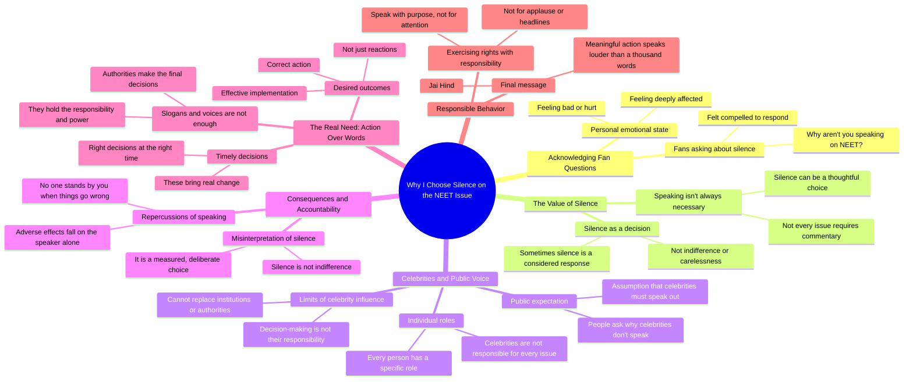

# Isha Koppikar Addresses NEET Issue and Fan Concerns

> 🌐 **Read this in:** **English** · [中文](../../zh-CN/2026-08/tiktok-transcript-12k-views-28k-reactions-to-everyone-feeling-anxious-angry-or-55d0.md)

> **Creator:** [@Isha Koppikar](https://www.tiktok.com/@Isha Koppikar) · **Views:** 619.7K · **Posted:** 2026-08-01 · **Niche:** other
>
> **TL;DR:** The creator directly addresses fan pressure and flips the expectation, creating immediate curiosity and engagement.

[Watch original video →](https://www.facebook.com/share/v/1Buf2CwoTG/)

## Why This Went Viral

## Hook (first 3 seconds)
- **Verbatim opening:** "नमशकार, कई फैन्स ने मुझसे पूछा कि आप नीट के मुद्दे पर बात क्यों नहीं कर रहे हो…"
- **Hook pattern:** Direct audience callback + unaddressed controversy (a "question" hook with a twist — it answers a criticism instead of posing a new question).
- **Why it stops scroll:** The creator acknowledges a hot-button issue (NEET) by name, instantly signaling relevance. It flips the script: instead of joining the outrage bandwagon, they're about to justify *silence* — a contrarian stance that forces viewers to watch for the reasoning.

## Emotional Rhythm
1. **Tension** — "Why aren't you talking about NEET?" (viewer expects defense or outrage)
2. **Reluctant vulnerability** — "मुझे इस वक कितना भी बुरा लग रहा हो…" (admits personal pain, lowers guard)
3. **Frustration release** — "हर बात पर बोलना जरूरी नहीं होता" (first contrarian pivot)
4. **Antagonism toward critics** — "सेलेब्रिटीज क्यों नहीं बोलते… repercussions हम अकेले ही झेलते हैं" (creates us-vs-them resonance)
5. **Rational authority** — "हर इंसान का अपना एक रोल होता है… authorities की जगह नहीं ले सकते" (shifts from emotion to logic)
6. **Appeal for trust** — "हमारी खामोशी को आप बेपरवाही मत समझे" (direct plea, humanizes the stance)
7. **Climax — Call to action** — "हमें सिर्फ reactions नहीं चाहिए… हमें effective implementation, सही action" (pivots from defense to demand)
8. **Philosophical resolution** — "Speak not for attention, applause, or headlines, but with purpose… meaningful action speaks louder than a thousand words" (elevates to universal truth)
9. **Patriotic close** — "जय हिंद" (emotional anchor, cultural resonance)

## Keyword Density
- **"बोलना / बोलते / आवाज उठाना"** (speaking/raising voice) — repeated 6+ times; drives the core debate and algorithmic reach (controversy keyword).
- **"खामोशी"** (silence) — repeated 3 times; emotional pull, frames the creator as thoughtful, not absent.
- **"फैसले"** (decisions) — repeated 4 times; shifts focus to authority and action, triggers "accountability" search interest.
- **"जिम्मेदारी"** (responsibility) — repeated 3 times; moral weight, resonates with viewers who feel let down by institutions.
- **"reactions vs. action"** — contrast pair; algorithmic reach via "NEET" + "celebrities" + "silence" trend cluster, emotional pull via "we suffer alone."

## Why It Spreads
- **Contrarian stance on a trending crisis:** While every creator is posting outrage about NEET, this video says "silence is a choice." That inverse take sparks debate — shares come from both supporters and critics.
- **Direct fan-callback framing:** "कई फैन्स ने मुझसे पूछा" makes viewers feel personally addressed; it invites them into a private conversation, boosting comment engagement.
- **Celebrity accountability bait:** "सेलेब्रिटीज क्यों नहीं बोलते" is a loaded phrase that gets picked up by gossip/news aggregators, driving external traffic.
- **Universal philosophical close:** The English lines ("Speak not for attention… meaningful action speaks louder") are quote-worthy — they get screenshotted and reposted as standalone memes, extending reach beyond the video.
- **Cultural sign-off "जय हिंद":** Ends with a patriotic note, aligning with nationalist sentiment and broadening shareability across demographic groups.

## What You Can Steal
- **Address the elephant in the room by name:** Open with the exact controversy your audience is asking about (e.g., "You keep asking why I haven't posted about X…"). This guarantees relevance and stops the scroll.
- **Use the "silence as strategy" pivot:** Instead of adding noise, take the opposite stance — justify your restraint. This creates a unique angle in a saturated feed and sparks debate in comments.
- **End with a quote-worthy universal line:** Switch to a language or tone that feels "bigger" (here: English aphorism) and deliver a one-liner that can stand alone. Make it screenshot-able — that's your free distribution engine.

## Mind Map

## Full Transcript (Generated by [try this transcription tool](https://toktranscript.com/?utm_source=github&utm_medium=breakdown&utm_campaign=tool_attribution))

> 📝 Transcripts on this page are auto-generated and show the first 60%. Want to transcribe any TikTok in 30 seconds and get the full version? [Try TokTranscript free →](https://toktranscript.com/?utm_source=github&utm_medium=breakdown&utm_campaign=transcript_cta)

नमशकार, कई फैन्स ने मुझसे पूछा कि आप नीट के मुद्दे पर बात क्यों नहीं कर रहे हो, तो मैंने उनसे ये कहना बहुत जरूरी समझा कि मुझे इस वक कितना भी बुरा लग रहा हो या फील हो रहा हो, पर हर बात पर बोलना जरूरी नहीं होता, कभी कभी खामो पश्कार, कई फैन्स ने मुझसे पूछा कि आप नीट के मुद्दे पर बात क्यों नहीं कर रहे हो, तो मैंने उनसे ये कहना बहुत जरूरी समझा कि मुझे इस वक कितना भी बुरा लग रहा हो, या फील हो रहा हो, पर हर बात पर बोलना जरूरी नहीं होता, कभी-कभी खा बकसर कहते हैं कि celebrities क्यों नहीं बोलते लेकिन जब किसी बात का उल्टा असर होता है उसके repercussions हम अकेले ही जहिलते हैं तब कोई हमारे लिए खड़ा नहीं होता और एक बात हर इंसान का अपना एक रोल होता है सेलेब्रिटीज का काम हर मुद्दे पर आवाज उठाना नहीं है और ना ही हम संस्ताओं या अथॉलिटीज की जगह ले सकते हैं जिनके हाथ में फैसले लेने की जिम्मिदारी है हमारी खामोशी को आप बेपरवाही मत समझे कभी-कभी वो सिर्फ सोच 

*[Read the full transcript on TokTranscript →](https://toktranscript.com/plaza/tiktok-transcript-12k-views-28k-reactions-to-everyone-feeling-anxious-angry-or-55d0?utm_source=github&utm_medium=breakdown&utm_campaign=transcript_full)*

## Browse More

- All [other](../../by-niche/en/other.md) breakdowns
- All [Direct address + contrarian stance](../../by-pattern/en/hook-direct-address-contrarian-stance.md) examples

## Video Info

| | |
|---|---|
| Creator | [@Isha Koppikar](https://www.tiktok.com/@Isha Koppikar) |
| Original video | [https://www.facebook.com/share/v/1Buf2CwoTG/](https://www.facebook.com/share/v/1Buf2CwoTG/) |
| Original title | 12K views · 28K reactions | To everyone feeling anxious, angry, or uncertain right now, I hear you. Your concerns matter. Your voice matters. But let’s not lose hope or let emotions push us towards violence. Because the goal isn’t just a reaction. The goal is the right outcome. | Isha Koppikar |
| Views | 619.7K (619734) |
| Posted | 2026-08-01 |
| Duration | 0s |
| Niche | `other` |
| Hook pattern | `Direct address + contrarian stance` |
| Original language | `en` |
| Available languages | en, zh-CN |
| Generated | 2026-08-02 by [TokTranscript](https://toktranscript.com/) |

---

*This breakdown is for educational analysis under fair use. Original video © [@Isha Koppikar](https://www.tiktok.com/@Isha Koppikar). All transcripts are auto-generated and may contain errors.*

*Want to analyze your own TikToks like this? [try this transcription tool →](https://toktranscript.com/viral-breakdown?utm_source=github&utm_medium=breakdown&utm_campaign=footer_cta)*