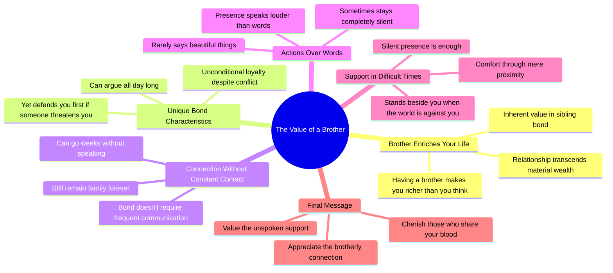

# If You Have a Brother, You Are Richer Than You Think

> 🌐 **Read this in:** **English** · [中文](../../zh-CN/2026-08/tiktok-transcript-14k-reactions-2-3k-shares-4036.md)

> **Creator:** [@Арсен Бегендыкович](https://www.tiktok.com/@Арсен Бегендыкович) · **Views:** 152.7K · **Posted:** 2026-08-25 · **Niche:** other
>
> **TL;DR:** The hook reframes a common relationship as a hidden wealth, instantly making viewers feel special and prompting them to continue.

[Watch original video →](https://www.facebook.com/share/r/1FM6E3gqeY/?mibextid=wwXIfr)

## Why This Went Viral

## Hook (first 3 seconds)
- **Verbatim opening line:** "Если у тебя есть брат, ты богаче, чем думаешь." (If you have a brother, you are richer than you think.)
- **Hook pattern:** Bold claim + contrast ("richer than you think" implies a hidden value).
- **Why it stops scroll:** It instantly reframes a common relationship (brother) as a hidden asset, triggering self-reflection and a "do I have this?" pause. It's universal, personal, and flattering to the viewer's own life.

## Emotional Rhythm
- **Beat 1 — Curiosity/Validation (0–2s):** The bold claim creates a warm, flattering premise.
- **Beat 2 — Tension (3–5s):** "Can argue all day, but if someone touches you, he stands up first" — introduces conflict (arguing) then immediate loyalty (protection). This is the first emotional spike.
- **Beat 3 — Resonance (6–8s):** "Can go weeks without talking and still be family forever" — normalizes distance, relieves guilt, creates deep relatability.
- **Beat 4 — Quiet Depth (9–12s):** "He rarely says beautiful words, sometimes silent" — lowers intensity, builds intimacy.
- **Beat 5 — Climax (13–15s):** "When the whole world is against you, a brother can stand next to you in silence. And that is enough." — the emotional peak. It's a poetic, minimal resolution that lands like a punch.
- **Beat 6 — Call to Action (16s):** "Take care of those who share your blood." — a direct, imperative close that triggers sharing.

## Keyword Density
- **Брат (brother)** — 5x. The core subject, drives both algorithmic topic clarity and emotional pull.
- **Молча/молчит (silence/silently)** — 2x. Emotional anchor; creates a motif of unspoken loyalty.
- **Рядом (nearby)** — 2x. Reinforces physical/emotional presence; strong visual cue.
- **Богаче (richer)** — 1x (opening). High-impact, sets the frame.
- **Родными (family/kin)** — 1x. Expands the concept beyond blood to chosen closeness.
- **Достаточно (enough)** — 1x. The climactic word; minimalism as power.

**Algorithmic drivers:** "Brother" (clear topic), "family" (broad reach), "rich" (aspirational).  
**Emotional pull:** "Silence," "nearby," "enough" — they create a feeling of quiet strength.

## Why It Spreads
- **Universal specificity:** It targets a specific relationship (brother) but the emotions apply to anyone with a sibling or close friend. Viewers tag their brother or share with someone who feels like a brother. The line "weeks without talking" makes it easy to send to a distant sibling.
- **Emotional contrast without negativity:** It acknowledges conflict ("argue all day") but flips it into loyalty. This makes it safe to share — no drama, only warmth.
- **Minimalist climax:** The line "his presence says more than any words" and "silence is enough" is a perfect, quotable moment. It's designed to be screenshotted or reposted as a standalone text.
- **Call to action embedded in emotion:** "Take care of those who share your blood" is not a "like and subscribe" — it's a moral imperative. It makes the viewer feel that sharing is an act of gratitude, not promotion.
- **Rhythmic pacing:** Short sentences, pauses after each beat. The transcript reads like spoken poetry, which makes it ideal for voiceover with slow, emotional background music.

## What You Can Steal
- **Open with a reframe, not a statement.** "You are richer than you think" works because it implies the viewer is missing something valuable. Try: "If you have X, you already have what most people search for."
- **Use silence as a narrative tool.** Don't fill every second with words. Let one quiet line ("And that is enough") breathe for a full beat before the next sentence. The pause is the emotion.
- **End with a directive that feels like a gift.** Instead of "follow for more," use a line that makes the viewer feel like a better person by sharing: "Take care of those who…" — it turns the video into a social currency.

## Mind Map

## Full Transcript (Generated by [TokTranscript](https://toktranscript.com/?utm_source=github&utm_medium=breakdown&utm_campaign=tool_attribution))

> 📝 Transcripts on this page are auto-generated and show the first 60%. Want to transcribe any TikTok in 30 seconds and get the full version? [Try TokTranscript free →](https://toktranscript.com/?utm_source=github&utm_medium=breakdown&utm_campaign=transcript_cta)

Если у тебя есть брат, ты богаче, чем думаешь. Брат — это тот, кто может спорить с тобой весь день, но если кто-то тронет тебя, он встанет первым. Это тот, с кем можно не общаться неделями и все равно остаться родными навсегда. Он редко говорит красивые слова, Иногда вообще молчит.

*[Read the full transcript on TokTranscript →](https://toktranscript.com/plaza/tiktok-transcript-14k-reactions-2-3k-shares-4036?utm_source=github&utm_medium=breakdown&utm_campaign=transcript_full)*

## Browse More

- All [other](../../by-niche/en/other.md) breakdowns
- All [Value affirmation](../../by-pattern/en/hook-value-affirmation.md) examples

## Video Info

| | |
|---|---|
| Creator | [@Арсен Бегендыкович](https://www.tiktok.com/@Арсен Бегендыкович) |
| Original video | [https://www.facebook.com/share/r/1FM6E3gqeY/?mibextid=wwXIfr](https://www.facebook.com/share/r/1FM6E3gqeY/?mibextid=wwXIfr) |
| Original title | 14K reactions · 2.3K shares | Брат | Арсен Бегендыкович |
| Views | 152.7K (152652) |
| Posted | 2026-08-25 |
| Duration | 0s |
| Niche | `other` |
| Hook pattern | `Value affirmation` |
| Original language | `en` |
| Available languages | en, zh-CN |
| Generated | 2026-08-26 by [TokTranscript](https://toktranscript.com/) |

---

*This breakdown is for educational analysis under fair use. Original video © [@Арсен Бегендыкович](https://www.tiktok.com/@Арсен Бегендыкович). All transcripts are auto-generated and may contain errors.*

*Want to analyze your own TikToks like this? [TokTranscript.com →](https://toktranscript.com/viral-breakdown?utm_source=github&utm_medium=breakdown&utm_campaign=footer_cta)*