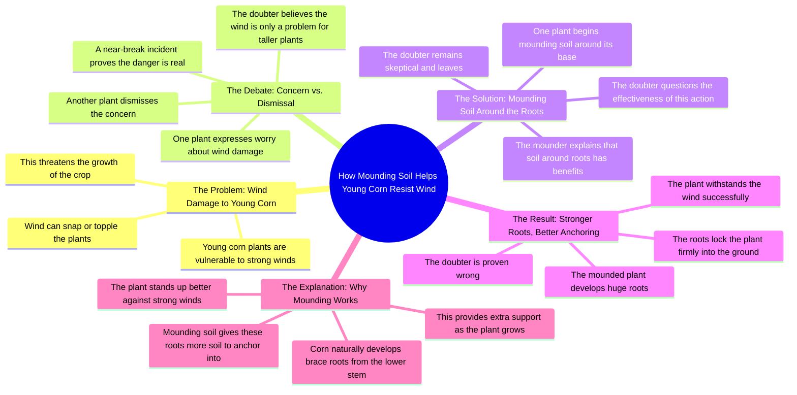

# How to Keep Corn From Blowing Over in Wind

> 🌐 **Read this in:** **English** · [中文](../../zh-CN/2026-08/tiktok-transcript-161k-views-3-7k-reactions-this-method-keeps-corn-from-blowin-16ca.md)

> **Creator:** [@Dr.Bota](https://www.tiktok.com/@Dr.Bota) · **Views:** 111.1K · **Posted:** 2026-08-14 · **Niche:** entertainment
>
> **TL;DR:** Immediately personifies the corn and creates an emotional, relatable problem that hooks viewers.

[Watch original video →](https://www.facebook.com/reel/1092022893358681/?fs=e&rdid=eNsGPUAAMgkdB535&share_url=https%3A%2F%2Fwww.facebook.com%2Fshare%2Fr%2F1BtAVEZRnN#)

## Why This Went Viral

## Hook (first 3 seconds)
- **Verbatim opening line:** "Dude, this happens every day! How are we supposed to grow like this?"
- **Hook pattern:** Scene + tension (dialogue between two characters, immediate frustration)
- **Why it stops scroll:** The viewer is dropped mid-conversation into a crisis. The stakes ("grow like this") are unclear but urgent, and the personified corn plants create an instant curiosity gap — *wait, the corn is talking? And it's scared?* That anthropomorphic twist is unexpected enough to halt a thumb.

## Emotional Rhythm
- **Beat 1 — Tension/Anxiety (0–3s):** The young corn panics about daily wind. Viewers feel the instability.
- **Beat 2 — Dismissal/Comic Relief (3–6s):** The older corn says "we're not even that tall yet" — a light, almost parental calm that lowers the stakes.
- **Beat 3 — Shock/Escalation (6–9s):** "It almost snapped us in half!" — sudden danger, physical stakes introduced. Tension spikes.
- **Beat 4 — Frustration/Conflict (9–12s):** The young corn calls the solution "no use" and gives up ("Later."). Emotional low point — feels like defeat.
- **Beat 5 — Payoff/Climax (12–15s):** "Look at those huge roots!" — visual reveal. The mound worked. Tension breaks into triumph.
- **Beat 6 — Victory/Release (15–18s):** "Haha, is that all you got?" — catharsis, confidence, comedic bravado.
- **Beat 7 — Education/Resolution (18–28s):** Calm, authoritative voiceover explains the science. Emotional drop from high to neutral — a satisfying landing.

## Keyword Density
- **"roots"** — appears 4+ times; drives both the visual payoff and the educational payoff.
- **"wind"** — repeated 4+ times; creates the villain and the tension.
- **"grow"** — repeated 3 times; ties to the core question and the solution.
- **"soil/mounding"** — repeated 3 times; the actionable takeaway.
- **"worry"** — repeated 3 times; emotional anchor for the audience's own gardening fears.
- **"support"** — 1x, but it's the final keyword that seals the educational value.

**Algorithmic reach:** "wind" and "roots" are high-search gardening terms that surface in captions, hashtags, and suggested video metadata.  
**Emotional pull:** "worry" and "grow" connect to universal gardener anxiety — people fear their plants dying, and they want reassurance.

## Why It Spreads
- **Personification creates instant relatability:** Two corn plants having a "dad and anxious kid" conversation makes an agricultural tip feel like a sitcom scene. Viewers share it because it's *funny*, not just informative — the line "Dude, look at those huge roots" is a meme-able moment of victory.
- **The twist is visual and physical:** The reveal of the brace roots at 12–15s is a "before/after" payoff in real-time. The viewer sees the proof before the explanation — this satisfies the brain's reward loop and makes the video feel like a magic trick.
- **Conflict structure mirrors a story arc:** It's not a lecture; it's a mini-drama with a villain (wind), a hero (the older corn), a skeptic (the younger corn), and a resolution. This narrative shape is inherently shareable because it feels like a 30-second movie.
- **The educational payoff is perfectly timed:** The voiceover arrives *after* the emotional climax, so the viewer is primed to learn. People share videos that make them feel smart — this one teaches a specific, actionable tip (mounding soil) that viewers can immediately use.
- **Short, punchy dialogue with quotable lines:** "Is that all you got?" and "Let the big guys worry about the wind" are easily clipped, quoted, and repurposed — which fuels remixes and duets.

## What You Can Steal
- **Give your subject a personality and a problem:** Don't just explain a tip — create a two-character dynamic (anxious novice vs. calm expert) and let them argue. The tension makes the lesson sticky.
- **Delay the payoff until after the emotional peak:** Show the problem, let the viewer doubt the solution, *then* reveal the result visually before explaining the science. The "proof first, explanation second" structure keeps retention high.
- **End with a calm, authoritative voiceover:** After the drama, drop the energy and deliver the facts in a neutral tone. This contrast makes the educational part feel like a trustworthy "afterword" — and it's the part viewers screenshot and save.

## Mind Map

## Full Transcript (Generated by [TokTranscript](https://toktranscript.com/?utm_source=github&utm_medium=breakdown&utm_campaign=tool_attribution))

> 📝 Transcripts on this page are auto-generated and show the first 60%. Want to transcribe any TikTok in 30 seconds and get the full version? [Try TokTranscript free →](https://toktranscript.com/?utm_source=github&utm_medium=breakdown&utm_campaign=transcript_cta)

Dude, this happens every day! How are we supposed to grow like this? Why are you so worried? We're not even that tall yet! Let the big guys worry about the wind! You see that? It almost snapped us in half, and you're telling me not to worry? What are you doing? The wind's up here, not down there! There's no way this is gonna fix anything! Don't worry, mounding soil around your roots has its benefits. Just wait and see. Ah, this is no use. Later. Dude, look at those huge roots. Let's see the wind beat that.

*[Read the full transcript on TokTranscript →](https://toktranscript.com/plaza/tiktok-transcript-161k-views-3-7k-reactions-this-method-keeps-corn-from-blowin-16ca?utm_source=github&utm_medium=breakdown&utm_campaign=transcript_full)*

## Browse More

- All [entertainment](../../by-niche/en/entertainment.md) breakdowns
- All [Relatable Frustration](../../by-pattern/en/hook-relatable-frustration.md) examples

## Video Info

| | |
|---|---|
| Creator | [@Dr.Bota](https://www.tiktok.com/@Dr.Bota) |
| Original video | [https://www.facebook.com/reel/1092022893358681/?fs=e&rdid=eNsGPUAAMgkdB535&share_url=https%3A%2F%2Fwww.facebook.com%2Fshare%2Fr%2F1BtAVEZRnN#](https://www.facebook.com/reel/1092022893358681/?fs=e&rdid=eNsGPUAAMgkdB535&share_url=https%3A%2F%2Fwww.facebook.com%2Fshare%2Fr%2F1BtAVEZRnN#) |
| Original title | 161K views · 3.7K reactions | This Method Keeps Corn From Blowing Over | Dr.Bota |
| Views | 111.1K (111105) |
| Posted | 2026-08-14 |
| Duration | 0s |
| Niche | `entertainment` |
| Hook pattern | `Relatable Frustration` |
| Original language | `en` |
| Available languages | en, zh-CN |
| Generated | 2026-08-15 by [TokTranscript](https://toktranscript.com/) |

---

*This breakdown is for educational analysis under fair use. Original video © [@Dr.Bota](https://www.tiktok.com/@Dr.Bota). All transcripts are auto-generated and may contain errors.*

*Want to analyze your own TikToks like this? [analyze your own TikToks →](https://toktranscript.com/viral-breakdown?utm_source=github&utm_medium=breakdown&utm_campaign=footer_cta)*