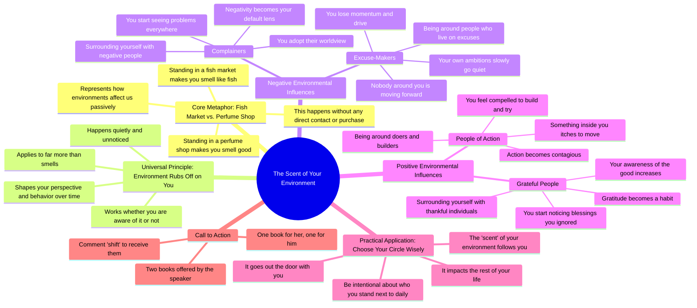

# Why You Smell Like the People You Surround Yourself With

> 🌐 **Read this in:** **English** · [中文](../../zh-CN/2026-08/tiktok-transcript-188k-views-5-7k-reactions-if-you-spend-a-whole-day-at-a-fish-5e18.md)

> **Creator:** [@Hard Truth Talks](https://www.tiktok.com/@Hard Truth Talks) · **Views:** 103.0K · **Posted:** 2026-08-17 · **Niche:** entertainment
>
> **TL;DR:** Uses a vivid, relatable metaphor to instantly create curiosity and set up the core message.

[Watch original video →](https://www.facebook.com/share/r/1Eh1q98FmD/)

## Why This Went Viral

## Hook (first 3 seconds)
- **Verbatim opening:** "Spend your whole day standing in a fish market and you'll walk out smelling like fish, even if you never laid a finger on a single one."
- **Hook pattern:** Contrast + familiar sensory scene (fish market vs. perfume shop).
- **Why it stops scroll:** It uses a universal, visceral experience (smell) that everyone instantly relates to, then flips it into a metaphor. The brain immediately wants to know where this analogy is going — it feels like a riddle being solved.

## Emotional Rhythm
1. **Curiosity (0–5s):** The fish market image is vivid and slightly gross; the viewer leans in to see the point.
2. **Recognition (5–10s):** The perfume shop contrast lands — "that's just how it works" creates a small "aha" moment.
3. **Shift to unease (10–20s):** "Your environment always rubs off on you" — the tone turns introspective and slightly warning-like.
4. **Tension build (20–35s):** Negative examples (complainers, excuse-makers) create a sense of dread — the viewer mentally checks their own circle.
5. **Relief/aspiration (35–45s):** The pivot to "people of action" and "grateful people" lifts the mood; it feels like a path forward.
6. **Climax (45–50s):** "The scent of your environment... will always follow you out the door" — the metaphor closes the loop, delivering the core thesis with poetic finality.
7. **Soft call-to-action (50s+):** Book offer feels like a reward for staying to the end.

## Keyword Density
- **"Spend your time"** (4x) — drives the core behavioral message; algorithmic reach via clear, repeatable phrasing.
- **"Environment"** (2x) — the conceptual anchor; high search/interest pull for self-improvement audiences.
- **"Smelling/smell/scent"** (4x) — the sensory metaphor; emotional pull, makes the abstract tangible.
- **"Complain/excuses/action/grateful"** (4 contrasting pairs) — emotional pull; creates in-group vs. out-group identity.
- **"Choose carefully"** (1x, but pivotal) — the actionable takeaway; drives shares because it's directive.
- **"Books/comment shift"** (1x) — algorithmic trigger for engagement (comments boost reach).

## Why It Spreads
- **Metaphor is instantly graspable and shareable.** The fish/perfume analogy is so clean that viewers can repeat it to a friend verbatim — that's the "pass-along" test. It becomes a mental shortcut for a complex idea.
- **It names a silent problem.** "Your environment rubs off on you" is something people feel but rarely articulate. The video gives them language for it, which drives saves and shares ("this is exactly what I've been trying to say").
- **It creates an identity check.** The negative examples (complainers, excuse-makers) force the viewer to audit their own circle. That self-reflection is uncomfortable, and people share uncomfortable truths to signal self-awareness.
- **The emotional arc is a complete story.** It goes from curiosity → warning → hope in under a minute. That completeness makes it feel more like a "mini-film" than a talking head, increasing watch time.
- **The CTA is low-friction and curiosity-driven.** "Comment shift" is a single word, easy to type, and the promise of two books (one for him, one for her) creates a personalized reward that boosts comment volume — which feeds the algorithm.

## What You Can Steal
- **Open with a sensory, universal metaphor before the lesson.** Don't state your thesis upfront; let the viewer solve a small puzzle first. The fish market line does more work than any abstract statement could.
- **Use paired contrasts to build rhythm.** Complainers vs. action-takers, excuses vs. gratitude. Each pair is a mini-beat that keeps the script moving and makes the message feel universal.
- **End with a specific, low-effort engagement trigger.** "Comment shift" works because it's one word, easy to remember, and promises a tangible reward. Make your CTA that simple — not "follow for more" but a single word that unlocks something.

## Mind Map

## Full Transcript (Generated by [analyze your own TikToks](https://toktranscript.com/?utm_source=github&utm_medium=breakdown&utm_campaign=tool_attribution))

> 📝 Transcripts on this page are auto-generated and show the first 60%. Want to transcribe any TikTok in 30 seconds and get the full version? [Try TokTranscript free →](https://toktranscript.com/?utm_source=github&utm_medium=breakdown&utm_campaign=transcript_cta)

Spend your whole day standing in a fish market and you'll walk out smelling like fish, even if you never laid a finger on a single one. But spend that same day inside a perfume shop and you'll leave smelling good, even if you never bought a thing off the shelf. That's not a trick, that's just how it works. And it's true of far more than smells. Your environment always rubs off on you, quietly, whether you notice it happening or not. Spend your time around people who do nothing but complain. And before long, you'll start seeing problems and negativity everywhere you look. Because that's the lens you've been handed. Spend it around people who live on excuses. And you'll find your own ambitions slowly going quiet.

*[Read the full transcript on TokTranscript →](https://toktranscript.com/plaza/tiktok-transcript-188k-views-5-7k-reactions-if-you-spend-a-whole-day-at-a-fish-5e18?utm_source=github&utm_medium=breakdown&utm_campaign=transcript_full)*

## Browse More

- All [entertainment](../../by-niche/en/entertainment.md) breakdowns
- All [Metaphor/Contrast Hook](../../by-pattern/en/hook-metaphor-contrast-hook.md) examples

## Video Info

| | |
|---|---|
| Creator | [@Hard Truth Talks](https://www.tiktok.com/@Hard Truth Talks) |
| Original video | [https://www.facebook.com/share/r/1Eh1q98FmD/](https://www.facebook.com/share/r/1Eh1q98FmD/) |
| Original title | 188K views · 5.7K reactions | If you spend a whole day at a fish market, then you will smell like fish. #podcast #relationships #love #men #women | Hard Truth Talks |
| Views | 103.0K (102962) |
| Posted | 2026-08-17 |
| Duration | 0s |
| Niche | `entertainment` |
| Hook pattern | `Metaphor/Contrast Hook` |
| Original language | `en` |
| Available languages | en, zh-CN |
| Generated | 2026-08-19 by [TokTranscript](https://toktranscript.com/) |

---

*This breakdown is for educational analysis under fair use. Original video © [@Hard Truth Talks](https://www.tiktok.com/@Hard Truth Talks). All transcripts are auto-generated and may contain errors.*

*Want to analyze your own TikToks like this? [the tool we used to generate this →](https://toktranscript.com/viral-breakdown?utm_source=github&utm_medium=breakdown&utm_campaign=footer_cta)*