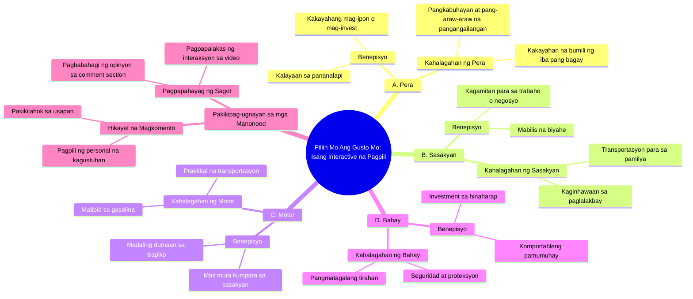

# Choose Your Prize: Money, Car, Motorcycle, or House

> 🌐 **Read this in:** **English** · [中文](../../zh-CN/2026-08/tiktok-transcript-1m-views-20k-reactions-comment-nyo-na-mga-boss-baka-sa-inyo-77c9.md)

> **Creator:** [@𝔦𝔳 𝔱𝔢𝔞𝔪.](https://www.tiktok.com/@𝔦𝔳 𝔱𝔢𝔞𝔪.) · **Views:** 316.0K · **Posted:** 2026-08-30 · **Niche:** other
>
> **TL;DR:** Directly challenges the viewer to make a personal choice, triggering immediate engagement.

[Watch original video →](https://www.facebook.com/share/r/1DqKGDowiZ/)

## Why This Went Viral

## Hook (first 3 seconds)
- **Verbatim opening:** "Piliin mo ang gusto mo. A. Pera B. Sasakyan C. Motor o D. Bahay"
- **Hook pattern:** Interactive choice / question with options (a "pick-a-door" pattern)
- **Why it stops scroll:** It forces an immediate mental decision. The viewer can't passively watch — their brain is wired to answer. The options are universally aspirational (money, car, motorcycle, house), so it triggers a personal stake within 2 seconds. No intro, no context — pure engagement bait.

## Emotional Rhythm
1. **Curiosity/Challenge** (0–2s): "Piliin mo ang gusto mo" — the viewer is dared to choose.
2. **Self-projection** (2–5s): Reading the options, the viewer mentally weighs their own desire (Pera vs. Bahay — a values conflict).
3. **Anticipation** (5–7s): "I-comment mo ang sagot mo sa baba" — creates a social contract; you feel you *should* reply.
4. **Direct pressure** (7–9s): "Alin ang pipiliin mo? Sabihin mo ha!" — the "ha" is a playful nudge, adding urgency and a hint of personal accountability.
5. **Climax:** The final "Sabihin mo ha!" — it's the emotional peak where passive viewer becomes active participant. The tension is resolved only by commenting.

## Keyword Density
- **"Piliin"** (choose) — repeated 2x; drives the interactive mechanic, algorithmic engagement signal.
- **"Pera"** (money) — top option; highest emotional pull, universal desire.
- **"Sasakyan"** (car) — aspirational, status-driven.
- **"Motor"** (motorcycle) — relatable, youth-culture appeal.
- **"Bahay"** (house) — deepest emotional anchor (security, family).
- **"I-comment"** — direct CTA; algorithmic gold (boosts comment rate).
- **"Sagot"** (answer) — reinforces the action loop.
- **"Sabihin mo"** — conversational, creates a sense of being personally addressed.

*Algorithmic drivers:* "I-comment," "sagot," "piliin" — all push the platform's engagement metrics.
*Emotional pull:* "Pera," "Bahay," "Sasakyan" — these are not just words; they are life goals that trigger instant self-identification.

## Why It Spreads
1. **Zero-barrier participation:** The entire video is a single question with options. Anyone can answer in 5 seconds. The transcript's "I-comment mo ang sagot mo" is a frictionless CTA — no thinking needed, just typing a letter.
2. **Values-based debate engine:** By offering "Pera" vs. "Bahay," the video forces a values clash. Comment sections explode with people justifying their choice ("Mas okay ang bahay kasi investment" vs. "Pera para may freedom"). This debate is the real content — the video is just the spark.
3. **Personal accountability trap:** "Sabihin mo ha!" is a pseudo-confrontational line. It makes the viewer feel like they're being called out personally. This drives comment volume because people feel obligated to "defend" their choice.
4. **Universal relatability across demographics:** The options cover every socioeconomic class. A student picks "Motor," a parent picks "Bahay," a hustler picks "Pera." This guarantees a wide, diverse comment audience — which signals the algorithm to push it further.
5. **Comment-section as content:** The video is engineered so that the *comments* become the viral content. People screenshot the comment section and repost it. The transcript's open-ended question ensures endless replies, which feeds the loop.

## What You Can Steal
1. **Open with a forced choice, not a statement.** Give your audience 2–4 concrete options (A/B/C/D) in the first 3 seconds. Even if your niche is unrelated, frame your topic as a dilemma: "Mas okay ba ang X o Y?" — the brain can't ignore an unresolved choice.
2. **Add a pseudo-personal nudge at the end.** Copy the "Sabihin mo ha!" pattern: a short, slightly cheeky command that makes the viewer feel individually addressed. Examples: "Seryoso, sagutin mo 'to." or "Huwag kang mag-scroll nang hindi sumasagot." It converts passive viewers into commenters.
3. **Design for the comment section, not the video.** Ask a question that has *multiple valid answers* so people argue in the comments. Avoid yes/no questions. The goal is to create a debate where every comment is a new reason for the algorithm to boost your video. Your transcript is the bait; the comments are the trap.

## Mind Map

## Full Transcript (Generated by [TokTranscript](https://toktranscript.com/?utm_source=github&utm_medium=breakdown&utm_campaign=tool_attribution))

> 📝 Transcripts on this page are auto-generated and show the first 60%. Want to transcribe any TikTok in 30 seconds and get the full version? [Try TokTranscript free →](https://toktranscript.com/?utm_source=github&utm_medium=breakdown&utm_campaign=transcript_cta)

Piliin mo ang gusto mo. A. Pera B. Sasakyan C. Motor o D.

*[Read the full transcript on TokTranscript →](https://toktranscript.com/plaza/tiktok-transcript-1m-views-20k-reactions-comment-nyo-na-mga-boss-baka-sa-inyo-77c9?utm_source=github&utm_medium=breakdown&utm_campaign=transcript_full)*

## Browse More

- All [other](../../by-niche/en/other.md) breakdowns
- All [Interactive Choice Hook](../../by-pattern/en/hook-interactive-choice-hook.md) examples

## Video Info

| | |
|---|---|
| Creator | [@𝔦𝔳 𝔱𝔢𝔞𝔪.](https://www.tiktok.com/@𝔦𝔳 𝔱𝔢𝔞𝔪.) |
| Original video | [https://www.facebook.com/share/r/1DqKGDowiZ/](https://www.facebook.com/share/r/1DqKGDowiZ/) |
| Original title | 1M views · 20K reactions | Comment nyo na mga boss baka sa inyo na sunod! 😱🥳 #ivanaalawi #monaalawi #ivanaalawireall #laptopwarehouse #lapag #dailyvlog #laptop #bossa #BossA #Pamorma #CrisHippers #Kuyamoboss #fistbump #TisayShin #filipina #iphone #pera | 𝔦𝔳 𝔱𝔢𝔞𝔪. |
| Views | 316.0K (315979) |
| Posted | 2026-08-30 |
| Duration | 0s |
| Niche | `other` |
| Hook pattern | `Interactive Choice Hook` |
| Original language | `en` |
| Available languages | en, zh-CN |
| Generated | 2026-08-31 by [TokTranscript](https://toktranscript.com/) |

---

*This breakdown is for educational analysis under fair use. Original video © [@𝔦𝔳 𝔱𝔢𝔞𝔪.](https://www.tiktok.com/@𝔦𝔳 𝔱𝔢𝔞𝔪.). All transcripts are auto-generated and may contain errors.*

*Want to analyze your own TikToks like this? [free TikTok transcript generator →](https://toktranscript.com/viral-breakdown?utm_source=github&utm_medium=breakdown&utm_campaign=footer_cta)*