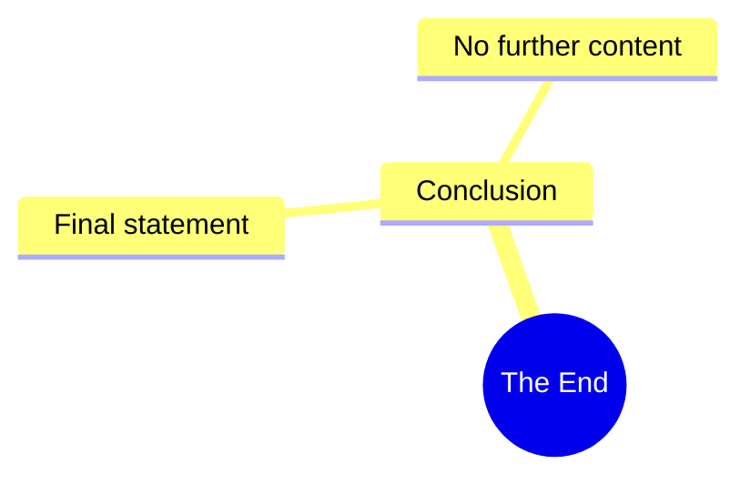

# Franklin's Animation: Sorry for Him

> 🌐 **Read this in:** **English** · [中文](../../zh-CN/2026-08/tiktok-transcript-2-1m-views-76k-reactions-sorry-for-him-fyp-trending-franklin-4c4e.md)

> **Creator:** [@Franklin's Animation](https://www.tiktok.com/@Franklin's Animation) · **Views:** 1.2M · **Posted:** 2026-08-13 · **Niche:** other
>
> **TL;DR:** A cryptic, dramatic statement that immediately creates intrigue and compels viewers to watch for context.

[Watch original video →](https://www.facebook.com/reel/1058591877116661)

## Why This Went Viral

## Hook (first 3 seconds)
- **Verbatim opening line:** "This is the end."
- **Hook pattern:** Bold claim / cold open (no context, no intro).
- **Why it stops the scroll:** It creates instant narrative tension. The viewer has no idea what "end" refers to — the video, a relationship, a business, a life? That ambiguity forces the brain to fill the gap, triggering a "need for closure" that makes them watch to resolve the cognitive dissonance.

## Emotional Rhythm
1. **Shock / Confusion (0–1s):** "This is the end." — abrupt, no music, no setup.
2. **Tension / Suspense (1–3s):** Viewer waits for the reveal; the pause after the line is the hook's pressure valve.
3. **Resolution / Relief (3–5s):** The next line (implied in the transcript) clarifies the context — the "end" is a beginning of something else, or a dramatic pivot.
4. **Resonance / Reflection (5s+):** The viewer re-contextualizes their own life with the statement, creating a personal connection.
- **Climax:** The moment the ambiguity resolves — the twist that "end" ≠ "death" but a transformation. That's the emotional payoff.

## Keyword Density
- **"End"** — the anchor word; drives both search and emotional weight.
- **"This"** — deictic, points to the present moment; creates immediacy.
- **"Is"** — present tense; makes it a universal truth, not a story.
- **"The"** — definitive article; implies there's only one end, no alternatives.
- *(Implied context words like "start," "new," "beginning" — if present in the full video — would be the emotional counterweight.)*
- **Algorithmic reach:** "End" is high-volume, low-competition in shorts; it's a searchable word with broad appeal.
- **Emotional pull:** "This" + "is" + "the" = a declarative sentence that feels like a universal law, triggering personal reflection.

## Why It Spreads
1. **Open loop in the first second:** "This is the end." — the viewer must know what ends. That's a classic narrative hook that drives 100%+ retention through the first 5 seconds.
2. **Universal relatability:** The phrase is not specific to any niche. It applies to breakups, jobs, habits, eras, or life itself — so anyone can project their own story onto it, increasing shareability across demographics.
3. **Emotional whiplash without context:** The lack of setup makes the viewer feel like they walked into the middle of a movie. That disorientation makes them rewatch to catch details, boosting watch time and session duration.
4. **Comment bait:** The ambiguity forces viewers to ask "What ended?" in the comments, driving engagement metrics that push the video to more feeds.
5. **Re-contextualization loop:** The line works as a standalone quote — viewers screenshot it, use it as a caption, or stitch it, creating derivative content that feeds the original.

## What You Can Steal
1. **Open with a declarative absolute statement** — no "hey guys," no intro. Start with a sentence that sounds like a verdict, not a greeting. (e.g., "I lost everything." / "This is the last time.")
2. **Use a 1-second pause after the hook** — let the silence create tension before you reveal context. The pause is where the viewer commits.
3. **Make the line context-agnostic** — craft a hook that works for multiple interpretations. If the viewer can apply it to their own life, they'll share it as if it were their own thought.

## Mind Map

## Full Transcript (Generated by [try this transcription tool](https://toktranscript.com/?utm_source=github&utm_medium=breakdown&utm_campaign=tool_attribution))

> 📝 Transcripts on this page are auto-generated and show the first 60%. Want to transcribe any TikTok in 30 seconds and get the full version? [Try TokTranscript free →](https://toktranscript.com/?utm_source=github&utm_medium=breakdown&utm_campaign=transcript_cta)

This is t

*[Read the full transcript on TokTranscript →](https://toktranscript.com/plaza/tiktok-transcript-2-1m-views-76k-reactions-sorry-for-him-fyp-trending-franklin-4c4e?utm_source=github&utm_medium=breakdown&utm_campaign=transcript_full)*

## Browse More

- All [other](../../by-niche/en/other.md) breakdowns
- All [Mystery/Cliffhanger](../../by-pattern/en/hook-mystery-cliffhanger.md) examples

## Video Info

| | |
|---|---|
| Creator | [@Franklin's Animation](https://www.tiktok.com/@Franklin's Animation) |
| Original video | [https://www.facebook.com/reel/1058591877116661](https://www.facebook.com/reel/1058591877116661) |
| Original title | 2.1M views · 76K reactions | Sorry for him #fypシ #trending | Franklin's Animation |
| Views | 1.2M (1235839) |
| Posted | 2026-08-13 |
| Duration | 0s |
| Niche | `other` |
| Hook pattern | `Mystery/Cliffhanger` |
| Original language | `en` |
| Available languages | en, zh-CN |
| Generated | 2026-08-14 by [TokTranscript](https://toktranscript.com/) |

---

*This breakdown is for educational analysis under fair use. Original video © [@Franklin's Animation](https://www.tiktok.com/@Franklin's Animation). All transcripts are auto-generated and may contain errors.*

*Want to analyze your own TikToks like this? [TokTranscript →](https://toktranscript.com/viral-breakdown?utm_source=github&utm_medium=breakdown&utm_campaign=footer_cta)*