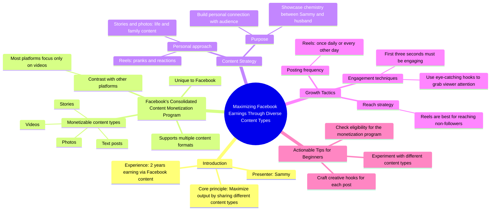

# Maximize Facebook Income with Samantha Blizzard’s Content...

> 🌐 **Read this in:** **English** · [中文](../../zh-CN/2026-08/tiktok-transcript-2-5m-views-20k-reactions-a-reminder-that-you-can-earn-money-ba3c.md)

> **Creator:** [@Facebook for Creators](https://www.tiktok.com/@Facebook for Creators) · **Views:** 1.2M · **Posted:** 2026-08-15 · **Niche:** marketing
>
> **TL;DR:** Immediately offers a clear financial benefit, enticing viewers to keep watching for the actionable advice.

[Watch original video →](https://www.facebook.com/reel/1872427233306540)

## Why This Went Viral

## Hook (first 3 seconds)
- **Verbatim opening:** "If you want to know the best way to cash in on your earnings, it's to maximize the output by sharing different content types."
- **Hook pattern:** Bold claim + direct address ("you") + money trigger word ("cash in").
- **Why it stops scroll:** It promises a financial formula in the first sentence, creating immediate perceived value. The word "cash" activates loss aversion — viewers feel they're leaving money on the table if they skip.

## Emotional Rhythm
1. **Curiosity (0–3s):** "Best way to cash in" — viewer leans in.
2. **Authority (3–8s):** "Hi, my name is Sammy… two years" — trust is established via proof of experience.
3. **Contrast/Tension (8–15s):** "While most platforms only focus on videos" — creates a gap between what viewers know and what's possible.
4. **Relief/Revelation (15–20s):** Reveals the specific program and the multi-format strategy — the "aha" moment.
5. **Personal proof (20–30s):** "I show mine and my husband's chemistry…" — humanizes the strategy, adds relatability and authenticity.
6. **Actionable clarity (30–40s):** "Posting reels once a day or every other day" — concrete, low-friction instruction.
7. **Climax (40–45s):** "Reels are the best way to reach people who don't follow you" — the single most valuable insight, delivered late to keep retention.
8. **Call-to-action (45–50s):** "Check your eligibility… try different content types" — urgency + a simple next step.

## Keyword Density
- **"Earn/earning"** (4×) — dual purpose: algorithmic (money niche = high CPM advertisers) and emotional (aspirational pull).
- **"Content types"** (3×) — drives the educational angle; signals listicle-style value.
- **"Reels"** (3×) — platform-specific keyword that targets Facebook's recommendation algorithm.
- **"First three seconds"** (1×) — meta-commentary that signals "this video knows how to hook you," reinforcing credibility.
- **"Grow"** (1×) — aspirational trigger.
- **"Eligibility"** (1×) — creates a scarcity gate; viewers self-identify as qualified or not.
- **"Cash in"** (1×) — high-emotion money phrase, stronger than "earn."

**Algorithmic drivers:** "Facebook," "Reels," "Monetization Program," "earn" — these match search and recommendation keywords.
**Emotional pull:** "Cash in," "chemistry," "grow," "family" — these create identity and lifestyle resonance.

## Why It Spreads
- **The "secret door" effect:** "While most platforms only focus on videos… on Facebook, you can earn from stories, videos, photos, and text" — reveals a lesser-known loophole, making viewers feel they're getting insider knowledge worth sharing.
- **Proof via personal narrative:** "I show mine and my husband's chemistry through pranks" — this isn't abstract advice; it's a real person with a real relationship, which makes the advice feel tested and authentic.
- **Specificity builds trust:** "Posting my reels once a day or every other day" — a precise cadence that sounds like a formula, not a vague suggestion. Specificity = credibility = shares.
- **The retention payoff:** "Reels are the best way to reach people who don't follow you" — this is the single most shareable line. It's a universal growth truth wrapped in a platform-specific insight, so it applies beyond Facebook.
- **Actionable ending:** "Check your eligibility" — turns passive viewers into active participants. People share content that gives their network a clear next step.

## What You Can Steal
1. **Lead with a money or outcome promise in the first sentence.** Don't warm up. Say "If you want to [desired result], do [specific action]" — even if the rest of the video is educational, the first line must create perceived value.
2. **Embed a "personal proof" moment mid-video.** Mention a real relationship, a real routine, or a real number ("two years," "once a day"). This converts generic advice into lived experience — the difference between a lecture and a story.
3. **Save your single most valuable insight for the 70–80% mark.** The line "Reels are the best way to reach people who don't follow you" lands late, which forces viewers to watch the whole video to get the gold. Structure your script so the best insight isn't the first one — it's the reward for staying.

## Mind Map

## Full Transcript (Generated by [free TikTok transcript generator](https://toktranscript.com/?utm_source=github&utm_medium=breakdown&utm_campaign=tool_attribution))

> 📝 Transcripts on this page are auto-generated and show the first 60%. Want to transcribe any TikTok in 30 seconds and get the full version? [Try TokTranscript free →](https://toktranscript.com/?utm_source=github&utm_medium=breakdown&utm_campaign=transcript_cta)

If you want to know the best way to cash in on your earnings, it's to maximize the output by sharing different content types. Hi, my name is Sammy, and I've been earning money through my Facebook content for two years now. While most platforms only focus on videos, on Facebook, you can earn money from stories, videos, photos, and text posts as a part of the Consolidated Content Monetization Program. I like to show mine and my husband's chemistry through pranks and reactions on reels, while also sharing the life and family on my stories and photos.

*[Read the full transcript on TokTranscript →](https://toktranscript.com/plaza/tiktok-transcript-2-5m-views-20k-reactions-a-reminder-that-you-can-earn-money-ba3c?utm_source=github&utm_medium=breakdown&utm_campaign=transcript_full)*

## Browse More

- All [marketing](../../by-niche/en/marketing.md) breakdowns
- All [Direct benefit promise](../../by-pattern/en/hook-direct-benefit-promise.md) examples

## Video Info

| | |
|---|---|
| Creator | [@Facebook for Creators](https://www.tiktok.com/@Facebook for Creators) |
| Original video | [https://www.facebook.com/reel/1872427233306540](https://www.facebook.com/reel/1872427233306540) |
| Original title | 2.5M views · 20K reactions | A reminder that you can earn money on Facebook by sharing different types of content. 🤑 Take a look at Samantha Blizzard's tips for maximizing your income on Facebook! | Facebook for Creators |
| Views | 1.2M (1168493) |
| Posted | 2026-08-15 |
| Duration | 0s |
| Niche | `marketing` |
| Hook pattern | `Direct benefit promise` |
| Original language | `en` |
| Available languages | en, zh-CN |
| Generated | 2026-08-16 by [TokTranscript](https://toktranscript.com/) |

---

*This breakdown is for educational analysis under fair use. Original video © [@Facebook for Creators](https://www.tiktok.com/@Facebook for Creators). All transcripts are auto-generated and may contain errors.*

*Want to analyze your own TikToks like this? [TokTranscript.com →](https://toktranscript.com/viral-breakdown?utm_source=github&utm_medium=breakdown&utm_campaign=footer_cta)*