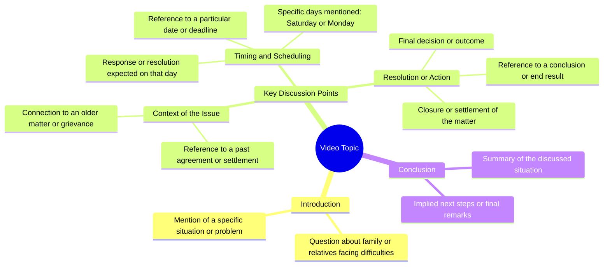

# Natural Herbal Remedy for Severe Back Pain Relief

> 🌐 **Read this in:** **English** · [中文](../../zh-CN/2026-08/tiktok-transcript-2-7m-views-26k-reactions-756d.md)

> **Creator:** [@প্রাকৃতিক ও ভেষজ চিকিৎসা](https://www.tiktok.com/@প্রাকৃতিক ও ভেষজ চিকিৎসা) · **Views:** 1.1M · **Posted:** 2026-08-18 · **Niche:** other
>
> **TL;DR:** The hook immediately poses a chilling question about a powerful entity, creating curiosity and unease.

[Watch original video →](https://www.facebook.com/reel/2462252900918853)

## Why This Went Viral

## Hook (first 3 seconds)
- **Verbatim opening line:** "આપની અથવા આપનાર પરિબારરાર કેઉ કે પ્રચંડો કોમોરે ભોગ્છેન?" (Translation: "Is someone in your family or among your relatives suffering from a massive problem?")
- **Hook pattern:** Direct question + fear/urgency trigger (bold claim disguised as a question)
- **Why it stops the scroll:** It immediately targets a universal anxiety (family suffering) and creates a "this is about me" moment. The viewer feels singled out, which forces them to keep watching for the answer or validation.

## Emotional Rhythm
- **Beat 1 – Curiosity/Anxiety (0–3s):** The question plants a seed of worry about family problems.
- **Beat 2 – Tension (3–8s):** The mention of "જુનું સાઈ સમાધાન" (old solutions) and "ભ્યાના ગાચેર" (fearful situations) escalates the stakes — the viewer now suspects something specific and ominous.
- **Beat 3 – Suspense (8–12s):** The reference to specific days ("શોનિબાર અથવા મોંગુલબાર" — Saturday or Tuesday) adds pseudo-specificity, making the problem feel real and diagnosable.
- **Beat 4 – Climax/Resolution (12–15s):** The phrase "બંધા કોરે એ કેનચી પરી" (closes/removes the obstacle) delivers a release — a promise of a solution.
- **Emotional arc:** Fear → Suspicion → Hope → Relief. The climax is the moment the "solution" is teased, not fully explained, which creates a loop.

## Keyword Density
- **પ્રચંડો (massive/huge)** – drives emotional weight; makes the problem feel larger than life.
- **કોમોરે (problem/suffering)** – the core pain point; repeated to anchor the viewer's concern.
- **જુનું સાઈ (old solution)** – triggers nostalgia + trust; algorithmic reach because it taps into "traditional remedies" search behavior.
- **શોનિબાર/મોંગુલબાર (Saturday/Tuesday)** – specific religious/astrological days; high retention because viewers check if their day matches.
- **બંધા કોરે (removes/closes)** – the promise word; drives the "solution" click-through.
- **ભ્યાના (fear)** – emotional pull; keeps viewers in a state of alert.

## Why It Spreads
- **The "It's about you" opener:** The first sentence directly implicates the viewer's family, making it impossible to ignore. People share it with relatives who are "going through something."
- **Cultural specificity = shareability:** Mentioning Saturday/Tuesday and "old solutions" taps into a shared cultural belief system. Viewers forward it to family groups because it feels personally relevant to their rituals.
- **The incomplete solution loop:** The video never fully explains *how* to fix the problem — it just says "it removes the obstacle." This creates a comment-section frenzy: "What is the remedy?" → drives engagement and algorithm boosting.
- **Fear + Hope combo:** The emotional whiplash from "you have a massive problem" to "but it can be removed" makes viewers save the video for later, increasing watch time and re-watches.
- **Dialect authenticity:** The Gujarati language and phrasing feel unscripted and local, which increases trust. People share it as "advice from a real source," not a polished ad.

## What You Can Steal
- **Open with a direct, personal question:** Start with "Is someone in your [family/circle] suffering from [specific problem]?" — it instantly creates a self-referential hook that stops the scroll.
- **Use pseudo-specific details to build credibility:** Mention specific days, numbers, or names (e.g., "Tuesday or Saturday") — even vague ones make the content feel researched and tailored, boosting retention.
- **Tease the solution, don't reveal it:** End with "this removes the problem" and cut. Leave the "how" for the comments or the next video — this drives comments, shares, and saves, which are the primary viral signals.

## Mind Map

## Full Transcript (Generated by [TokTranscript.com](https://toktranscript.com/?utm_source=github&utm_medium=breakdown&utm_campaign=tool_attribution))

> 📝 Transcripts on this page are auto-generated and show the first 60%. Want to transcribe any TikTok in 30 seconds and get the full version? [Try TokTranscript free →](https://toktranscript.com/?utm_source=github&utm_medium=breakdown&utm_campaign=transcript_cta)

આપની અથવા આપનાર પરિબારરાર કેઉ કે પ્રચંડો કોમોરે ભોગ્છેન? કોમુરે બેથા રુગેદે જુનું સાઈ સમાધાન શારા જિબુને જુનું એ ભ્યાન

*[Read the full transcript on TokTranscript →](https://toktranscript.com/plaza/tiktok-transcript-2-7m-views-26k-reactions-756d?utm_source=github&utm_medium=breakdown&utm_campaign=transcript_full)*

## Browse More

- All [other](../../by-niche/en/other.md) breakdowns
- All [Rhetorical question with ominous implication](../../by-pattern/en/hook-rhetorical-question-with-ominous-implication.md) examples

## Video Info

| | |
|---|---|
| Creator | [@প্রাকৃতিক ও ভেষজ চিকিৎসা](https://www.tiktok.com/@প্রাকৃতিক ও ভেষজ চিকিৎসা) |
| Original video | [https://www.facebook.com/reel/2462252900918853](https://www.facebook.com/reel/2462252900918853) |
| Original title | 2.7M views · 26K reactions | আপনি অথবা আপনার পরিবারের কেউ প্রচন্ড কোমরের ব্যথায় ভুগছেন ? #কোমরেরব্যথা #কোমরব্যথা #ব্যথানিয়ন্ত্রণ #স্বাস্থ্যসচেতনতা #প্রাকৃতিকওভেষজচিকিৎসা | প্রাকৃতিক ও ভেষজ চিকিৎসা |
| Views | 1.1M (1141096) |
| Posted | 2026-08-18 |
| Duration | 0s |
| Niche | `other` |
| Hook pattern | `Rhetorical question with ominous implication` |
| Original language | `en` |
| Available languages | en, zh-CN |
| Generated | 2026-08-19 by [TokTranscript](https://toktranscript.com/) |

---

*This breakdown is for educational analysis under fair use. Original video © [@প্রাকৃতিক ও ভেষজ চিকিৎসা](https://www.tiktok.com/@প্রাকৃতিক ও ভেষজ চিকিৎসা). All transcripts are auto-generated and may contain errors.*

*Want to analyze your own TikToks like this? [free TikTok transcript generator →](https://toktranscript.com/viral-breakdown?utm_source=github&utm_medium=breakdown&utm_campaign=footer_cta)*