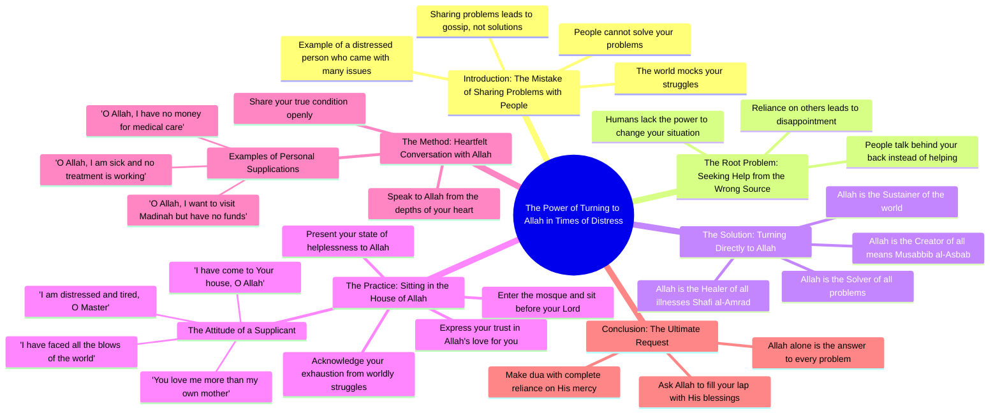

# Deep Lines on the Karakoram Highway: Scenic Drive Through...

> 🌐 **Read this in:** **English** · [中文](../../zh-CN/2026-08/tiktok-transcript-2-9k-views-43k-reactions-deep-lines-naltar-expressway-by-ree-c45a.md)

> **Creator:** [@Reelbymeer](https://www.tiktok.com/@Reelbymeer) · **Views:** 200.0K · **Posted:** 2026-08-11 · **Niche:** other
>
> **TL;DR:** Starts with a strong, relatable warning that immediately grabs attention and sets a confidential, emotional tone.

[Watch original video →](https://www.facebook.com/share/r/1PUHRaLnWk/)

## Why This Went Viral

## Hook (first 3 seconds)
- **Verbatim opening:** "کسی کو مت بتایا کرو کیا پرابلم ہے" ("Don't tell anyone what your problem is")
- **Hook pattern:** Bold claim / direct command — a contrarian life rule stated with absolute certainty.
- **Why it stops the scroll:** It instantly challenges a universal human instinct (sharing your problems). The viewer feels a cognitive dissonance: *Wait, I thought sharing was good?* This creates an immediate "why?" gap that forces the viewer to keep watching to resolve the tension.

## Emotional Rhythm
1. **Tension (0–3s):** The bold claim creates friction and skepticism.
2. **Validation (3–8s):** "کوئی کچھ نہیں کر سکتا دنیا والے مزاق اڑاتے ہیں" — "No one can do anything; people mock you." This shifts from challenge to bitter truth, resonating with anyone who's felt betrayed or dismissed.
3. **Personal story (8–12s):** "آیا تھا میرے پاس بڑا پریشان تھا" — introduces a narrative, making it relatable and concrete.
4. **Pivot (12–15s):** "جس رب کائنات سے مسئلہ حل کرنا ہے" — the twist: the solution isn't people, it's God. This is the emotional turn from despair to hope.
5. **Surrender/Climax (15–25s):** "تیرے گھر میں آ گیا ہوں... تھک گیا ہوں مولا" — raw vulnerability peaks. The speaker is at their lowest, which creates intense emotional resonance.
6. **Resolution (25–30s):** "تو میری ماں سے زیادہ مجھے چاہنے والا ہے" — the emotional payoff: unconditional love. This is the cathartic release that makes viewers feel seen and comforted.

**Climax moment:** The line "تیرے گھر میں آ گیا ہوں" — the act of surrendering to God's doorstep. This is where the emotional weight peaks and the viewer feels the shift from helplessness to trust.

## Keyword Density
1. **"مسئلہ" (Problem)** — appears 5+ times; drives the core theme and algorithmic relevance for anyone searching for solutions or struggling.
2. **"اللہ / رب" (Allah / Lord)** — repeated throughout; the spiritual anchor and primary emotional pull.
3. **"پریشان" (Worried/Anxious)** — repeated; taps into a high-volume emotional search term.
4. **"تھک گیا" (Tired/Exhausted)** — repeated; evokes burnout, a universal feeling.
5. **"گھر" (House/Home)** — repeated; symbolizes safety, belonging, and refuge.
6. **"پیسے" (Money)** — mentioned; triggers financial anxiety, a high-engagement topic.

**Algorithmic reach drivers:** "مسئلہ," "پریشان," "اللہ" — these are high-volume search terms in Urdu-speaking markets. The algorithm picks up on the emotional distress keywords and serves it to users searching for solutions or comfort.

**Emotional pull drivers:** "تھک گیا," "ماں سے زیادہ چاہنے والا" — these are intimacy triggers that create a parasocial bond with the speaker, making the video feel like a personal message to each viewer.

## Why It Spreads
- **Relatability through shared pain:** The line "دنیا بھر کے دھکے کھا لیے" ("I've endured the world's kicks") is so universal that anyone who has felt beaten down by life sees themselves in it. Viewers share this with friends who are struggling — it's a "this is for you" message.
- **The spiritual resolution arc:** The video doesn't just complain; it offers a solution (turn to God). This makes it shareable as a *gift* — viewers send it to others as a form of emotional support, not just entertainment.
- **Raw, unpolished delivery:** The speaker's voice cracks with genuine emotion. There's no scripted polish, which makes it feel like a real confession. Authenticity triggers the "this is real" response, which drives comments like "I feel this."
- **The "don't tell anyone" paradox:** The opening tells you *not* to share your problems, but the act of watching and sharing the video *is* sharing a problem. This creates a meta-commentary that fuels comment-section engagement: "But I just shared this video..."
- **Specificity of details:** "مدینہ جانا ہے" ("I want to go to Medina") and "علاج کے پیسے نہیں" ("no money for treatment") are concrete, relatable struggles that make the abstract pain tangible. Specificity drives shares because it feels like the speaker is telling *your* story.

## What You Can Steal
1. **Open with a contrarian command:** Start your video with a direct, counter-intuitive instruction ("Don't do X" or "Stop doing Y"). It creates instant cognitive friction that stops the scroll. Don't explain it — let the tension build for 3–5 seconds before you justify it.
2. **Use the "twist pivot" structure:** Start with a bitter truth about the world (people will mock you), then pivot to a higher solution (turn to a higher power, a bigger idea, a different frame). This two-part structure — problem → transcendence — gives your video an emotional arc that feels complete and satisfying.
3. **End with unconditional love, not a call to action:** Instead of "like and subscribe," close with a line that makes the viewer feel personally cherished ("You are loved more than you know"). This creates a share impulse because viewers want to pass that feeling on to someone else. Emotional resonance outperforms explicit CTAs in viral short-form.

## Mind Map

## Full Transcript (Generated by [free TikTok transcript generator](https://toktranscript.com/?utm_source=github&utm_medium=breakdown&utm_campaign=tool_attribution))

> 📝 Transcripts on this page are auto-generated and show the first 60%. Want to transcribe any TikTok in 30 seconds and get the full version? [Try TokTranscript free →](https://toktranscript.com/?utm_source=github&utm_medium=breakdown&utm_campaign=transcript_cta)

کسی کو مت بتایا کرو کیا پرابلم ہے کوئی کچھ نہیں کر سکتا دنیا والے مزاق اڑاتے ہیں آپ کسی کو جا کر کہتا ہے نا میرا یہ پرابلم ہے میرا یہ مسئلہ ہے اب حل کر دیں حل نہیں کرتے پیچھے جا کے باتیں کرتے ہیں آیا تھا میرے پاس بڑا پریشان تھا اس کا تو یہ مسئلہ تھا اس کا تو یہ مسئلہ تھا میں کیوں مت ہوں کسی کو یار میرا مسئلہ جس رب کائنات سے مسئلہ حل کرنا ہے جو مسبیبل اسباب ہے جو شافیل امراض ہے جو دنیا کو نواز رہا ہے بیٹھ جاؤ نا اس کے گھر میں آ گیا ہوں یا اللہ تیرے گھر میں پریشان ہوں 

*[Read the full transcript on TokTranscript →](https://toktranscript.com/plaza/tiktok-transcript-2-9k-views-43k-reactions-deep-lines-naltar-expressway-by-ree-c45a?utm_source=github&utm_medium=breakdown&utm_campaign=transcript_full)*

## Browse More

- All [other](../../by-niche/en/other.md) breakdowns
- All [Direct advice with negative consequence](../../by-pattern/en/hook-direct-advice-with-negative-consequence.md) examples

## Video Info

| | |
|---|---|
| Creator | [@Reelbymeer](https://www.tiktok.com/@Reelbymeer) |
| Original video | [https://www.facebook.com/share/r/1PUHRaLnWk/](https://www.facebook.com/share/r/1PUHRaLnWk/) |
| Original title | 2.9K views · 43K reactions | Deep lines 🥀 📍 naltar expressway 📹 by Reelbymir The Karakoram Highway (KKH) is an engineering marvel and a breathtaking road trip through the Himalayas, Karakoram, and Hindu Kush mountains, often called the “Eighth Wonder of the World”. Perfect for showcasing snowy peaks, rugged gorges, and high-altitude, the KKH connects Pakistan and China via the scenic Khunjerab Pass ❤️Double tap if epic road journeys inspire you 💾 Stay connected with us for the best reels. 🔔 Follow Reelbymir for more epic nature views ⏩Share with your friends and loved ones. #viralpost❤️ #trendingsong❤️ #reelinstagram❤️ #reels #réel | Reelbymeer |
| Views | 200.0K (199990) |
| Posted | 2026-08-11 |
| Duration | 0s |
| Niche | `other` |
| Hook pattern | `Direct advice with negative consequence` |
| Original language | `en` |
| Available languages | en, zh-CN |
| Generated | 2026-08-13 by [TokTranscript](https://toktranscript.com/) |

---

*This breakdown is for educational analysis under fair use. Original video © [@Reelbymeer](https://www.tiktok.com/@Reelbymeer). All transcripts are auto-generated and may contain errors.*

*Want to analyze your own TikToks like this? [free TikTok transcript generator →](https://toktranscript.com/viral-breakdown?utm_source=github&utm_medium=breakdown&utm_campaign=footer_cta)*